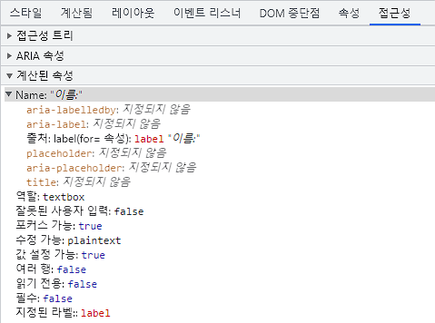
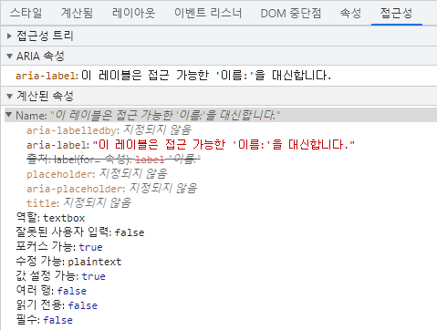
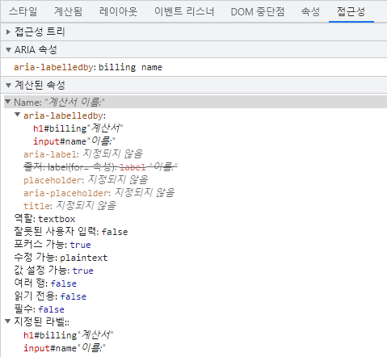
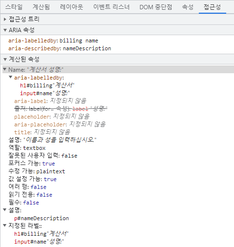

# 접근성 {#accessibility}

웹 접근성(일명 a11y)은 장애가 있는 사람, 느린 인터넷 연결, 구식 또는 고장난 하드웨어를 사용하는 사람, 혹은 단순히 불리한 환경에 있는 사람 등 누구나 웹사이트를 사용할 수 있도록 만드는 실천을 의미합니다. 예를 들어, 동영상에 자막을 추가하면 청각 장애가 있거나 난청인 사용자뿐만 아니라 시끄러운 환경에서 휴대폰 소리를 들을 수 없는 사용자에게도 도움이 됩니다. 마찬가지로, 텍스트의 대비가 너무 낮지 않도록 하면 저시력 사용자뿐만 아니라 밝은 햇빛 아래에서 휴대폰을 사용하려는 사용자에게도 도움이 됩니다.

시작할 준비가 되었지만 어디서부터 시작해야 할지 모르겠나요?

[World Wide Web Consortium (W3C)](https://www.w3.org/)에서 제공하는 [웹 접근성 계획 및 관리 가이드](https://www.w3.org/WAI/planning-and-managing/)를 확인해보세요.

## 건너뛰기 링크 {#skip-link}

각 페이지 상단에 메인 콘텐츠 영역으로 바로 이동할 수 있는 링크를 추가해야 합니다. 이를 통해 사용자는 여러 웹 페이지에서 반복되는 콘텐츠를 건너뛸 수 있습니다.

일반적으로 이는 `App.vue`의 상단에 추가되며, 모든 페이지에서 첫 번째로 포커스 가능한 요소가 됩니다:

```vue-html
<span ref="backToTop" tabindex="-1" />
<ul class="skip-links">
  <li>
    <a href="#main" ref="skipLink" class="skip-link">메인 콘텐츠로 건너뛰기</a>
  </li>
</ul>
```

링크가 포커스될 때만 보이도록 하려면 다음 스타일을 추가할 수 있습니다:

```css
.skip-links {
  list-style: none;
}
.skip-link {
  white-space: nowrap;
  margin: 1em auto;
  top: 0;
  position: fixed;
  left: 50%;
  margin-left: -72px;
  opacity: 0;
}
.skip-link:focus {
  opacity: 1;
  background-color: white;
  padding: 0.5em;
  border: 1px solid black;
}
```

사용자가 라우트를 변경하면, 페이지의 맨 처음, 즉 건너뛰기 링크 바로 앞에 포커스를 다시 가져와야 합니다. 이는 `backToTop` 템플릿 ref에 focus를 호출하여 달성할 수 있습니다(`vue-router` 사용을 가정):

<div class="options-api">

```vue
<script>
export default {
  watch: {
    $route() {
      this.$refs.backToTop.focus()
    }
  }
}
</script>
```

</div>
<div class="composition-api">

```vue
<script setup>
import { ref, watch } from 'vue'
import { useRoute } from 'vue-router'

const route = useRoute()
const backToTop = ref()

watch(
  () => route.path,
  () => {
    backToTop.value.focus()
  }
)
</script>
```

</div>

[메인 콘텐츠로 건너뛰기 링크에 대한 문서 읽기](https://www.w3.org/WAI/WCAG21/Techniques/general/G1.html)

## 콘텐츠 구조 {#content-structure}

접근성에서 가장 중요한 요소 중 하나는 디자인이 접근 가능한 구현을 지원할 수 있도록 하는 것입니다. 디자인은 색상 대비, 글꼴 선택, 텍스트 크기, 언어뿐만 아니라 애플리케이션 내에서 콘텐츠가 어떻게 구조화되는지도 고려해야 합니다.

### 제목 {#headings}

사용자는 제목을 통해 애플리케이션을 탐색할 수 있습니다. 애플리케이션의 모든 섹션에 설명적인 제목을 제공하면 사용자가 각 섹션의 내용을 예측하기 쉬워집니다. 제목과 관련하여 권장되는 접근성 실천 방법은 다음과 같습니다:

- 제목을 순위에 따라 중첩하세요: `<h1>` - `<h6>`
- 섹션 내에서 제목을 건너뛰지 마세요
- 텍스트에 스타일만 적용하여 제목처럼 보이게 하지 말고 실제 제목 태그를 사용하세요

[제목에 대해 더 알아보기](https://www.w3.org/TR/UNDERSTANDING-WCAG20/navigation-mechanisms-descriptive.html)

```vue-html
<main role="main" aria-labelledby="main-title">
  <h1 id="main-title">메인 제목</h1>
  <section aria-labelledby="section-title-1">
    <h2 id="section-title-1"> 섹션 제목 </h2>
    <h3>섹션 부제목</h3>
    <!-- 콘텐츠 -->
  </section>
  <section aria-labelledby="section-title-2">
    <h2 id="section-title-2"> 섹션 제목 </h2>
    <h3>섹션 부제목</h3>
    <!-- 콘텐츠 -->
    <h3>섹션 부제목</h3>
    <!-- 콘텐츠 -->
  </section>
</main>
```

### 랜드마크 {#landmarks}

[랜드마크](https://developer.mozilla.org/en-US/docs/Web/Accessibility/ARIA/Roles/landmark_role)는 애플리케이션 내 섹션에 대한 프로그래밍적 접근을 제공합니다. 보조 기술에 의존하는 사용자는 애플리케이션의 각 섹션으로 이동하고 콘텐츠를 건너뛸 수 있습니다. [ARIA 역할](https://developer.mozilla.org/en-US/docs/Web/Accessibility/ARIA/Roles)을 사용하여 이를 달성할 수 있습니다.

| HTML            | ARIA 역할            | 랜드마크 목적                                                                                                 |
| --------------- | -------------------- | ------------------------------------------------------------------------------------------------------------- |
| header          | role="banner"        | 주요 제목: 페이지의 제목                                                                                      |
| nav             | role="navigation"    | 문서 또는 관련 문서를 탐색할 때 사용할 수 있는 링크 모음                                                      |
| main            | role="main"          | 문서의 주요 또는 중심 콘텐츠                                                                                  |
| footer          | role="contentinfo"   | 상위 문서에 대한 정보: 각주/저작권/개인정보 보호정책 링크                                                     |
| aside           | role="complementary" | 주요 콘텐츠를 보조하지만 분리되어 있고 자체적으로 의미 있는 콘텐츠                                            |
| search          | role="search"        | 이 섹션은 애플리케이션의 검색 기능을 포함합니다                                                               |
| form            | role="form"          | 폼 관련 요소들의 모음                                                                                         |
| section         | role="region"        | 관련성이 높고 사용자가 탐색하고 싶어할 가능성이 있는 콘텐츠. 이 요소에는 반드시 레이블이 제공되어야 합니다.   |

[랜드마크에 대해 더 알아보기](https://www.w3.org/TR/wai-aria-1.2/#landmark_roles)

## 시맨틱 폼 {#semantic-forms}

폼을 만들 때는 다음 요소들을 사용할 수 있습니다: `<form>`, `<label>`, `<input>`, `<textarea>`, `<button>`

레이블은 일반적으로 폼 필드의 위나 왼쪽에 배치됩니다:

```vue-html
<form action="/dataCollectionLocation" method="post" autocomplete="on">
  <div v-for="item in formItems" :key="item.id" class="form-item">
    <label :for="item.id">{{ item.label }}: </label>
    <input
      :type="item.type"
      :id="item.id"
      :name="item.id"
      v-model="item.value"
    />
  </div>
  <button type="submit">제출</button>
</form>
```

`autocomplete='on'`을 form 요소에 포함하면 폼 내 모든 입력에 적용됩니다. 각 입력마다 [autocomplete 속성의 다양한 값](https://developer.mozilla.org/en-US/docs/Web/HTML/Attributes/autocomplete)을 설정할 수도 있습니다.

### 레이블 {#labels}

모든 폼 컨트롤의 목적을 설명하는 레이블을 제공하세요; `for`와 `id`를 연결하세요:

```vue-html
<label for="name">이름: </label>
<input type="text" name="name" id="name" v-model="name" />
```

이 요소를 Chrome DevTools에서 검사하고 Elements 탭 내의 접근성 탭을 열면 입력이 레이블에서 이름을 가져오는 것을 볼 수 있습니다:



:::warning 경고:
아래와 같이 레이블이 입력 필드를 감싸는 것을 본 적이 있을 수 있습니다:

```vue-html
<label>
  이름:
  <input type="text" name="name" id="name" v-model="name" />
</label>
```

id와 일치하는 레이블을 명시적으로 설정하는 것이 보조 기술에서 더 잘 지원됩니다.
:::

#### `aria-label` {#aria-label}

[`aria-label`](https://developer.mozilla.org/en-US/docs/Web/Accessibility/ARIA/Attributes/aria-label)로 입력에 접근 가능한 이름을 줄 수도 있습니다.

```vue-html
<label for="name">이름: </label>
<input
  type="text"
  name="name"
  id="name"
  v-model="name"
  :aria-label="nameLabel"
/>
```

Chrome DevTools에서 이 요소를 검사하여 접근 가능한 이름이 어떻게 변경되었는지 확인해보세요:



#### `aria-labelledby` {#aria-labelledby}

[`aria-labelledby`](https://developer.mozilla.org/en-US/docs/Web/Accessibility/ARIA/Attributes/aria-labelledby)는 `aria-label`과 비슷하지만, 레이블 텍스트가 화면에 보이는 경우에 사용합니다. 다른 요소의 `id`와 연결하며, 여러 개의 `id`를 연결할 수 있습니다:

```vue-html
<form
  class="demo"
  action="/dataCollectionLocation"
  method="post"
  autocomplete="on"
>
  <h1 id="billing">청구</h1>
  <div class="form-item">
    <label for="name">이름: </label>
    <input
      type="text"
      name="name"
      id="name"
      v-model="name"
      aria-labelledby="billing name"
    />
  </div>
  <button type="submit">제출</button>
</form>
```



이 패턴을 재사용 가능한 컴포넌트 내부에서 사용할 때는, ID를 하드코딩하는 대신 [`useId()`](/api/composition-api-helpers.html#useid)로 생성하세요. 이렇게 하면 화면에 보이는 텍스트를 폼 컨트롤과 연결하면서도, 각 컴포넌트 인스턴스의 `id` 값을 고유하게 유지할 수 있습니다:

```vue
<script setup>
import { useId } from 'vue'

const sectionId = useId()
const nameId = useId()
</script>

<template>
  <section class="form-section">
    <h2 :id="sectionId">Billing</h2>

    <label :id="nameId" :for="`${nameId}-input`">Name: </label>
    <input
      :id="`${nameId}-input`"
      type="text"
      name="name"
      :aria-labelledby="`${sectionId} ${nameId}`"
    />
  </section>
</template>
```

#### `aria-describedby` {#aria-describedby}

[aria-describedby](https://developer.mozilla.org/en-US/docs/Web/Accessibility/ARIA/Attributes/aria-describedby)는 `aria-labelledby`와 동일한 방식으로 사용되지만, 사용자가 필요로 할 수 있는 추가 정보를 설명하는 데 사용됩니다. 이는 입력의 기준을 설명하는 데 사용할 수 있습니다:

```vue-html
<form
  class="demo"
  action="/dataCollectionLocation"
  method="post"
  autocomplete="on"
>
  <h1 id="billing">청구</h1>
  <div class="form-item">
    <label for="name">전체 이름: </label>
    <input
      type="text"
      name="name"
      id="name"
      v-model="name"
      aria-labelledby="billing name"
      aria-describedby="nameDescription"
    />
    <p id="nameDescription">이름과 성을 모두 입력해주세요.</p>
  </div>
  <button type="submit">제출</button>
</form>
```

Chrome DevTools에서 설명을 확인할 수 있습니다:



### 플레이스홀더 {#placeholder}

플레이스홀더 사용은 많은 사용자에게 혼란을 줄 수 있으므로 피하세요.

플레이스홀더의 문제 중 하나는 기본적으로 [색상 대비 기준](https://www.w3.org/WAI/WCAG21/Understanding/contrast-minimum.html)을 충족하지 못한다는 점입니다. 색상 대비를 수정하면 플레이스홀더가 입력 필드에 미리 입력된 데이터처럼 보이게 됩니다. 다음 예시를 보면, 색상 대비 기준을 충족하는 성(Last Name) 플레이스홀더가 미리 입력된 데이터처럼 보이는 것을 알 수 있습니다:


```vue-html
<form
  class="demo"
  action="/dataCollectionLocation"
  method="post"
  autocomplete="on"
>
  <div v-for="item in formItems" :key="item.id" class="form-item">
    <label :for="item.id">{{ item.label }}: </label>
    <input
      type="text"
      :id="item.id"
      :name="item.id"
      v-model="item.value"
      :placeholder="item.placeholder"
    />
  </div>
  <button type="submit">제출</button>
</form>
```

```css
/* https://www.w3schools.com/howto/howto_css_placeholder.asp */

#lastName::placeholder {
  /* Chrome, Firefox, Opera, Safari 10.1+ */
  color: black;
  opacity: 1; /* Firefox */
}

#lastName:-ms-input-placeholder {
  /* Internet Explorer 10-11 */
  color: black;
}

#lastName::-ms-input-placeholder {
  /* Microsoft Edge */
  color: black;
}
```

사용자가 폼을 작성하는 데 필요한 모든 정보를 입력 외부에 제공하는 것이 가장 좋습니다.

### 안내문 {#instructions}

입력 필드에 안내문을 추가할 때는 입력과 올바르게 연결되었는지 확인하세요.
추가 안내문을 제공하고 [`aria-labelledby`](https://developer.mozilla.org/en-US/docs/Web/Accessibility/ARIA/Attributes/aria-labelledby) 내에 여러 id를 바인딩할 수 있습니다. 이를 통해 더 유연한 디자인이 가능합니다.

```vue-html
<fieldset>
  <legend>aria-labelledby 사용</legend>
  <label id="date-label" for="date">현재 날짜: </label>
  <input
    type="date"
    name="date"
    id="date"
    aria-labelledby="date-label date-instructions"
  />
  <p id="date-instructions">MM/DD/YYYY</p>
</fieldset>
```

또는 [`aria-describedby`](https://developer.mozilla.org/en-US/docs/Web/Accessibility/ARIA/Attributes/aria-describedby)로 안내문을 입력에 연결할 수 있습니다:

```vue-html
<fieldset>
  <legend>aria-describedby 사용</legend>
  <label id="dob" for="dob">생년월일: </label>
  <input type="date" name="dob" id="dob" aria-describedby="dob-instructions" />
  <p id="dob-instructions">MM/DD/YYYY</p>
</fieldset>
```

### 콘텐츠 숨기기 {#hiding-content}

일반적으로 입력에 접근 가능한 이름이 있더라도 레이블을 시각적으로 숨기는 것은 권장되지 않습니다. 그러나 입력의 기능이 주변 콘텐츠로 이해될 수 있다면 시각적 레이블을 숨길 수 있습니다.

다음 검색 필드를 살펴보세요:

```vue-html
<form role="search">
  <label for="search" class="hidden-visually">검색: </label>
  <input type="text" name="search" id="search" v-model="search" />
  <button type="submit">검색</button>
</form>
```

검색 버튼이 시각적 사용자에게 입력 필드의 목적을 식별하는 데 도움이 되므로 이렇게 할 수 있습니다.

CSS를 사용하여 요소를 시각적으로 숨기면서도 보조 기술에서는 사용할 수 있도록 할 수 있습니다:

```css
.hidden-visually {
  position: absolute;
  overflow: hidden;
  white-space: nowrap;
  margin: 0;
  padding: 0;
  height: 1px;
  width: 1px;
  clip: rect(0 0 0 0);
  clip-path: inset(100%);
}
```

#### `aria-hidden="true"` {#aria-hidden-true}

`aria-hidden="true"`를 추가하면 해당 요소가 보조 기술에서는 숨겨지지만, 다른 사용자에게는 시각적으로 남아 있습니다. 포커스 가능한 요소에는 사용하지 말고, 장식용, 중복 또는 화면 밖 콘텐츠에만 사용하세요.

```vue-html
<p>이 문장은 스크린 리더에서 숨겨지지 않습니다.</p>
<p aria-hidden="true">이 문장은 스크린 리더에서 숨겨집니다.</p>
```

### 버튼 {#buttons}

폼 내에서 버튼을 사용할 때는 폼 제출을 방지하기 위해 type을 반드시 설정해야 합니다.
입력을 사용하여 버튼을 만들 수도 있습니다:

```vue-html
<form action="/dataCollectionLocation" method="post" autocomplete="on">
  <!-- 버튼 -->
  <button type="button">취소</button>
  <button type="submit">제출</button>

  <!-- 입력 버튼 -->
  <input type="button" value="취소" />
  <input type="submit" value="제출" />
</form>
```

### 기능성 이미지 {#functional-images}

이 기법을 사용하여 기능성 이미지를 만들 수 있습니다.

- 입력 필드

  - 이 이미지는 폼에서 submit 타입 버튼 역할을 합니다

  ```vue-html
  <form role="search">
    <label for="search" class="hidden-visually">검색: </label>
    <input type="text" name="search" id="search" v-model="search" />
    <input
      type="image"
      class="btnImg"
      src="https://img.icons8.com/search"
      alt="검색"
    />
  </form>
  ```

- 아이콘

```vue-html
<form role="search">
  <label for="searchIcon" class="hidden-visually">검색: </label>
  <input type="text" name="searchIcon" id="searchIcon" v-model="searchIcon" />
  <button type="submit">
    <i class="fas fa-search" aria-hidden="true"></i>
    <span class="hidden-visually">검색</span>
  </button>
</form>
```

## 표준 {#standards}

World Wide Web Consortium (W3C) 웹 접근성 이니셔티브(WAI)는 다양한 구성 요소에 대한 웹 접근성 표준을 개발합니다:

- [사용자 에이전트 접근성 가이드라인(UAAG)](https://www.w3.org/WAI/standards-guidelines/uaag/)
  - 웹 브라우저 및 미디어 플레이어, 일부 보조 기술 포함
- [저작 도구 접근성 가이드라인(ATAG)](https://www.w3.org/WAI/standards-guidelines/atag/)
  - 저작 도구
- [웹 콘텐츠 접근성 가이드라인(WCAG)](https://www.w3.org/WAI/standards-guidelines/wcag/)
  - 웹 콘텐츠 - 개발자, 저작 도구, 접근성 평가 도구에서 사용

### 웹 콘텐츠 접근성 가이드라인(WCAG) {#web-content-accessibility-guidelines-wcag}

[WCAG 2.1](https://www.w3.org/TR/WCAG21/)은 [WCAG 2.0](https://www.w3.org/TR/WCAG20/)을 확장하여 웹의 변화에 대응하는 새로운 기술 구현을 허용합니다. W3C는 웹 접근성 정책을 개발하거나 업데이트할 때 가장 최신 버전의 WCAG 사용을 권장합니다.

#### WCAG 2.1의 네 가지 주요 원칙(POUR로 약칭): {#wcag-2-1-four-main-guiding-principles-abbreviated-as-pour}

- [인지 가능(Perceivable)](https://www.w3.org/TR/WCAG21/#perceivable)
  - 사용자가 제공되는 정보를 인지할 수 있어야 합니다
- [운영 가능(Operable)](https://www.w3.org/TR/WCAG21/#operable)
  - 인터페이스 폼, 컨트롤, 내비게이션이 조작 가능해야 합니다
- [이해 가능(Understandable)](https://www.w3.org/TR/WCAG21/#understandable)
  - 정보와 사용자 인터페이스의 동작이 모든 사용자에게 이해 가능해야 합니다
- [견고함(Robust)](https://www.w3.org/TR/WCAG21/#robust)
  - 기술이 발전해도 사용자가 콘텐츠에 접근할 수 있어야 합니다

#### 웹 접근성 이니셔티브 – 접근 가능한 리치 인터넷 애플리케이션(WAI-ARIA) {#web-accessibility-initiative-–-accessible-rich-internet-applications-wai-aria}

W3C의 WAI-ARIA는 동적 콘텐츠와 고급 사용자 인터페이스 컨트롤을 구축하는 방법에 대한 지침을 제공합니다.

- [접근 가능한 리치 인터넷 애플리케이션(WAI-ARIA) 1.2](https://www.w3.org/TR/wai-aria-1.2/)
- [WAI-ARIA 저작 실천 1.2](https://www.w3.org/TR/wai-aria-practices-1.2/)

## 자료 {#resources}

### 문서 {#documentation}

- [WCAG 2.0](https://www.w3.org/TR/WCAG20/)
- [WCAG 2.1](https://www.w3.org/TR/WCAG21/)
- [접근 가능한 리치 인터넷 애플리케이션(WAI-ARIA) 1.2](https://www.w3.org/TR/wai-aria-1.2/)
- [WAI-ARIA 저작 실천 1.2](https://www.w3.org/TR/wai-aria-practices-1.2/)

### 보조 기술 {#assistive-technologies}

- 스크린 리더
  - [NVDA](https://www.nvaccess.org/download/)
  - [VoiceOver](https://www.apple.com/accessibility/mac/vision/)
  - [JAWS](https://www.freedomscientific.com/products/software/jaws/?utm_term=jaws%20screen%20reader&utm_source=adwords&utm_campaign=All+Products&utm_medium=ppc&hsa_tgt=kwd-394361346638&hsa_cam=200218713&hsa_ad=296201131673&hsa_kw=jaws%20screen%20reader&hsa_grp=52663682111&hsa_net=adwords&hsa_mt=e&hsa_src=g&hsa_acc=1684996396&hsa_ver=3&gclid=Cj0KCQjwnv71BRCOARIsAIkxW9HXKQ6kKNQD0q8a_1TXSJXnIuUyb65KJeTWmtS6BH96-5he9dsNq6oaAh6UEALw_wcB)
  - [ChromeVox](https://chrome.google.com/webstore/detail/chromevox-classic-extensi/kgejglhpjiefppelpmljglcjbhoiplfn?hl=en)
- 확대 도구
  - [MAGic](https://www.freedomscientific.com/products/software/magic/)
  - [ZoomText](https://www.freedomscientific.com/products/software/zoomtext/)
  - [Magnifier](https://support.microsoft.com/en-us/help/11542/windows-use-magnifier-to-make-things-easier-to-see)

### 테스트 {#testing}

- 자동화 도구
  - [Lighthouse](https://chrome.google.com/webstore/detail/lighthouse/blipmdconlkpinefehnmjammfjpmpbjk)
  - [WAVE](https://chrome.google.com/webstore/detail/wave-evaluation-tool/jbbplnpkjmmeebjpijfedlgcdilocofh)
  - [ARC Toolkit](https://chrome.google.com/webstore/detail/arc-toolkit/chdkkkccnlfncngelccgbgfmjebmkmce?hl=en-US)
- 색상 도구
  - [WebAim 색상 대비](https://webaim.org/resources/contrastchecker/)
  - [WebAim 링크 색상 대비](https://webaim.org/resources/linkcontrastchecker)
- 기타 유용한 도구
  - [HeadingMap](https://chrome.google.com/webstore/detail/headingsmap/flbjommegcjonpdmenkdiocclhjacmbi?hl=en…)
  - [Color Oracle](https://colororacle.org)
  - [NerdeFocus](https://chrome.google.com/webstore/detail/nerdefocus/lpfiljldhgjecfepfljnbjnbjfhennpd?hl=en-US…)
  - [Visual Aria](https://chrome.google.com/webstore/detail/visual-aria/lhbmajchkkmakajkjenkchhnhbadmhmk?hl=en-US)
  - [Silktide 웹사이트 접근성 시뮬레이터](https://chrome.google.com/webstore/detail/silktide-website-accessib/okcpiimdfkpkjcbihbmhppldhiebhhaf?hl=en-US)

### 사용자 {#users}

세계보건기구(WHO)는 전 세계 인구의 15%가 어떤 형태로든 장애를 가지고 있으며, 이 중 2-4%는 심각한 장애를 가지고 있다고 추정합니다. 이는 전 세계적으로 약 10억 명에 해당하며, 장애인은 세계에서 가장 큰 소수 집단입니다.

장애의 범위는 매우 다양하며, 대략 네 가지 범주로 나눌 수 있습니다:

- _[시각](https://webaim.org/articles/visual/)_ - 이 사용자는 스크린 리더, 화면 확대, 화면 대비 조절, 점자 디스플레이의 사용으로 혜택을 볼 수 있습니다.
- _[청각](https://webaim.org/articles/auditory/)_ - 이 사용자는 자막, 전사, 수화 동영상의 사용으로 혜택을 볼 수 있습니다.
- _[운동](https://webaim.org/articles/motor/)_ - 이 사용자는 [운동 장애를 위한 다양한 보조 기술](https://webaim.org/articles/motor/assistive): 음성 인식 소프트웨어, 시선 추적, 단일 스위치 접근, 헤드 완드, 입김 스위치, 대형 트랙볼 마우스, 보조 키보드 또는 기타 보조 기술의 사용으로 혜택을 볼 수 있습니다.
- _[인지](https://webaim.org/articles/cognitive/)_ - 이 사용자는 보조 미디어, 콘텐츠의 구조적 조직, 명확하고 간단한 글쓰기의 도움을 받을 수 있습니다.

사용자 관점에서 이해하려면 WebAim의 다음 링크를 확인해보세요:

- [웹 접근성 관점: 모두를 위한 영향과 이점 탐색](https://www.w3.org/WAI/perspective-videos/)
- [웹 사용자 이야기](https://www.w3.org/WAI/people-use-web/user-stories/)
