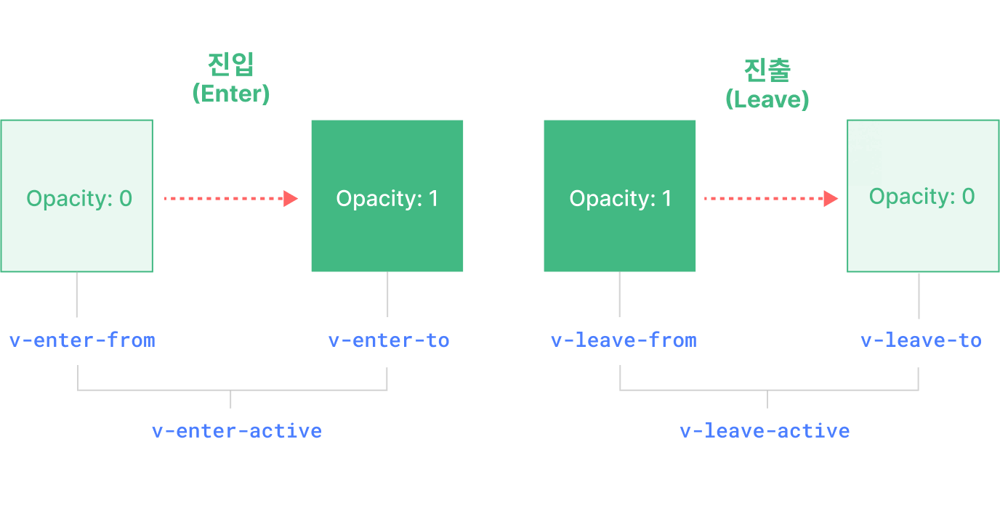

<script setup>
import Basic from './transition-demos/Basic.vue'
import SlideFade from './transition-demos/SlideFade.vue'
import CssAnimation from './transition-demos/CssAnimation.vue'
import NestedTransitions from './transition-demos/NestedTransitions.vue'
import JsHooks from './transition-demos/JsHooks.vue'
import BetweenElements from './transition-demos/BetweenElements.vue'
import BetweenComponents from './transition-demos/BetweenComponents.vue'
</script>

# 트랜지션(transition) {#transition}

Vue는 상태 변화에 따라 트랜지션과 애니메이션을 다루는 데 도움이 되는 두 개의 내장 컴포넌트(component)를 제공합니다:

- `<Transition>`: 요소나 컴포넌트가 DOM에 진입하거나 퇴장할 때 애니메이션을 적용합니다. 이 페이지에서 다룹니다.

- `<TransitionGroup>`: `v-for` 리스트에서 요소나 컴포넌트가 삽입, 제거, 이동될 때 애니메이션을 적용합니다. [다음 장](/guide/built-ins/transition-group)에서 다룹니다.

이 두 컴포넌트 외에도, CSS 클래스 토글이나 스타일 바인딩(binding)을 통한 상태 기반 애니메이션 등 다른 기법을 사용하여 Vue에서 애니메이션을 적용할 수 있습니다. 이러한 추가 기법들은 [애니메이션 기법](/guide/extras/animation) 장에서 다룹니다.

## `<Transition>` 컴포넌트 {#the-transition-component}

`<Transition>`은 내장 컴포넌트입니다: 즉, 어떤 컴포넌트의 템플릿(template)에서도 별도의 등록 없이 사용할 수 있습니다. 기본 슬롯(slot)을 통해 전달된 요소나 컴포넌트에 진입 및 퇴장 애니메이션을 적용할 수 있습니다. 진입 또는 퇴장은 다음 중 하나에 의해 트리거될 수 있습니다:

- `v-if`를 통한 조건부 렌더링(rendering)
- `v-show`를 통한 조건부 표시
- `<component>` 특수 요소를 통한 동적 컴포넌트 토글
- 특수 `key` 속성 변경

가장 기본적인 사용 예시는 다음과 같습니다:

```vue-html
<button @click="show = !show">토글</button>
<Transition>
  <p v-if="show">hello</p>
</Transition>
```

```css
/* 다음에서 이 클래스들이 무엇을 하는지 설명하겠습니다! */
.v-enter-active,
.v-leave-active {
  transition: opacity 0.5s ease;
}

.v-enter-from,
.v-leave-to {
  opacity: 0;
}
```

<Basic />

<div class="composition-api">

[플레이그라운드에서 실행해보기](https://play.vuejs.org/#eNpVkEFuwyAQRa8yZZNWqu1sunFJ1N4hSzYUjRNUDAjGVJHluxcCipIV/OG/pxEr+/a+TwuykfGogvYEEWnxR2H17F0gWCHgBBtMwc2wy9WdsMIqZ2OuXtwfHErhlcKCb8LyoVoynwPh7I0kzAmA/yxEzsKXMlr9HgRr9Es5BTue3PlskA+1VpFTkDZq0i3niYfU6anRmbqgMY4PZeH8OjwBfHhYIMdIV1OuferQEoZOKtIJ328TgzJhm8BabHR3jeC8VJqusO8/IqCM+CnsVqR3V/mfRxO5amnkCPuK5B+6rcG2fydshks=)

</div>
<div class="options-api">

[플레이그라운드에서 실행해보기](https://play.vuejs.org/#eNpVkMFuAiEQhl9lyqlNuouXXrZo2nfwuBeKs0qKQGBAjfHdZZfVrAmB+f/M/2WGK/v1vs0JWcdEVEF72vQWz94Fgh0OMhmCa28BdpLk+0etAQJSCvahAOLBnTqgkLA6t/EpVzmCP7lFEB69kYRFAYi/ROQs/Cij1f+6ZyMG1vA2vj3bbN1+b1Dw2lYj2yBt1KRnXRwPudHDnC6pAxrjBPe1n78EBF8MUGSkixnLNjdoCUMjFemMn5NjUGacnboqPVkdOC+Vpgus2q8IKCN+T+suWENwxyWJXKXMyQ5WNVJ+aBqD3e6VSYoi)

</div>

:::tip
`<Transition>`은 슬롯 콘텐츠로 단일 요소 또는 컴포넌트만 지원합니다. 콘텐츠가 컴포넌트인 경우, 해당 컴포넌트 역시 단일 루트 요소만 가져야 합니다.
:::

`<Transition>` 컴포넌트 내의 요소가 삽입되거나 제거될 때 다음과 같은 일이 발생합니다:

1. Vue는 대상 요소에 CSS 트랜지션 또는 애니메이션이 적용되어 있는지 자동으로 감지합니다. 적용되어 있다면, [CSS 트랜지션 클래스](#transition-classes)들이 적절한 타이밍에 추가/제거됩니다.

2. [자바스크립트 훅(hook)](#javascript-hooks)에 대한 리스너(listener)가 있다면, 이 훅들이 적절한 타이밍에 호출됩니다.

3. CSS 트랜지션/애니메이션이 감지되지 않고 자바스크립트 훅도 제공되지 않은 경우, 삽입 및/또는 제거에 대한 DOM 조작이 브라우저의 다음 애니메이션 프레임에 실행됩니다.

## CSS 기반 트랜지션 {#css-based-transitions}

### 트랜지션 클래스 {#transition-classes}

진입/퇴장 트랜지션에는 여섯 개의 클래스가 적용됩니다.



<!-- https://www.figma.com/file/rlOv0ZKJFFNA9hYmzdZv3S/Transition-Classes -->

1. `v-enter-from`: 진입의 시작 상태. 요소가 삽입되기 전에 추가되고, 요소가 삽입된 한 프레임 후에 제거됩니다.

2. `v-enter-active`: 진입의 활성 상태. 전체 진입 단계 동안 적용됩니다. 요소가 삽입되기 전에 추가되고, 트랜지션/애니메이션이 끝나면 제거됩니다. 이 클래스는 진입 트랜지션의 지속 시간, 지연, 이징 곡선을 정의하는 데 사용할 수 있습니다.

3. `v-enter-to`: 진입의 종료 상태. 요소가 삽입된 한 프레임 후(`v-enter-from`이 제거되는 시점) 추가되고, 트랜지션/애니메이션이 끝나면 제거됩니다.

4. `v-leave-from`: 퇴장의 시작 상태. 퇴장 트랜지션이 트리거되자마자 추가되고, 한 프레임 후에 제거됩니다.

5. `v-leave-active`: 퇴장의 활성 상태. 전체 퇴장 단계 동안 적용됩니다. 퇴장 트랜지션이 트리거되자마자 추가되고, 트랜지션/애니메이션이 끝나면 제거됩니다. 이 클래스는 퇴장 트랜지션의 지속 시간, 지연, 이징 곡선을 정의하는 데 사용할 수 있습니다.

6. `v-leave-to`: 퇴장의 종료 상태. 퇴장 트랜지션이 트리거된 한 프레임 후(`v-leave-from`이 제거되는 시점) 추가되고, 트랜지션/애니메이션이 끝나면 제거됩니다.

`v-enter-active`와 `v-leave-active`를 사용하면 진입/퇴장 트랜지션에 서로 다른 이징 곡선을 지정할 수 있습니다. 다음 섹션에서 예시를 확인할 수 있습니다.

### 네임드 트랜지션 {#named-transitions}

트랜지션은 `name` prop을 통해 이름을 지정할 수 있습니다:

```vue-html
<Transition name="fade">
  ...
</Transition>
```

네임드 트랜지션의 경우, 트랜지션 클래스는 `v` 대신 해당 이름이 접두사로 붙습니다. 예를 들어, 위 트랜지션에 적용되는 클래스는 `v-enter-active` 대신 `fade-enter-active`가 됩니다. 페이드 트랜지션의 CSS는 다음과 같습니다:

```css
.fade-enter-active,
.fade-leave-active {
  transition: opacity 0.5s ease;
}

.fade-enter-from,
.fade-leave-to {
  opacity: 0;
}
```

### CSS 트랜지션 {#css-transitions}

`<Transition>`은 [네이티브 CSS 트랜지션](https://developer.mozilla.org/ko/docs/Web/CSS/CSS_Transitions/Using_CSS_transitions)과 함께 가장 자주 사용됩니다. 위의 기본 예시에서 볼 수 있습니다. `transition` CSS 속성은 트랜지션의 여러 측면(애니메이션할 속성, 트랜지션 지속 시간, [이징 곡선](https://developer.mozilla.org/ko/docs/Web/CSS/easing-function) 등)을 지정할 수 있는 단축 속성입니다.

다음은 여러 속성을 트랜지션하고, 진입과 퇴장에 서로 다른 지속 시간과 이징 곡선을 사용하는 좀 더 고급 예시입니다:

```vue-html
<Transition name="slide-fade">
  <p v-if="show">hello</p>
</Transition>
```

```css
/*
  진입과 퇴장 애니메이션에
  서로 다른 지속 시간과 타이밍 함수를 사용할 수 있습니다.
*/
.slide-fade-enter-active {
  transition: all 0.3s ease-out;
}

.slide-fade-leave-active {
  transition: all 0.8s cubic-bezier(1, 0.5, 0.8, 1);
}

.slide-fade-enter-from,
.slide-fade-leave-to {
  transform: translateX(20px);
  opacity: 0;
}
```

<SlideFade />

<div class="composition-api">

[플레이그라운드에서 실행해보기](https://play.vuejs.org/#eNqFkc9uwjAMxl/F6wXQKIVNk1AX0HbZC4zDDr2E4EK0NIkStxtDvPviFQ0OSFzyx/m+n+34kL16P+lazMpMRBW0J4hIrV9WVjfeBYIDBKzhCHVwDQySdFDZyipnY5Lu3BcsWDCk0OKosqLoKcmfLoSNN5KQbyTWLZGz8KKMVp+LKju573ivsuXKbbcG4d3oDcI9vMkNiqL3JD+AWAVpoyadGFY2yATW5nVSJj9rkspDl+v6hE/hHRrjRMEdpdfiDEkBUVxWaEWkveHj5AzO0RKGXCrSHcKBIfSPKEEaA9PJYwSUEXPX0nNlj8y6RBiUHd5AzCOodq1VvsYfjWE4G6fgEy/zMcxG17B9ZTyX8bV85C5y1S40ZX/kdj+GD1P/zVQA56XStC9h2idJI/z7huz4CxoVvE4=)

</div>
<div class="options-api">

[플레이그라운드에서 실행해보기](https://play.vuejs.org/#eNqFkc1uwjAMgF/F6wk0SmHTJNQFtF32AuOwQy+hdSFamkSJ08EQ776EbMAkJKTIf7I/O/Y+ezVm3HvMyoy52gpDi0rh1mhL0GDLvSTYVwqg4cQHw2QDWCRv1Z8H4Db6qwSyHlPkEFUQ4bHixA0OYWckJ4wesZUn0gpeainqz3mVRQzM4S7qKlss9XotEd6laBDu4Y03yIpUE+oB2NJy5QSJwFC8w0iIuXkbMkN9moUZ6HPR/uJDeINSalaYxCjOkBBgxeWEijnayWiOz+AcFaHNeU2ix7QCOiFK4FLCZPzoALnDXHt6Pq7hP0Ii7/EGYuag9itR5yv8FmgH01EIPkUxG8F0eA2bJmut7kbX+pG+6NVq28WTBTN+92PwMDHbSAXQhteCdiVMUpNwwuMassMP8kfAJQ==)

</div>

### CSS 애니메이션 {#css-animations}

[네이티브 CSS 애니메이션](https://developer.mozilla.org/ko/docs/Web/CSS/CSS_Animations/Using_CSS_animations)은 CSS 트랜지션과 동일한 방식으로 적용되지만, `*-enter-from`이 요소가 삽입된 직후 바로 제거되는 것이 아니라 `animationend` 이벤트에서 제거된다는 차이점이 있습니다.

대부분의 CSS 애니메이션의 경우, `*-enter-active`와 `*-leave-active` 클래스에 선언하면 됩니다. 예시는 다음과 같습니다:

```vue-html
<Transition name="bounce">
  <p v-if="show" style="text-align: center;">
    Hello here is some bouncy text!
  </p>
</Transition>
```

```css
.bounce-enter-active {
  animation: bounce-in 0.5s;
}
.bounce-leave-active {
  animation: bounce-in 0.5s reverse;
}
@keyframes bounce-in {
  0% {
    transform: scale(0);
  }
  50% {
    transform: scale(1.25);
  }
  100% {
    transform: scale(1);
  }
}
```

<CssAnimation />

<div class="composition-api">

[플레이그라운드에서 실행해보기](https://play.vuejs.org/#eNqNksGOgjAQhl9lJNmoBwRNvCAa97YP4JFLbQZsLG3TDqzG+O47BaOezCYkpfB9/0wHbsm3c4u+w6RIyiC9cgQBqXO7yqjWWU9wA4813KH2toUpo9PKVEZaExg92V/YRmBGvsN5ZcpsTGGfN4St04Iw7qg8dkTWwF5qJc/bKnnYk7hWye5gm0ZjmY0YKwDlwQsTFCnWjGiRpaPtjETG43smHPSpqh9pVQKBrjpyrfCNMilZV8Aqd5cNEF4oFVo1pgCJhtBvnjEAP6i1hRN6BBUg2BZhKHUdvMmjWhYHE9dXY/ygzN4PasqhB75djM2mQ7FUSFI9wi0GCJ6uiHYxVsFUGcgX67CpzP0lahQ9/k/kj9CjDzgG7M94rT1PLLxhQ0D+Na4AFI9QW98WEKTQOMvnLAOwDrD+wC0Xq/Ubusw/sU+QL/45hskk9z8Bddbn)

</div>
<div class="options-api">

[플레이그라운드에서 실행해보기](https://play.vuejs.org/#eNqNUs2OwiAQfpWxySZ66I8mXioa97YP4LEXrNNKpEBg2tUY330pqOvJmBBgyPczP1yTb2OyocekTJirrTC0qRSejbYEB2x4LwmulQI4cOLTWbwDWKTeqkcE4I76twSyPcaX23j4zS+WP3V9QNgZyQnHiNi+J9IKtrUU9WldJaMMrGEynlWy2em2lcjyCPMUALazXDlBwtMU79CT9rpXNXp4tGYGhlQ0d7UqAUcXOeI6bluhUtKmhEVhzisgPFPKpWhVCTUqQrt6ygD8oJQajmgRhAOnO4RgdQm8yd0tNzGv/D8x/8Dy10IVCzn4axaTTYNZymsSA8YuciU6PrLL6IKpUFBkS7cKXXwQJfIBPyP6IQ1oHUaB7QkvjfUdcy+wIFB8PeZIYwmNtl0JruYSp8XMk+/TXL7BzbPF8gU6L95hn8D4OUJnktsfM1vavg==)

</div>

### 커스텀 트랜지션 클래스 {#custom-transition-classes}

다음과 같은 prop을 `<Transition>`에 전달하여 커스텀 트랜지션 클래스를 지정할 수도 있습니다:

- `enter-from-class`
- `enter-active-class`
- `enter-to-class`
- `leave-from-class`
- `leave-active-class`
- `leave-to-class`

이들은 기존의 클래스 이름을 덮어씁니다. 이는 [Animate.css](https://daneden.github.io/animate.css/)와 같은 기존 CSS 애니메이션 라이브러리와 Vue의 트랜지션 시스템을 결합하고 싶을 때 특히 유용합니다:

```vue-html
<!-- Animate.css가 페이지에 포함되어 있다고 가정 -->
<Transition
  name="custom-classes"
  enter-active-class="animate__animated animate__tada"
  leave-active-class="animate__animated animate__bounceOutRight"
>
  <p v-if="show">hello</p>
</Transition>
```

<div class="composition-api">

[플레이그라운드에서 실행해보기](https://play.vuejs.org/#eNqNUctuwjAQ/BXXF9oDsZB6ogbRL6hUcbSEjLMhpn7JXtNWiH/vhqS0R3zxPmbWM+szf02pOVXgSy6LyTYhK4A1rVWwPsWM7MwydOzCuhw9mxF0poIKJoZC0D5+stUAeMRc4UkFKcYpxKcEwSenEYYM5b4ixsA2xlnzsVJ8Yj8Mt+LrbTwcHEgxwojCmNxmHYpFG2kaoxO0B2KaWjD6uXG6FCiKj00ICHmuDdoTjD2CavJBCna7KWjZrYK61b9cB5pI93P3sQYDbxXf7aHHccpVMolO7DS33WSQjPXgXJRi2Cl1xZ8nKkjxf0dBFvx2Q7iZtq94j5jKUgjThmNpjIu17ZzO0JjohT7qL+HsvohJWWNKEc/NolncKt6Goar4y/V7rg/wyw9zrLOy)

</div>
<div class="options-api">

[플레이그라운드에서 실행해보기](https://play.vuejs.org/#eNqNUcFuwjAM/RUvp+1Ao0k7sYDYF0yaOFZCJjU0LE2ixGFMiH9f2gDbcVKU2M9+tl98Fm8hNMdMYi5U0tEEXraOTsFHho52mC3DuXUAHTI+PlUbIBLn6G4eQOr91xw4ZqrIZXzKVY6S97rFYRqCRabRY7XNzN7BSlujPxetGMvAAh7GtxXLtd/vLSlZ0woFQK0jumTY+FJt7ORwoMLUObEfZtpiSpRaUYPkmOIMNZsj1VhJRWeGMsFmczU6uCOMHd64lrCQ/s/d+uw0vWf+MPuea5Vp5DJ0gOPM7K4Ci7CerPVKhipJ/moqgJJ//8ipxN92NFdmmLbSip45pLmUunOH1Gjrc7ezGKnRfpB4wJO0ZpvkdbJGpyRfmufm+Y4Mxo1oK16n9UwNxOUHwaK3iQ==)

</div>

### 트랜지션과 애니메이션을 함께 사용하기 {#using-transitions-and-animations-together}

Vue는 트랜지션이 끝났는지 알기 위해 이벤트 리스너를 부착해야 합니다. 적용된 CSS 규칙의 종류에 따라 `transitionend` 또는 `animationend`가 될 수 있습니다. 둘 중 하나만 사용하는 경우, Vue가 자동으로 올바른 타입을 감지할 수 있습니다.

하지만, 같은 요소에 둘 다 사용하고 싶을 때가 있습니다. 예를 들어, Vue에 의해 트리거되는 CSS 애니메이션과, hover 시 CSS 트랜지션 효과를 함께 사용하고 싶을 때입니다. 이런 경우, Vue가 신경 써야 할 타입을 `type` prop을 통해 명시적으로 선언해야 하며, 값은 `animation` 또는 `transition` 중 하나입니다:

```vue-html
<Transition type="animation">...</Transition>
```

### 중첩 트랜지션과 명시적 트랜지션 지속 시간 {#nested-transitions-and-explicit-transition-durations}

트랜지션 클래스는 `<Transition>`의 직접 자식 요소에만 적용되지만, 중첩된 CSS 선택자를 사용하여 중첩 요소에도 트랜지션을 적용할 수 있습니다:

```vue-html
<Transition name="nested">
  <div v-if="show" class="outer">
    <div class="inner">
      Hello
    </div>
  </div>
</Transition>
```

```css
/* 중첩 요소를 타겟팅하는 규칙 */
.nested-enter-active .inner,
.nested-leave-active .inner {
  transition: all 0.3s ease-in-out;
}

.nested-enter-from .inner,
.nested-leave-to .inner {
  transform: translateX(30px);
  opacity: 0;
}

/* ... 필요한 다른 CSS는 생략 */
```

진입 시 중첩 요소에 트랜지션 지연을 추가하여, 계단식 진입 애니메이션 시퀀스를 만들 수도 있습니다:

```css{3}
/* 계단식 효과를 위해 중첩 요소의 진입을 지연 */
.nested-enter-active .inner {
  transition-delay: 0.25s;
}
```

하지만, 이로 인해 작은 문제가 발생합니다. 기본적으로 `<Transition>` 컴포넌트는 루트 트랜지션 요소에서 **첫 번째** `transitionend` 또는 `animationend` 이벤트를 감지하여 트랜지션이 끝났는지 자동으로 판단합니다. 중첩 트랜지션의 경우, 모든 내부 요소의 트랜지션이 끝날 때까지 기다리는 것이 바람직합니다.

이런 경우 `<Transition>` 컴포넌트의 `duration` prop을 사용하여 명시적으로 트랜지션 지속 시간(밀리초 단위)을 지정할 수 있습니다. 전체 지속 시간은 내부 요소의 지연 시간과 트랜지션 지속 시간을 합한 값이어야 합니다:

```vue-html
<Transition :duration="550">...</Transition>
```

<NestedTransitions />

[플레이그라운드에서 실행해보기](https://play.vuejs.org/#eNqVVd9v0zAQ/leO8LAfrE3HNKSFbgKmSYMHQNAHkPLiOtfEm2NHttN2mvq/c7bTNi1jgFop9t13d9995ziPyfumGc5bTLJkbLkRjQOLrm2uciXqRhsHj2BwBiuYGV3DAUEPcpUrrpUlaKUXcOkBh860eJSrcRqzUDxtHNaNZA5pBzCets5pBe+4FPz+Mk+66Bf+mSdXE12WEsdphMWQiWHKCicoLCtaw/yKIs/PR3kCitVIG4XWYUEJfATFFGIO84GYdRUIyCWzlra6dWg2wA66dgqlts7c+d8tSqk34JTQ6xqb9TjdUiTDOO21TFvrHqRfDkPpExiGKvBITjdl/L40ulVFBi8R8a3P17CiEKrM4GzULIOlFmpQoSgrl8HpKFpX3kFZu2y0BNhJxznvwaJCA1TEYcC4E3MkKp1VIptjZ43E3KajDJiUMBqeWUBmcUBUqJGYOT2GAiV7gJAA9Iy4GyoBKLH2z+N0W3q/CMC2yCCkyajM63Mbc+9z9mfvZD+b071MM23qLC69+j8PvX5HQUDdMC6cL7BOTtQXCJwpas/qHhWIBdYtWGgtDWNttWTmThu701pf1W6+v1Hd8Xbz+k+VQxmv8i7Fv1HZn+g/iv2nRkjzbd6npf/Rkz49DifQ3dLZBBYOJzC4rqgCwsUbmLYlCAUVU4XsCd1NrCeRHcYXb1IJC/RX2hEYCwJTvHYVMZoavbBI09FmU+LiFSzIh0AIXy1mqZiFKaKCmVhiEVJ7GftHZTganUZ56EYLL3FykjhL195MlMM7qxXdmEGDPOG6boRE86UJVPMki+p4H01WLz4Fm78hSdBo5xXy+yfsd3bpbXny1SA1M8c82fgcMyW66L75/hmXtN44a120ktDPOL+h1bL1HCPsA42DaPdwge3HcO/TOCb2ZumQJtA15Yl65Crg84S+BdfPtL6lezY8C3GkZ7L6Bc1zNR0=)

필요하다면, 진입과 퇴장 지속 시간을 객체로 각각 지정할 수도 있습니다:

```vue-html
<Transition :duration="{ enter: 500, leave: 800 }">...</Transition>
```

### 성능 고려사항 {#performance-considerations}

위에서 보여준 애니메이션들은 주로 `transform`과 `opacity`와 같은 속성을 사용합니다. 이 속성들은 애니메이션에 효율적인데, 그 이유는 다음과 같습니다:

1. 애니메이션 중 문서 레이아웃에 영향을 주지 않으므로, 매 프레임마다 비싼 CSS 레이아웃 계산이 발생하지 않습니다.

2. 대부분의 최신 브라우저는 `transform` 애니메이션 시 GPU 하드웨어 가속을 활용할 수 있습니다.

반면, `height`나 `margin`과 같은 속성은 CSS 레이아웃을 트리거하므로 애니메이션 비용이 훨씬 크며, 주의해서 사용해야 합니다.

## 자바스크립트 훅 {#javascript-hooks}

`<Transition>` 컴포넌트에서 이벤트를 리스닝하여 트랜지션 과정에 자바스크립트로 개입할 수 있습니다:

```vue-html
<Transition
  @before-enter="onBeforeEnter"
  @enter="onEnter"
  @after-enter="onAfterEnter"
  @enter-cancelled="onEnterCancelled"
  @before-leave="onBeforeLeave"
  @leave="onLeave"
  @after-leave="onAfterLeave"
  @leave-cancelled="onLeaveCancelled"
>
  <!-- ... -->
</Transition>
```

<div class="composition-api">

```js
// 요소가 DOM에 삽입되기 전에 호출됩니다.
// 이곳에서 요소의 "enter-from" 상태를 설정할 수 있습니다.
function onBeforeEnter(el) {}

// 요소가 삽입된 한 프레임 후에 호출됩니다.
// 이곳에서 진입 애니메이션을 시작할 수 있습니다.
function onEnter(el, done) {
  // done 콜백을 호출하여 트랜지션 종료를 알립니다.
  // CSS와 함께 사용할 경우 선택 사항입니다.
  done()
}

// 진입 트랜지션이 끝났을 때 호출됩니다.
function onAfterEnter(el) {}

// 진입 트랜지션이 완료되기 전에 취소되었을 때 호출됩니다.
function onEnterCancelled(el) {}

// 퇴장 훅 전에 호출됩니다.
// 대부분의 경우 leave 훅만 사용하면 됩니다.
function onBeforeLeave(el) {}

// 퇴장 트랜지션이 시작될 때 호출됩니다.
// 이곳에서 퇴장 애니메이션을 시작할 수 있습니다.
function onLeave(el, done) {
  // done 콜백을 호출하여 트랜지션 종료를 알립니다.
  // CSS와 함께 사용할 경우 선택 사항입니다.
  done()
}

// 퇴장 트랜지션이 끝나고
// 요소가 DOM에서 제거되었을 때 호출됩니다.
function onAfterLeave(el) {}

// v-show 트랜지션에서만 사용 가능합니다.
function onLeaveCancelled(el) {}
```

</div>
<div class="options-api">

```js
export default {
  // ...
  methods: {
    // 요소가 DOM에 삽입되기 전에 호출됩니다.
    // 이곳에서 요소의 "enter-from" 상태를 설정할 수 있습니다.
    onBeforeEnter(el) {},

    // 요소가 삽입된 한 프레임 후에 호출됩니다.
    // 이곳에서 애니메이션을 시작할 수 있습니다.
    onEnter(el, done) {
      // done 콜백을 호출하여 트랜지션 종료를 알립니다.
      // CSS와 함께 사용할 경우 선택 사항입니다.
      done()
    },

    // 진입 트랜지션이 끝났을 때 호출됩니다.
    onAfterEnter(el) {},

    // 진입 트랜지션이 완료되기 전에 취소되었을 때 호출됩니다.
    onEnterCancelled(el) {},

    // 퇴장 훅 전에 호출됩니다.
    // 대부분의 경우 leave 훅만 사용하면 됩니다.
    onBeforeLeave(el) {},

    // 퇴장 트랜지션이 시작될 때 호출됩니다.
    // 이곳에서 퇴장 애니메이션을 시작할 수 있습니다.
    onLeave(el, done) {
      // done 콜백을 호출하여 트랜지션 종료를 알립니다.
      // CSS와 함께 사용할 경우 선택 사항입니다.
      done()
    },

    // 퇴장 트랜지션이 끝나고
    // 요소가 DOM에서 제거되었을 때 호출됩니다.
    onAfterLeave(el) {},

    // v-show 트랜지션에서만 사용 가능합니다.
    onLeaveCancelled(el) {}
  }
}
```

</div>

이 훅들은 CSS 트랜지션/애니메이션과 함께 또는 단독으로 사용할 수 있습니다.

자바스크립트 전용 트랜지션을 사용할 때는 `:css="false"` prop을 추가하는 것이 좋습니다. 이는 Vue에게 자동 CSS 트랜지션 감지를 건너뛰라고 명시적으로 알립니다. 약간 더 성능이 좋을 뿐만 아니라, CSS 규칙이 트랜지션에 실수로 간섭하는 것도 방지할 수 있습니다:

```vue-html{3}
<Transition
  ...
  :css="false"
>
  ...
</Transition>
```

`:css="false"`를 사용하면 트랜지션 종료 시점을 완전히 직접 제어해야 합니다. 이 경우, `@enter`와 `@leave` 훅에서 `done` 콜백(callback)이 필수입니다. 그렇지 않으면 훅이 동기적으로 호출되어 트랜지션이 즉시 끝나게 됩니다.

아래는 [GSAP 라이브러리](https://gsap.com/)를 사용하여 애니메이션을 수행하는 데모입니다. 물론 [Anime.js](https://animejs.com/)나 [Motion One](https://motion.dev/) 등 다른 애니메이션 라이브러리도 사용할 수 있습니다:

<JsHooks />

<div class="composition-api">

[플레이그라운드에서 실행해보기](https://play.vuejs.org/#eNqNVMtu2zAQ/JUti8I2YD3i1GigKmnaorcCveTQArpQFCWzlkiCpBwHhv+9Sz1qKYckJ3FnlzvD2YVO5KvW4aHlJCGpZUZoB5a7Vt9lUjRaGQcnMLyEM5RGNbDA0sX/VGWpHnB/xEQmmZIWe+zUI9z6m0tnWr7ymbKVzAklQclvvFSG/5COmyWvV3DKJHTdQiRHZN0jAJbRmv9OIA432/UE+jODlKZMuKcErnx8RrazP8woR7I1FEryKaVTU8aiNdRfwWZTQtQwi1HAGF/YB4BTyxNY8JpaJ1go5K/WLTfhdg1Xq8V4SX5Xja65w0ovaCJ8Jvsnpwc+l525F2XH4ac3Cj8mcB3HbxE9qnvFMRzJ0K3APuhIjPefmTTyvWBAGvWbiDuIgeNYRh3HCCDNW+fQmHtWC7a/zciwaO/8NyN3D6qqap5GfVnXAC89GCqt8Bp77vu827+A+53AJrOFzMhQdMnO8dqPpMO74Yx4wqxFtKS1HbBOMdIX4gAMffVp71+Qq2NG4BCIcngBKk8jLOvfGF30IpBGEwcwtO6p9sdwbNXPIadsXxnVyiKB9x83+c3N9WePN9RUQgZO6QQ2sT524KMo3M5Pf4h3XFQ7NwFyZQpuAkML0doEtvEHhPvRDPRkTfq/QNDgRvy1SuIvpFOSDQmbkWTckf7hHsjIzjltkyhqpd5XIVNN5HNfGlW09eAcMp3J+R+pEn7L)

</div>
<div class="options-api">

[플레이그라운드에서 실행해보기](https://play.vuejs.org/#eNqNVFFvmzAQ/is3pimNlABNF61iaddt2tukvfRhk/xiwIAXsJF9pKmq/PedDTSwh7ZSFLjvzvd9/nz4KfjatuGhE0ES7GxmZIu3TMmm1QahtLyFwugGFu51wRQAU+Lok7koeFcjPDk058gvlv07gBHYGTVGALbSDwmg6USPnNzjtHL/jcBK5zZxxQwZavVNFNqIHwqF8RUAWs2jn4IffCfqQz+mik5lKLWi3GT1hagHRU58aAUSshpV2YzX4ncCcbjZDp099GcG6ZZnEh8TuPR8S0/oTJhQjmQryLUSU0rUU8a8M9wtoWZTQtIwi0nAGJ/ZB0BwKxJYiJpblFko1a8OLzbhdgWXy8WzP99109YCqdIJmgifyfYuzmUzfFF2HH56o/BjAldx/BbRo7pXHKMjGbrl1IcciWn9fyaNfC8YsIueR5wCFFTGUVAEsEs7pOmDu6yW2f6GBW5o4QbeuScLbu91WdZiF/VlvgEtujdcWek09tx3qZ+/tXAzQU1mA8mCoeicneO1OxKP9yM+4ElmLaEFr+2AecVEn8sDZOSrSzv/1qk+sgAOa1kMOyDlu4jK+j1GZ70E7KKJAxRafKzdazi26s8h5dm+NLpTeQLvP27S6+urz/7T5aaUao26TWATt0cPPsgcK3f6Q1wJWVY4AVJtcmHWhueyo89+G38guD+agT5YBf39s25oIv5arehu8krYkLAs8BeG86DfuANYUCG2NomiTrX7Msx0E7ncl0bnXT04566M4PQPykWaWw==)

</div>

## 재사용 가능한 트랜지션 {#reusable-transitions}

트랜지션은 Vue의 컴포넌트 시스템을 통해 재사용할 수 있습니다. 재사용 가능한 트랜지션을 만들기 위해, `<Transition>` 컴포넌트를 감싸고 슬롯 콘텐츠를 전달하는 컴포넌트를 만들 수 있습니다:

```vue{6} [MyTransition.vue]
<script>
// 자바스크립트 훅 로직...
</script>

<template>
  <!-- 내장 Transition 컴포넌트를 감쌉니다 -->
  <Transition
    name="my-transition"
    @enter="onEnter"
    @leave="onLeave">
    <slot></slot> <!-- 슬롯 콘텐츠 전달 -->
  </Transition>
</template>

<style>
/*
  필요한 CSS...
  참고: 여기서 <style scoped>를 사용하지 마세요.
  슬롯 콘텐츠에는 적용되지 않습니다.
*/
</style>
```

이제 `MyTransition`을 내장 버전처럼 import하여 사용할 수 있습니다:

```vue-html
<MyTransition>
  <div v-if="show">Hello</div>
</MyTransition>
```

## 등장 시 트랜지션 {#transition-on-appear}

노드의 초기 렌더링 시에도 트랜지션을 적용하고 싶다면, `appear` prop을 추가할 수 있습니다:

```vue-html
<Transition appear>
  ...
</Transition>
```

## 요소 간 트랜지션 {#transition-between-elements}

`v-if` / `v-show`로 요소를 토글하는 것 외에도, `v-if` / `v-else` / `v-else-if`를 사용하여 두 요소 간에 트랜지션할 수 있습니다. 단, 한 번에 하나의 요소만 표시되도록 해야 합니다:

```vue-html
<Transition>
  <button v-if="docState === 'saved'">Edit</button>
  <button v-else-if="docState === 'edited'">Save</button>
  <button v-else-if="docState === 'editing'">Cancel</button>
</Transition>
```

<BetweenElements />

[플레이그라운드에서 실행해보기](https://play.vuejs.org/#eNqdk8tu2zAQRX9loI0SoLLcFN2ostEi6BekmwLa0NTYJkKRBDkSYhj+9wxJO3ZegBGu+Lhz7syQ3Bd/nJtNIxZN0QbplSMISKNbdkYNznqCPXhcwwHW3g5QsrTsTGekNYGgt/KBBCEsouimDGLCvrztTFtnGGN4QTg4zbK4ojY4YSDQTuOiKwbhN8pUXm221MDd3D11xfJeK/kIZEHupEagrbfjZssxzAgNs5nALIC2VxNILUJg1IpMxWmRUAY9U6IZ2/3zwgRFyhowYoieQaseq9ElDaTRrkYiVkyVWrPiXNdiAcequuIkPo3fMub5Sg4l9oqSevmXZ22dwR8YoQ74kdsL4Go7ZTbR74HT/KJfJlxleGrG8l4YifqNYVuf251vqOYr4llbXz4C06b75+ns1a3BPsb0KrBy14Aymnerlbby8Vc8cTajG35uzFITpu0t5ufzHQdeH6LBsezEO0eJVbB6pBiVVLPTU6jQEPpKyMj8dnmgkQs+HmQcvVTIQK1hPrv7GQAFt9eO9Bk6fZ8Ub52Qiri8eUo+4dbWD02exh79v/nBP+H2PStnwz/jelJ1geKvk/peHJ4BoRZYow==)

## 트랜지션 모드 {#transition-modes}

이전 예시에서는 진입 및 퇴장 요소가 동시에 애니메이션되었고, 두 요소가 DOM에 동시에 존재할 때 레이아웃 문제를 피하기 위해 `position: absolute`를 사용해야 했습니다.

하지만, 어떤 경우에는 이것이 불가능하거나 원하지 않는 동작일 수 있습니다. 퇴장 요소가 먼저 애니메이션되고, 진입 요소는 퇴장 애니메이션이 끝난 **후**에만 삽입되길 원할 수 있습니다. 이런 애니메이션을 수동으로 조율하는 것은 매우 복잡하지만, `<Transition>`에 `mode` prop을 전달하여 이 동작을 쉽게 활성화할 수 있습니다:

```vue-html
<Transition mode="out-in">
  ...
</Transition>
```

아래는 `mode="out-in"`을 적용한 이전 데모입니다:

<BetweenElements mode="out-in" />

`<Transition>`은 `mode="in-out"`도 지원하지만, 훨씬 덜 자주 사용됩니다.

## 컴포넌트 간 트랜지션 {#transition-between-components}

`<Transition>`은 [동적 컴포넌트](/guide/essentials/component-basics#dynamic-components)에도 사용할 수 있습니다:

```vue-html
<Transition name="fade" mode="out-in">
  <component :is="activeComponent"></component>
</Transition>
```

<BetweenComponents />

<div class="composition-api">

[플레이그라운드에서 실행해보기](https://play.vuejs.org/#eNqtksFugzAMhl/F4tJNKtDLLoxWKnuDacdcUnC3SCGJiMmEqr77EkgLbXfYYZyI8/v77dinZG9M5npMiqS0dScMgUXqzY4p0RrdEZzAfnEp9fc7HuEMx063sPIZq6viTbdmHy+yfDwF5K2guhFUUcBUnkNvcelBGrjTooHaC7VCRXBAoT6hQTRyAH2w2DlsmKq1sgS8JuEwUCfxdgF7Gqt5ZqrMp+58X/5A2BrJCcOJSskPKP0v+K8UyvQENBjcsqTjjdAsAZe2ukHpI3dm/q5wXPZBPFqxZAf7gCrzGfufDlVwqB4cPjqurCChFSjeBvGRN+iTA9afdE+pUD43FjG/bSHsb667Mr9qJot89vCBMl8+oiotDTL8ZsE39UnYpRN0fQlK5A5jEE6BSVdiAdrwWtAAm+zFAnKLr0ydA3pJDDt0x/PrMrJifgGbKdFPfCwpWU+TuWz5omzfVCNcfJJ5geL8pqtFn5E07u7fSHFOj6TzDyUDNEM=)

</div>
<div class="options-api">

[플레이그라운드에서 실행해보기](https://play.vuejs.org/#eNqtks9ugzAMxl/F4tJNamGXXVhWqewVduSSgStFCkkUDFpV9d0XJyn9t8MOkxBg5/Pvi+Mci51z5TxhURdi7LxytG2NGpz1BB92cDvYezvAqqxixNLVjaC5ETRZ0Br8jpIe93LSBMfWAHRBYQ0aGms4Jvw6Q05rFvSS5NNzEgN4pMmbcwQgO1Izsj5CalhFRLDj1RN/wis8olpaCQHh4LQk5IiEll+owy+XCGXcREAHh+9t4WWvbFvAvBlsjzpk7gx5TeqJtdG4LbawY5KoLtR/NGjYoHkw+PTSjIqUNWDkwOK97DHUMjVEdqKNMqE272E5dajV+JvpVlSLJllUF4+QENX1ERox0kHzb8m+m1CEfpOgYYgpqVHOmJNpgLQQa7BOdooO8FK+joByxLc4tlsiX6s7HtnEyvU1vKTCMO+4pWKdBnO+0FfbDk31as5HsvR+Hl9auuozk+J1/hspz+mRdPoBYtonzg==)

</div>

## 동적 트랜지션 {#dynamic-transitions}

`<Transition>`의 `name`과 같은 prop도 동적으로 지정할 수 있습니다! 이를 통해 상태 변화에 따라 서로 다른 트랜지션을 동적으로 적용할 수 있습니다:

```vue-html
<Transition :name="transitionName">
  <!-- ... -->
</Transition>
```

Vue의 트랜지션 클래스 규칙을 사용해 CSS 트랜지션/애니메이션을 정의하고, 이를 전환하고 싶을 때 유용합니다.

또한, 컴포넌트의 현재 상태에 따라 자바스크립트 트랜지션 훅에서 서로 다른 동작을 적용할 수도 있습니다. 마지막으로, [재사용 가능한 트랜지션 컴포넌트](#reusable-transitions)를 통해 prop을 받아 트랜지션의 성격을 바꿀 수도 있습니다. 다소 진부하게 들릴 수 있지만, 한계는 정말 여러분의 상상력뿐입니다.

## key 속성을 사용한 트랜지션 {#transitions-with-the-key-attribute}

때로는 트랜지션이 발생하도록 DOM 요소의 리렌더를 강제로 해야 할 필요가 있습니다.

예를 들어, 다음 카운터 컴포넌트를 보세요:

<div class="composition-api">

```vue
<script setup>
import { ref } from 'vue';
const count = ref(0);

setInterval(() => count.value++, 1000);
</script>

<template>
  <Transition>
    <span :key="count">{{ count }}</span>
  </Transition>
</template>
```

</div>
<div class="options-api">

```vue
<script>
export default {
  data() {
    return {
      count: 1,
      interval: null 
    }
  },
  mounted() {
    this.interval = setInterval(() => {
      this.count++;
    }, 1000)
  },
  beforeDestroy() {
    clearInterval(this.interval)
  }
}
</script>

<template>
  <Transition>
    <span :key="count">{{ count }}</span>
  </Transition>
</template>
```

</div>

`key` 속성을 제외했다면, 텍스트 노드만 업데이트되어 트랜지션이 발생하지 않습니다. 하지만 `key` 속성이 있으면, `count`가 변경될 때마다 Vue는 새로운 `span` 요소를 생성하므로 `Transition` 컴포넌트가 트랜지션할 두 개의 서로 다른 요소를 갖게 됩니다.

<div class="composition-api">

[플레이그라운드에서 실행해보기](https://play.vuejs.org/#eNp9UsFu2zAM/RVCl6Zo4nhYd/GcAtvQQ3fYhq1HXTSFydTKkiDJbjLD/z5KMrKgLXoTHx/5+CiO7JNz1dAja1gbpFcuQsDYuxtuVOesjzCCxx1MsPO2gwuiXnzkhhtpTYggbW8ibBJlUV/mBJXfmYh+EHqxuITNDYzcQGFWBPZ4dUXEaQnv6jrXtOuiTJoUROycFhEpAmi3agCpRQgbzp68cA49ZyV174UJKiprckxIcMJA84hHImc9oo7jPOQ0kQ4RSvH6WXW7JiV6teszfQpDPGqEIK3DLSGpQbazsyaugvqLDVx77JIhbqp5wsxwtrRvPFI7NWDhEGtYYVrQSsgELzOiUQw4I2Vh8TRgA9YJqeIR6upDABQh9TpTAPE7WN3HlxLp084Foi3N54YN1KWEVpOMkkO2ZJHsmp3aVw/BGjqMXJE22jml0X93STRw1pReKSe0tk9fMxZ9nzwVXP5B+fgK/hAOCePsh8dAt4KcnXJR+D3S16X07a9veKD3KdnZba+J/UbyJ+Zl0IyF9rk3Wxr7jJenvcvnrcz+PtweItKuZ1Np0MScMp8zOvkvb1j/P+776jrX0UbZ9A+fYSTP)

</div>
<div class="options-api">

[플레이그라운드에서 실행해보기](https://play.vuejs.org/#eNp9U8tu2zAQ/JUFTwkSyw6aXlQ7QB85pIe2aHPUhZHWDhOKJMiVYtfwv3dJSpbbBgEMWJydndkdUXvx0bmi71CUYhlqrxzdVAa3znqCBtey0wT7ygA0kuTZeX4G8EidN+MJoLadoRKuLkdAGULfS12C6bSGDB/i3yFx2tiAzaRIjyoUYxesICDdDaczZq1uJrNETY4XFx8G5Uu4WiwW55PBA66txy8YyNvdZFNrlP4o/Jdpbq4M/5bzYxZ8IGydloR8Alg2qmcVGcKqEi9eOoe+EqnExXsvTVCkrBkQxoKTBspn3HFDmprp+32ODA4H9mLCKDD/R2E5Zz9+Ws5PpuBjoJ1GCLV12DASJdKGa2toFtRvLOHaY8vx8DrFMGdiOJvlS48sp3rMHGb1M4xRzGQdYU6REY6rxwHJGdJxwBKsk7WiHSyK9wFQhqh14gDyIVjd0f8Wa2/bUwOyWXwQLGGRWzicuChvKC4F8bpmrTbFU7CGL2zqiJm2Tmn03100DZUox5ddCam1ffmaMPJd3Cnj9SPWz6/gT2EbsUr88Bj4VmAljjWSfoP88mL59tc33PLzsdjaptPMfqP4E1MYPGOmfepMw2Of8NK0d238+JTZ3IfbLSFnPSwVB53udyX4q/38xurTuO+K6/Fqi8MffqhR/A==)

</div>

---

**관련 문서**

- [`<Transition>` API 레퍼런스](/api/built-in-components#transition)
