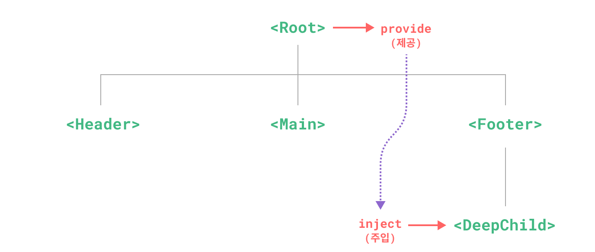

# Provide / Inject {#provide-inject}

> 이 페이지는 이미 [컴포넌트 기본](/guide/essentials/component-basics)을 읽었다고 가정합니다. 컴포넌트(component)가 처음이라면 먼저 해당 내용을 읽어보세요.

## Prop Drilling {#prop-drilling}

일반적으로 부모에서 자식 컴포넌트로 데이터를 전달할 때는 [props](/guide/components/props)를 사용합니다. 하지만, 큰 컴포넌트 트리에서 깊이 중첩된 컴포넌트가 먼 조상 컴포넌트의 무언가가 필요하다고 상상해보세요. props만으로는 동일한 prop을 전체 부모 체인에 걸쳐 전달해야 합니다:


<!-- https://www.figma.com/file/yNDTtReM2xVgjcGVRzChss/prop-drilling -->

`<Footer>` 컴포넌트가 이러한 prop에 전혀 관심이 없더라도, `<DeepChild>`가 접근할 수 있도록 prop을 선언하고 전달해야 한다는 점에 주목하세요. 부모 체인이 더 길어진다면 더 많은 컴포넌트가 영향을 받게 됩니다. 이를 "props drilling"이라고 하며, 확실히 다루기 번거롭습니다.

`provide`와 `inject`를 사용하면 props drilling 문제를 해결할 수 있습니다. 부모 컴포넌트는 모든 자손을 위한 **의존성 제공자** 역할을 할 수 있습니다. 자손 트리 내의 어떤 컴포넌트든, 깊이에 상관없이 부모 체인 상단의 컴포넌트가 제공한 의존성을 **주입**할 수 있습니다.



<!-- https://www.figma.com/file/PbTJ9oXis5KUawEOWdy2cE/provide-inject -->

## Provide {#provide}

<div class="composition-api">

컴포넌트의 자손에게 데이터를 제공하려면 [`provide()`](/api/composition-api-dependency-injection#provide) 함수를 사용하세요:

```vue
<script setup>
import { provide } from 'vue'

provide(/* key */ 'message', /* value */ 'hello!')
</script>
```

`<script setup>`을 사용하지 않는 경우, `provide()`는 반드시 `setup()` 내부에서 동기적으로 호출되어야 합니다:

```js
import { provide } from 'vue'

export default {
  setup() {
    provide(/* key */ 'message', /* value */ 'hello!')
  }
}
```

`provide()` 함수는 두 개의 인자를 받습니다. 첫 번째 인자는 **주입 키**(injection key)로, 문자열 또는 `Symbol`이 될 수 있습니다. 주입 키는 자손 컴포넌트가 주입할 값을 찾는 데 사용됩니다. 하나의 컴포넌트는 서로 다른 주입 키로 여러 번 `provide()`를 호출하여 다양한 값을 제공할 수 있습니다.

두 번째 인자는 제공할 값입니다. 값은 ref와 같은 반응형 상태를 포함하여 어떤 타입이든 될 수 있습니다:

```js
import { ref, provide } from 'vue'

const count = ref(0)
provide('key', count)
```

반응형 값을 제공하면, 제공된 값을 사용하는 자손 컴포넌트가 제공자 컴포넌트와 반응형 연결을 맺을 수 있습니다.

</div>

<div class="options-api">

컴포넌트의 자손에게 데이터를 제공하려면 [`provide`](/api/options-composition#provide) 옵션을 사용하세요:

```js
export default {
  provide: {
    message: 'hello!'
  }
}
```

`provide` 객체의 각 프로퍼티(property)에서, 키는 자식 컴포넌트가 올바른 값을 주입받는 데 사용되며, 값은 실제로 주입되는 값입니다.

인스턴스(instance)별 상태(예: `data()`로 선언된 데이터)를 제공해야 하는 경우, `provide`는 함수 값을 사용해야 합니다:

```js{7-12}
export default {
  data() {
    return {
      message: 'hello!'
    }
  },
  provide() {
    // `this`에 접근할 수 있도록 함수 문법을 사용합니다
    return {
      message: this.message
    }
  }
}
```

하지만, 이렇게 해도 주입이 **반응형이 되지는 않습니다**. 아래에서 [주입을 반응형으로 만드는 방법](#working-with-reactivity)을 다루겠습니다.

</div>

## App-level Provide {#app-level-provide}

컴포넌트에서 데이터를 제공하는 것 외에도, 앱 레벨에서 제공할 수도 있습니다:

```js
import { createApp } from 'vue'

const app = createApp({})

app.provide(/* key */ 'message', /* value */ 'hello!')
```

앱 레벨에서 제공한 값은 앱에서 렌더링(rendering)되는 모든 컴포넌트에서 사용할 수 있습니다. 이는 [플러그인(plugin)](/guide/reusability/plugins)을 작성할 때 특히 유용합니다. 플러그인은 일반적으로 컴포넌트를 통해 값을 제공할 수 없기 때문입니다.

## Inject {#inject}

<div class="composition-api">

조상 컴포넌트가 제공한 데이터를 주입하려면 [`inject()`](/api/composition-api-dependency-injection#inject) 함수를 사용하세요:

```vue
<script setup>
import { inject } from 'vue'

const message = inject('message')
</script>
```

여러 부모가 동일한 키로 데이터를 제공하는 경우, inject는 컴포넌트의 부모 체인에서 가장 가까운 부모의 값을 사용합니다.

제공된 값이 ref인 경우, 해당 값은 그대로 주입되며 **자동으로 언래핑되지 않습니다**. 이를 통해 주입자 컴포넌트가 제공자 컴포넌트와의 반응형 연결을 유지할 수 있습니다.

[반응형을 포함한 provide + inject 전체 예제](https://play.vuejs.org/#eNqFUUFugzAQ/MrKF1IpxfeIVKp66Kk/8MWFDXYFtmUbpArx967BhURRU9/WOzO7MzuxV+fKcUB2YlWovXYRAsbBvQije2d9hAk8Xo7gvB11gzDDxdseCuIUG+ZN6a7JjZIvVRIlgDCcw+d3pmvTglz1okJ499I0C3qB1dJQT9YRooVaSdNiACWdQ5OICj2WwtTWhAg9hiBbhHNSOxQKu84WT8LkNQ9FBhTHXyg1K75aJHNUROxdJyNSBVBp44YI43NvG+zOgmWWYGt7dcipqPhGZEe2ef07wN3lltD+lWN6tNkV/37+rdKjK2rzhRTt7f3u41xhe37/xJZGAL2PLECXa9NKdD/a6QTTtGnP88LgiXJtYv4BaLHhvg==)

마찬가지로, `<script setup>`을 사용하지 않는 경우 `inject()`는 반드시 `setup()` 내부에서 동기적으로 호출되어야 합니다:

```js
import { inject } from 'vue'

export default {
  setup() {
    const message = inject('message')
    return { message }
  }
}
```

</div>

<div class="options-api">

조상 컴포넌트가 제공한 데이터를 주입하려면 [`inject`](/api/options-composition#inject) 옵션을 사용하세요:

```js
export default {
  inject: ['message'],
  created() {
    console.log(this.message) // 주입된 값
  }
}
```

주입은 컴포넌트의 자체 상태보다 **먼저** 해결되므로, `data()`에서 주입된 프로퍼티에 접근할 수 있습니다:

```js
export default {
  inject: ['message'],
  data() {
    return {
      // 주입된 값을 기반으로 초기 데이터 설정
      fullMessage: this.message
    }
  }
}
```

여러 부모가 동일한 키로 데이터를 제공하는 경우, inject는 컴포넌트의 부모 체인에서 가장 가까운 부모의 값을 사용합니다.

[provide + inject 전체 예제](https://play.vuejs.org/#eNqNkcFqwzAQRH9l0EUthOhuRKH00FO/oO7B2JtERZaEvA4F43+vZCdOTAIJCImRdpi32kG8h7A99iQKobs6msBvpTNt8JHxcTC2wS76FnKrJpVLZelKR39TSUO7qreMoXRA7ZPPkeOuwHByj5v8EqI/moZeXudCIBL30Z0V0FLXVXsqIA9krU8R+XbMR9rS0mqhS4KpDbZiSgrQc5JKQqvlRWzEQnyvuc9YuWbd4eXq+TZn0IvzOeKr8FvsNcaK/R6Ocb9Uc4FvefpE+fMwP0wH8DU7wB77nIo6x6a2hvNEME5D0CpbrjnHf+8excI=)

### Injection Aliasing \* {#injection-aliasing}

`inject`의 배열 문법을 사용할 때, 주입된 프로퍼티는 동일한 키로 컴포넌트 인스턴스에 노출됩니다. 위 예제에서는 `"message"`라는 키로 제공된 프로퍼티가 `this.message`로 주입되었습니다. 로컬 키와 주입 키가 동일합니다.

다른 로컬 키로 프로퍼티를 주입하고 싶다면, `inject` 옵션에 객체 문법을 사용해야 합니다:

```js
export default {
  inject: {
    /* 로컬 키 */ localMessage: {
      from: /* 주입 키 */ 'message'
    }
  }
}
```

여기서 컴포넌트는 `"message"`라는 키로 제공된 프로퍼티를 찾아 `this.localMessage`로 노출합니다.

</div>

### Injection Default Values {#injection-default-values}

기본적으로, `inject`는 주입된 키가 부모 체인 어딘가에서 제공된다고 가정합니다. 만약 키가 제공되지 않은 경우 런타임 경고가 발생합니다.

주입된 프로퍼티가 선택적 제공자와 함께 동작하도록 하려면, props와 유사하게 기본값을 선언해야 합니다:

<div class="composition-api">

```js
// "message"에 해당하는 데이터가 제공되지 않았다면
// `value`는 "default value"가 됩니다
const value = inject('message', 'default value')
```

경우에 따라 기본값을 함수 호출이나 새 클래스 인스턴스화로 생성해야 할 수도 있습니다. 선택적 값이 사용되지 않을 때 불필요한 연산이나 부작용을 피하려면, 기본값 생성에 팩토리 함수를 사용할 수 있습니다:

```js
const value = inject('key', () => new ExpensiveClass(), true)
```

세 번째 인자는 기본값을 팩토리 함수로 처리해야 함을 나타냅니다.

</div>

<div class="options-api">

```js
export default {
  // 주입에 기본값을 선언할 때는
  // 객체 문법이 필요합니다
  inject: {
    message: {
      from: 'message', // 주입 키가 동일하다면 생략 가능
      default: 'default value'
    },
    user: {
      // 생성 비용이 크거나, 컴포넌트 인스턴스마다 고유해야 하는
      // 비원시값에는 팩토리 함수를 사용하세요.
      default: () => ({ name: 'John' })
    }
  }
}
```

</div>

## Working with Reactivity {#working-with-reactivity}

<div class="composition-api">

반응형 provide / inject 값을 사용할 때는, **가능하다면 반응형 상태의 모든 변경을 _제공자_ 내부에서만 처리하는 것이 좋습니다**. 이렇게 하면 제공된 상태와 그 변이 로직이 동일 컴포넌트에 위치하게 되어, 향후 유지보수가 쉬워집니다.

주입자 컴포넌트에서 데이터를 업데이트해야 할 때도 있습니다. 이런 경우, 상태 변이를 담당하는 함수를 함께 제공하는 것을 권장합니다:

```vue{7-9,13}
<!-- 제공자 컴포넌트 내부 -->
<script setup>
import { provide, ref } from 'vue'

const location = ref('North Pole')

function updateLocation() {
  location.value = 'South Pole'
}

provide('location', {
  location,
  updateLocation
})
</script>
```

```vue{5}
<!-- 주입자 컴포넌트에서 -->
<script setup>
import { inject } from 'vue'

const { location, updateLocation } = inject('location')
</script>

<template>
  <button @click="updateLocation">{{ location }}</button>
</template>
```

마지막으로, `provide`를 통해 전달되는 데이터가 주입자 컴포넌트에서 변경되지 않도록 하려면 [`readonly()`](/api/reactivity-core#readonly)로 감쌀 수 있습니다.

```vue
<script setup>
import { ref, provide, readonly } from 'vue'

const count = ref(0)
provide('read-only-count', readonly(count))
</script>
```

</div>

<div class="options-api">

주입이 제공자와 반응형으로 연결되도록 하려면, [computed()](/api/reactivity-core#computed) 함수를 사용해 계산 속성(computed property)을 제공해야 합니다:

```js{12}
import { computed } from 'vue'

export default {
  data() {
    return {
      message: 'hello!'
    }
  },
  provide() {
    return {
      // 계산 속성을 명시적으로 제공
      message: computed(() => this.message)
    }
  }
}
```

[반응형을 포함한 provide + inject 전체 예제](https://play.vuejs.org/#eNqNUctqwzAQ/JVFFyeQxnfjBEoPPfULqh6EtYlV9EKWTcH43ytZtmPTQA0CsdqZ2dlRT16tPXctkoKUTeWE9VeqhbLGeXirheRwc0ZBds7HKkKzBdBDZZRtPXIYJlzqU40/I4LjjbUyIKmGEWw0at8UgZrUh1PscObZ4ZhQAA596/RcAShsGnbHArIapTRBP74O8Up060wnOO5QmP0eAvZyBV+L5jw1j2tZqsMp8yWRUHhUVjKPoQIohQ460L0ow1FeKJlEKEnttFweijJfiORElhCf5f3umObb0B9PU/I7kk17PJj7FloN/2t7a2Pj/Zkdob+x8gV8ZlMs2de/8+14AXwkBngD9zgVqjg2rNXPvwjD+EdlHilrn8MvtvD1+Q==)

`computed()` 함수는 주로 Composition API 컴포넌트에서 사용되지만, Options API의 특정 용례를 보완하는 데도 사용할 수 있습니다. [반응성(reactivity) 기초](/guide/essentials/reactivity-fundamentals)와 [계산 속성](/guide/essentials/computed)에서 Composition API로 API 선호도를 설정해 더 자세히 배울 수 있습니다.

</div>

## Symbol 키 사용하기 {#working-with-symbol-keys}

지금까지 예제에서는 문자열 주입 키를 사용했습니다. 많은 의존성 제공자가 있는 대규모 애플리케이션을 개발하거나, 다른 개발자가 사용할 컴포넌트를 작성하는 경우, 잠재적 충돌을 피하기 위해 [Symbol](https://developer.mozilla.org/ko/docs/Web/JavaScript/Reference/Global_Objects/Symbol) 주입 키를 사용하는 것이 가장 좋습니다.

Symbol을 별도의 파일에 export하는 것이 권장됩니다:

```js [keys.js]
export const myInjectionKey = Symbol()
```

<div class="composition-api">

```js
// 제공자 컴포넌트에서
import { provide } from 'vue'
import { myInjectionKey } from './keys.js'

provide(myInjectionKey, {
  /* 제공할 데이터 */
})
```

```js
// 주입자 컴포넌트에서
import { inject } from 'vue'
import { myInjectionKey } from './keys.js'

const injected = inject(myInjectionKey)
```

참고: [Provide / Inject 타입 지정](/guide/typescript/composition-api#typing-provide-inject) <sup class="vt-badge ts" />

</div>

<div class="options-api">

```js
// 제공자 컴포넌트에서
import { myInjectionKey } from './keys.js'

export default {
  provide() {
    return {
      [myInjectionKey]: {
        /* 제공할 데이터 */
      }
    }
  }
}
```

```js
// 주입자 컴포넌트에서
import { myInjectionKey } from './keys.js'

export default {
  inject: {
    injected: { from: myInjectionKey }
  }
}
```

</div>
