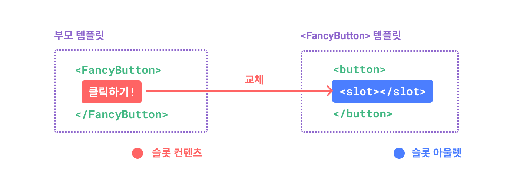
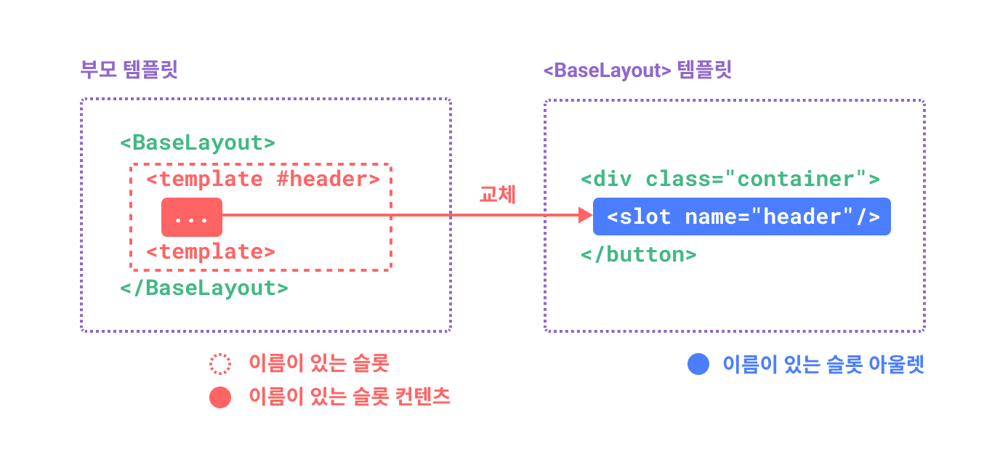

# 슬롯 {#slots}

> 이 페이지는 이미 [컴포넌트 기본](/guide/essentials/component-basics)을 읽었다고 가정합니다. 컴포넌트가 처음이라면 먼저 해당 내용을 읽어보세요.

<VueSchoolLink href="https://vueschool.io/lessons/vue-3-component-slots" title="무료 Vue.js 슬롯 강의"/>

## 슬롯 콘텐츠와 아웃렛 {#slot-content-and-outlet}

우리는 컴포넌트가 props를 받아들일 수 있다는 것을 배웠습니다. props는 어떤 타입의 JavaScript 값도 될 수 있습니다. 그렇다면 템플릿 콘텐츠는 어떨까요? 어떤 경우에는 템플릿 조각을 자식 컴포넌트에 전달하고, 자식 컴포넌트가 자신의 템플릿 내에서 해당 조각을 렌더링하도록 하고 싶을 수 있습니다.

예를 들어, 다음과 같이 사용할 수 있는 `<FancyButton>` 컴포넌트가 있다고 가정해봅시다:

```vue-html{2}
<FancyButton>
  Click me! <!-- 슬롯 콘텐츠 -->
</FancyButton>
```

`<FancyButton>`의 템플릿은 다음과 같습니다:

```vue-html{2}
<button class="fancy-btn">
  <slot></slot> <!-- 슬롯 아웃렛 -->
</button>
```

`<slot>` 요소는 **슬롯 아웃렛**으로, 부모에서 제공한 **슬롯 콘텐츠**가 렌더링될 위치를 나타냅니다.



<!-- https://www.figma.com/file/LjKTYVL97Ck6TEmBbstavX/slot -->

그리고 최종적으로 렌더링된 DOM은 다음과 같습니다:

```html
<button class="fancy-btn">Click me!</button>
```

<div class="composition-api">

[플레이그라운드에서 실행해보기](https://play.vuejs.org/#eNpdUdlqAyEU/ZVbQ0kLMdNsXabTQFvoV8yLcRkkjopLSQj596oTwqRvnuM9y9UT+rR2/hs5qlHjqZM2gOch2m2rZW+NC/BDND1+xRCMBuFMD9N5NeKyeNrqphrUSZdA4L1VJPCEAJrRdCEAvpWke+g5NHcYg1cmADU6cB0A4zzThmYckqimupqiGfpXILe/zdwNhaki3n+0SOR5vAu6ReU++efUajtqYGJQ/FIg5w8Wt9FlOx+OKh/nV1c4ZVNqlHE1TIQQ7xnvCN13zkTNalBSc+Jw5wiTac2H1WLDeDeDyXrJVm9LWG7uE3hev3AhHge1cYwnO200L4QljEnd1bCxB1g82UNhe+I6qQs5kuGcE30NrxeaRudzOWtkemeXuHP5tLIKOv8BN+mw3w==)

</div>
<div class="options-api">

[플레이그라운드에서 실행해보기](https://play.vuejs.org/#eNpdUdtOwzAM/RUThAbSurIbl1ImARJf0ZesSapoqROlKdo07d9x0jF1SHmIT+xzcY7sw7nZTy9Zwcqu9tqFTYW6ddYH+OZYHz77ECyC8raFySwfYXFsUiFAhXKfBoRUvDcBjhGtLbGgxNAVcLziOlVIp8wvelQE2TrDg6QKoBx1JwDgy+h6B62E8ibLoDM2kAAGoocsiz1VKMfmCCrzCymbsn/GY95rze1grja8694rpmJ/tg1YsfRO/FE134wc2D4YeTYQ9QeKa+mUrgsHE6+zC+vfjoz1Bdwqpd5iveX1rvG2R1GA0Si5zxrPhaaY98v5WshmCrerhVi+LmCxvqPiafUslXoYpq0XkuiQ1p4Ax4XQ2BSwdnuYP7p9QlvuG40JHI1lUaenv3o5w3Xvu2jOWU179oQNn5aisNMvLBvDOg==)

</div>

슬롯을 사용하면 `<FancyButton>`이 바깥쪽 `<button>`(및 그 화려한 스타일링)을 렌더링하는 역할을 하며, 내부 콘텐츠는 부모 컴포넌트에서 제공합니다.

슬롯을 이해하는 또 다른 방법은 JavaScript 함수와 비교하는 것입니다:

```js
// 부모 컴포넌트가 슬롯 콘텐츠를 전달
FancyButton('Click me!')

// FancyButton이 자신의 템플릿에서 슬롯 콘텐츠를 렌더링
function FancyButton(slotContent) {
  return `<button class="fancy-btn">
      ${slotContent}
    </button>`
}
```

슬롯 콘텐츠는 텍스트에만 국한되지 않습니다. 유효한 템플릿 콘텐츠라면 무엇이든 될 수 있습니다. 예를 들어, 여러 요소나 다른 컴포넌트도 전달할 수 있습니다:

```vue-html
<FancyButton>
  <span style="color:red">Click me!</span>
  <AwesomeIcon name="plus" />
</FancyButton>
```

<div class="composition-api">

[플레이그라운드에서 실행해보기](https://play.vuejs.org/#eNp1UmtOwkAQvspQYtCEgrx81EqCJibeoX+W7bRZaHc3+1AI4QyewH8ewvN4Aa/gbgtNIfFf5+vMfI/ZXbCQcvBmMYiCWFPFpAGNxsp5wlkphTLwQjjdPlljBIdMiRJ6g2EL88O9pnnxjlqU+EpbzS3s0BwPaypH4gqDpSyIQVcBxK3VFQDwXDC6hhJdlZi4zf3fRKwl4aDNtsDHJKCiECqiW8KTYH5c1gEnwnUdJ9rCh/XeM6Z42AgN+sFZAj6+Ux/LOjFaEK2diMz3h0vjNfj/zokuhPFU3lTdfcpShVOZcJ+DZgHs/HxtCrpZlj34eknoOlfC8jSCgnEkKswVSRlyczkZzVLM+9CdjtPJ/RjGswtX3ExvMcuu6mmhUnTruOBYAZKkKeN5BDO5gdG13FRoSVTOeAW2xkLPY3UEdweYWqW9OCkYN6gctq9uXllx2Z09CJ9dJwzBascI7nBYihWDldUGMqEgdTVIq6TQqCEMfUpNSD+fX7/fH+3b7P8AdGP6wA==)

</div>
<div class="options-api">

[플레이그라운드에서 실행해보기](https://play.vuejs.org/#eNptUltu2zAQvMpGQZEWsOzGiftQ1QBpgQK9g35oaikwkUiCj9aGkTPkBPnLIXKeXCBXyJKKBdoIoA/tYGd3doa74tqY+b+ARVXUjltp/FWj5GC09fCHKb79FbzXCoTVA5zNFxkWaWdT8/V/dHrAvzxrzrC3ZoBG4SYRWhQs9B52EeWapihU3lWwyxfPDgbfNYq+ejEppcLjYHrmkSqAOqMmAOB3L/ktDEhV4+v8gMR/l1M7wxQ4v+3xZ1Nw3Wtb8S1TTXG1H3cCJIO69oxc5mLUcrSrXkxSi1lxZGT0//CS9Wg875lzJELE/nLto4bko69dr31cFc8auw+3JHvSEfQ7nwbsHY9HwakQ4kes14zfdlYH1VbQS4XMlp1lraRMPl6cr1rsZnB6uWwvvi9hufpAxZfLryjEp5GtbYs0TlGICTCsbaXqKliZDZx/NpuEDsx2UiUwo5VxT6Dkv73BPFgXxRktlUdL2Jh6OoW8O3pX0buTsoTgaCNQcDjoGwk3wXkQ2tJLGzSYYI126KAso0uTSc8Pjy9P93k2d6+NyRKa)

</div>

슬롯을 사용함으로써 `<FancyButton>`은 더 유연하고 재사용 가능해집니다. 이제 다양한 위치에서 서로 다른 내부 콘텐츠와 함께 사용할 수 있지만, 모두 동일한 화려한 스타일을 적용받습니다.

Vue 컴포넌트의 슬롯 메커니즘은 [네이티브 웹 컴포넌트 `<slot>` 요소](https://developer.mozilla.org/en-US/docs/Web/HTML/Element/slot)에서 영감을 받았지만, 이후에 살펴볼 추가적인 기능들이 있습니다.

## 렌더 스코프 {#render-scope}

슬롯 콘텐츠는 부모 컴포넌트의 데이터 스코프에 접근할 수 있습니다. 왜냐하면 슬롯 콘텐츠는 부모에서 정의되기 때문입니다. 예를 들어:

```vue-html
<span>{{ message }}</span>
<FancyButton>{{ message }}</FancyButton>
```

여기서 두 <span v-pre>`{{ message }}`</span> 보간은 동일한 내용을 렌더링합니다.

슬롯 콘텐츠는 자식 컴포넌트의 데이터에는 **접근할 수 없습니다**. Vue 템플릿의 표현식은 정의된 스코프에만 접근할 수 있는데, 이는 JavaScript의 렉시컬 스코프와 일치합니다. 다시 말해:

> 부모 템플릿의 표현식은 부모 스코프에만 접근할 수 있고, 자식 템플릿의 표현식은 자식 스코프에만 접근할 수 있습니다.

## 폴백 콘텐츠 {#fallback-content}

경우에 따라 슬롯에 대해 폴백(즉, 기본) 콘텐츠를 지정하는 것이 유용할 수 있습니다. 이는 슬롯에 아무런 콘텐츠가 제공되지 않았을 때만 렌더링됩니다. 예를 들어, `<SubmitButton>` 컴포넌트에서:

```vue-html
<button type="submit">
  <slot></slot>
</button>
```

부모가 슬롯 콘텐츠를 제공하지 않은 경우 `<button>` 내부에 "Submit"이라는 텍스트가 렌더링되길 원할 수 있습니다. "Submit"을 폴백 콘텐츠로 만들려면 `<slot>` 태그 사이에 넣으면 됩니다:

```vue-html{3}
<button type="submit">
  <slot>
    Submit <!-- 폴백 콘텐츠 -->
  </slot>
</button>
```

이제 부모 컴포넌트에서 `<SubmitButton>`을 사용할 때 슬롯에 아무런 콘텐츠도 제공하지 않으면:

```vue-html
<SubmitButton />
```

폴백 콘텐츠인 "Submit"이 렌더링됩니다:

```html
<button type="submit">Submit</button>
```

하지만 콘텐츠를 제공하면:

```vue-html
<SubmitButton>Save</SubmitButton>
```

제공된 콘텐츠가 대신 렌더링됩니다:

```html
<button type="submit">Save</button>
```

<div class="composition-api">

[플레이그라운드에서 실행해보기](https://play.vuejs.org/#eNp1kMsKwjAQRX9lzMaNbfcSC/oL3WbT1ikU8yKZFEX8d5MGgi2YVeZxZ86dN7taWy8B2ZlxP7rZEnikYFuhZ2WNI+jCoGa6BSKjYXJGwbFufpNJfhSaN1kflTEgVFb2hDEC4IeqguARpl7KoR8fQPgkqKpc3Wxo1lxRWWeW+Y4wBk9x9V9d2/UL8g1XbOJN4WAntodOnrecQ2agl8WLYH7tFyw5olj10iR3EJ+gPCxDFluj0YS6EAqKR8mi9M3Td1ifLxWShcU=)

</div>
<div class="options-api">

[플레이그라운드에서 실행해보기](https://play.vuejs.org/#eNp1UEEOwiAQ/MrKxYu1d4Mm+gWvXChuk0YKpCyNxvh3lxIb28SEA8zuDDPzEucQ9mNCcRAymqELdFKu64MfCK6p6Tu6JCLvoB18D9t9/Qtm4lY5AOXwMVFu2OpkCV4ZNZ51HDqKhwLAQjIjb+X4yHr+mh+EfbCakF8AclNVkCJCq61ttLkD4YOgqsp0YbGesJkVBj92NwSTIrH3v7zTVY8oF8F4SdazD7ET69S5rqXPpnigZ8CjEnHaVyInIp5G63O6XIGiIlZMzrGMd8RVfR0q4lIKKV+L+srW+wNTTZq3)

</div>

## 네임드 슬롯 {#named-slots}

하나의 컴포넌트에 여러 슬롯 아웃렛이 필요할 때가 있습니다. 예를 들어, 다음과 같은 템플릿을 가진 `<BaseLayout>` 컴포넌트가 있다고 가정해봅시다:

```vue-html
<div class="container">
  <header>
    <!-- 여기에 헤더 콘텐츠가 필요합니다 -->
  </header>
  <main>
    <!-- 여기에 메인 콘텐츠가 필요합니다 -->
  </main>
  <footer>
    <!-- 여기에 푸터 콘텐츠가 필요합니다 -->
  </footer>
</div>
```

이런 경우 `<slot>` 요소에는 특별한 속성인 `name`이 있습니다. 이를 사용해 서로 다른 슬롯에 고유한 ID를 할당할 수 있으므로, 콘텐츠가 어디에 렌더링될지 결정할 수 있습니다:

```vue-html
<div class="container">
  <header>
    <slot name="header"></slot>
  </header>
  <main>
    <slot></slot>
  </main>
  <footer>
    <slot name="footer"></slot>
  </footer>
</div>
```

`name`이 없는 `<slot>` 아웃렛은 암묵적으로 "default"라는 이름을 가집니다.

`<BaseLayout>`을 사용하는 부모 컴포넌트에서는, 서로 다른 슬롯 아웃렛을 대상으로 하는 여러 슬롯 콘텐츠 조각을 전달할 방법이 필요합니다. 이때 **네임드 슬롯**이 사용됩니다.

네임드 슬롯을 전달하려면, `v-slot` 디렉티브가 있는 `<template>` 요소를 사용하고, `v-slot`에 슬롯 이름을 인자로 전달해야 합니다:

```vue-html
<BaseLayout>
  <template v-slot:header>
    <!-- header 슬롯을 위한 콘텐츠 -->
  </template>
</BaseLayout>
```

`v-slot`에는 전용 축약형 `#`이 있으므로, `<template v-slot:header>`는 `<template #header>`로 줄일 수 있습니다. 이는 "이 템플릿 조각을 자식 컴포넌트의 'header' 슬롯에 렌더링하라"는 의미로 생각할 수 있습니다.



<!-- https://www.figma.com/file/2BhP8gVZevttBu9oUmUUyz/named-slot -->

다음은 축약형 문법을 사용해 세 개의 슬롯 모두에 콘텐츠를 전달하는 코드입니다:

```vue-html
<BaseLayout>
  <template #header>
    <h1>Here might be a page title</h1>
  </template>

  <template #default>
    <p>A paragraph for the main content.</p>
    <p>And another one.</p>
  </template>

  <template #footer>
    <p>Here's some contact info</p>
  </template>
</BaseLayout>
```

컴포넌트가 기본 슬롯과 네임드 슬롯을 모두 허용할 때, 모든 최상위의 `<template>`이 아닌 노드는 암묵적으로 기본 슬롯의 콘텐츠로 처리됩니다. 따라서 위 코드는 다음과 같이 쓸 수도 있습니다:

```vue-html
<BaseLayout>
  <template #header>
    <h1>Here might be a page title</h1>
  </template>

  <!-- 암묵적 기본 슬롯 -->
  <p>A paragraph for the main content.</p>
  <p>And another one.</p>

  <template #footer>
    <p>Here's some contact info</p>
  </template>
</BaseLayout>
```

이제 `<template>` 요소 안의 모든 내용이 해당 슬롯에 전달됩니다. 최종적으로 렌더링되는 HTML은 다음과 같습니다:

```html
<div class="container">
  <header>
    <h1>Here might be a page title</h1>
  </header>
  <main>
    <p>A paragraph for the main content.</p>
    <p>And another one.</p>
  </main>
  <footer>
    <p>Here's some contact info</p>
  </footer>
</div>
```

<div class="composition-api">

[플레이그라운드에서 실행해보기](https://play.vuejs.org/#eNp9UsFuwjAM/RWrHLgMOi5o6jIkdtphn9BLSF0aKU2ixEVjiH+fm8JoQdvRfu/5xS8+ZVvvl4cOsyITUQXtCSJS5zel1a13geBdRvyUR9cR1MG1MF/mt1YvnZdW5IOWVVwQtt5IQq4AxI2cau5ccZg1KCsMlz4jzWrzgQGh1fuGYIcgwcs9AmkyKHKGLyPykcfD1Apr2ZmrHUN+s+U5Qe6D9A3ULgA1bCK1BeUsoaWlyPuVb3xbgbSOaQGcxRH8v3XtHI0X8mmfeYToWkxmUhFoW7s/JvblJLERmj1l0+T7T5tqK30AZWSMb2WW3LTFUGZXp/u8o3EEVrbI9AFjLn8mt38fN9GIPrSp/p4/Yoj7OMZ+A/boN9KInPeZZpAOLNLRDAsPZDgN4p0L/NQFOV/Ayn9x6EZXMFNKvQ4E5YwLBczW6/WlU3NIi6i/sYDn5Qu2qX1OF51MsvMPkrIEHg==)

</div>
<div class="options-api">

[플레이그라운드에서 실행해보기](https://play.vuejs.org/#eNp9UkFuwjAQ/MoqHLiUpFxQlaZI9NRDn5CLSTbEkmNb9oKgiL934wRwQK3ky87O7njGPicba9PDHpM8KXzlpKV1qWVnjSP4FB6/xcnsCRpnOpin2R3qh+alBig1HgO9xkbsFcG5RyvDOzRq8vkAQLSury+l5lNkN1EuCDurBCFXAMWdH2pGrn2YtShqdCPOnXa5/kKH0MldS7BFEGDFDoEkKSwybo8rskjjaevo4L7Wrje8x4mdE7aFxjiglkWE1GxQE9tLi8xO+LoGoQ3THLD/qP2/dGMMxYZs8DP34E2HQUxUBFI35o+NfTlJLOomL8n04frXns7W8gCVEt5/lElQkxpdmVyVHvP2yhBo0SHThx5z+TEZvl1uMlP0oU3nH/kRo3iMI9Ybes960UyRsZ9pBuGDeTqpwfBAvn7NrXF81QUZm8PSHjl0JWuYVVX1PhAqo4zLYbZarUak4ZAWXv5gDq/pG3YBHn50EEkuv5irGBk=)

</div>

다시 한 번, 네임드 슬롯을 JavaScript 함수에 비유하면 더 잘 이해할 수 있습니다:

```js
// 서로 다른 이름의 여러 슬롯 조각을 전달
BaseLayout({
  header: `...`,
  default: `...`,
  footer: `...`
})

// <BaseLayout>이 이를 서로 다른 위치에 렌더링
function BaseLayout(slots) {
  return `<div class="container">
      <header>${slots.header}</header>
      <main>${slots.default}</main>
      <footer>${slots.footer}</footer>
    </div>`
}
```

## 조건부 슬롯 {#conditional-slots}

때로는 슬롯에 콘텐츠가 전달되었는지 여부에 따라 무언가를 렌더링하고 싶을 수 있습니다.

이럴 때는 [$slots](/api/component-instance.html#slots) 속성과 [v-if](/guide/essentials/conditional.html#v-if)를 조합해 사용할 수 있습니다.

아래 예제에서는 `header`, `footer`, 그리고 `default`라는 세 개의 조건부 슬롯이 있는 Card 컴포넌트를 정의합니다.
header / footer / default에 대한 콘텐츠가 있을 때, 추가 스타일링을 제공하기 위해 래핑하고자 합니다:

```vue-html
<template>
  <div class="card">
    <div v-if="$slots.header" class="card-header">
      <slot name="header" />
    </div>
    
    <div v-if="$slots.default" class="card-content">
      <slot />
    </div>
    
    <div v-if="$slots.footer" class="card-footer">
      <slot name="footer" />
    </div>
  </div>
</template>
```

[플레이그라운드에서 실행해보기](https://play.vuejs.org/#eNqVVMtu2zAQ/BWCLZBLIjVoTq4aoA1yaA9t0eaoCy2tJcYUSZCUKyPwv2dJioplOw4C+EDuzM4+ONYT/aZ1tumBLmhhK8O1IxZcr29LyTutjCN3zNRkZVRHLrLcXzz9opRFHvnIxIuDTgvmAG+EFJ4WTnhOCPnQAqvBjHFE2uvbh5Zbgj/XAolwkWN4TM33VI/UalixXvjyo5yeqVVKOpCuyP0ob6utlHL7vUE3U4twkWP4hJq/jiPP4vSSOouNrHiTPVolcclPnl3SSnWaCzC/teNK2pIuSEA8xoRQ/3+GmDM9XKZ41UK1PhF/tIOPlfSPAQtmAyWdMMdMAy7C9/9+wYDnCexU3QtknwH/glWi9z1G2vde1tj2Hi90+yNYhcvmwd4PuHabhvKNeuYu8EuK1rk7M/pLu5+zm5BXyh1uMdnOu3S+95pvSCWYtV9xQcgqaXogj2yu+AqBj1YoZ7NosJLOEq5S9OXtPZtI1gFSppx8engUHs+vVhq9eVhq9ORRrXdpRyseSqfo6SmmnONK6XTw9yis24q448wXSG+0VAb3sSDXeiBoDV6TpWDV+ktENatrdMGCfAoBfL1JYNzzpINJjVFoJ9yKUKho19ul6OFQ6UYPx1rjIpPYeXIc/vXCgjetawzbni0dPnhhJ3T3DMVSruI=)

## 동적 슬롯 이름 {#dynamic-slot-names}

[동적 디렉티브 인자](/guide/essentials/template-syntax.md#dynamic-arguments)는 `v-slot`에서도 동작하므로, 동적으로 슬롯 이름을 정의할 수 있습니다:

```vue-html
<base-layout>
  <template v-slot:[dynamicSlotName]>
    ...
  </template>

  <!-- 축약형 사용 -->
  <template #[dynamicSlotName]>
    ...
  </template>
</base-layout>
```

이때 표현식은 [동적 디렉티브 인자의 문법 제약](/guide/essentials/template-syntax.md#dynamic-argument-syntax-constraints)을 따릅니다.

## 스코프드 슬롯 {#scoped-slots}

[렌더 스코프](#render-scope)에서 논의한 것처럼, 슬롯 콘텐츠는 자식 컴포넌트의 상태에 접근할 수 없습니다.

하지만 슬롯의 콘텐츠가 부모 스코프와 자식 스코프의 데이터를 모두 사용할 수 있으면 유용한 경우가 있습니다. 이를 위해서는 자식이 슬롯을 렌더링할 때 데이터를 슬롯에 전달할 방법이 필요합니다.

실제로 우리는 그렇게 할 수 있습니다. 컴포넌트에 props를 전달하듯이, 슬롯 아웃렛에도 속성을 전달할 수 있습니다:

```vue-html
<!-- <MyComponent> 템플릿 -->
<div>
  <slot :text="greetingMessage" :count="1"></slot>
</div>
```

슬롯 props를 받는 방법은 단일 기본 슬롯을 사용할 때와 네임드 슬롯을 사용할 때 약간 다릅니다. 먼저 단일 기본 슬롯을 사용할 때, 자식 컴포넌트 태그에 직접 `v-slot`을 사용해 props를 받는 방법을 보여드리겠습니다:

```vue-html
<MyComponent v-slot="slotProps">
  {{ slotProps.text }} {{ slotProps.count }}
</MyComponent>
```



<!-- https://www.figma.com/file/QRneoj8eIdL1kw3WQaaEyc/scoped-slot -->

<div class="composition-api">

[플레이그라운드에서 실행해보기](https://play.vuejs.org/#eNp9kMEKgzAMhl8l9OJlU3aVOhg7C3uAXsRlTtC2tFE2pO++dA5xMnZqk+b/8/2dxMnadBxQ5EL62rWWwCMN9qh021vjCMrn2fBNoya4OdNDkmarXhQnSstsVrOOC8LedhVhrEiuHca97wwVSsTj4oz1SvAUgKJpgqWZEj4IQoCvZm0Gtgghzss1BDvIbFkqdmID+CNdbbQnaBwitbop0fuqQSgguWPXmX+JePe1HT/QMtJBHnE51MZOCcjfzPx04JxsydPzp2Szxxo7vABY1I/p)

</div>
<div class="options-api">

[플레이그라운드에서 실행해보기](https://play.vuejs.org/#eNqFkNFqxCAQRX9l8CUttAl9DbZQ+rzQD/AlJLNpwKjoJGwJ/nvHpAnusrAg6FzHO567iE/nynlCUQsZWj84+lBmGJ31BKffL8sng4bg7O0IRVllWnpWKAOgDF7WBx2em0kTLElt975QbwLkhkmIyvCS1TGXC8LR6YYwVSTzH8yvQVt6VyJt3966oAR38XhaFjjEkvBCECNcia2d2CLyOACZQ7CDrI6h4kXcAF7lcg+za6h5et4JPdLkzV4B9B6RBtOfMISmxxqKH9TarrGtATxMgf/bDfM/qExEUCdEDuLGXAmoV06+euNs2JK7tyCrzSNHjX9aurQf)

</div>

자식이 슬롯에 전달한 props는 해당 `v-slot` 디렉티브의 값으로 사용할 수 있으며, 슬롯 내부의 표현식에서 접근할 수 있습니다.

스코프드 슬롯을 자식 컴포넌트에 전달되는 함수로 생각할 수 있습니다. 자식 컴포넌트는 이를 호출하면서 props를 인자로 전달합니다:

```js
MyComponent({
  // 기본 슬롯을 함수로 전달
  default: (slotProps) => {
    return `${slotProps.text} ${slotProps.count}`
  }
})

function MyComponent(slots) {
  const greetingMessage = 'hello'
  return `<div>${
    // 슬롯 함수를 props와 함께 호출!
    slots.default({ text: greetingMessage, count: 1 })
  }</div>`
}
```

실제로, 이것은 스코프드 슬롯이 컴파일되는 방식과 수동 [렌더 함수](/guide/extras/render-function)에서 스코프드 슬롯을 사용하는 방식과 매우 유사합니다.

`v-slot="slotProps"`가 슬롯 함수 시그니처와 일치하는 것에 주목하세요. 함수 인자와 마찬가지로, `v-slot`에서 구조 분해 할당을 사용할 수도 있습니다:

```vue-html
<MyComponent v-slot="{ text, count }">
  {{ text }} {{ count }}
</MyComponent>
```

### 네임드 스코프드 슬롯 {#named-scoped-slots}

네임드 스코프드 슬롯도 비슷하게 동작합니다. 슬롯 props는 `v-slot` 디렉티브의 값으로 접근할 수 있습니다: `v-slot:name="slotProps"`. 축약형을 사용할 때는 다음과 같습니다:

```vue-html
<MyComponent>
  <template #header="headerProps">
    {{ headerProps }}
  </template>

  <template #default="defaultProps">
    {{ defaultProps }}
  </template>

  <template #footer="footerProps">
    {{ footerProps }}
  </template>
</MyComponent>
```

네임드 슬롯에 props를 전달하는 방법:

```vue-html
<slot name="header" message="hello"></slot>
```

슬롯의 `name`은 예약어이므로 props에 포함되지 않는다는 점에 유의하세요. 따라서 `headerProps`는 `{ message: 'hello' }`가 됩니다.

네임드 슬롯과 기본 스코프드 슬롯을 혼합해서 사용할 경우, 기본 슬롯에는 명시적으로 `<template>` 태그를 사용해야 합니다. 컴포넌트에 직접 `v-slot` 디렉티브를 배치하면 컴파일 오류가 발생합니다. 이는 기본 슬롯의 props 스코프에 대한 모호성을 방지하기 위함입니다. 예를 들어:

```vue-html
<!-- <MyComponent> 템플릿 -->
<div>
  <slot :message="hello"></slot>
  <slot name="footer" />
</div>
```

```vue-html
<!-- 이 템플릿은 컴파일되지 않습니다 -->
<MyComponent v-slot="{ message }">
  <p>{{ message }}</p>
  <template #footer>
    <!-- message는 기본 슬롯에 속하며, 여기서는 사용할 수 없습니다 -->
    <p>{{ message }}</p>
  </template>
</MyComponent>
```

기본 슬롯에 명시적인 `<template>` 태그를 사용하면, `message` prop이 다른 슬롯 내부에서는 사용할 수 없다는 점이 명확해집니다:

```vue-html
<MyComponent>
  <!-- 명시적 기본 슬롯 사용 -->
  <template #default="{ message }">
    <p>{{ message }}</p>
  </template>

  <template #footer>
    <p>Here's some contact info</p>
  </template>
</MyComponent>
```

### 화려한 리스트 예제 {#fancy-list-example}

스코프드 슬롯의 좋은 사용 사례가 무엇일지 궁금할 수 있습니다. 예를 들어, `<FancyList>` 컴포넌트가 아이템 목록을 렌더링한다고 가정해봅시다. 이 컴포넌트는 원격 데이터 로딩, 데이터를 사용한 목록 표시, 심지어 페이지네이션이나 무한 스크롤 같은 고급 기능까지 로직을 캡슐화할 수 있습니다. 하지만 각 아이템의 스타일링은 이 컴포넌트를 사용하는 부모에게 맡기고 싶습니다. 원하는 사용법은 다음과 같을 수 있습니다:

```vue-html
<FancyList :api-url="url" :per-page="10">
  <template #item="{ body, username, likes }">
    <div class="item">
      <p>{{ body }}</p>
      <p>by {{ username }} | {{ likes }} likes</p>
    </div>
  </template>
</FancyList>
```

`<FancyList>` 내부에서는, 서로 다른 아이템 데이터를 사용해 동일한 `<slot>`을 여러 번 렌더링할 수 있습니다(객체를 슬롯 props로 전달하기 위해 `v-bind`를 사용하는 것에 주목하세요):

```vue-html
<ul>
  <li v-for="item in items">
    <slot name="item" v-bind="item"></slot>
  </li>
</ul>
```

<div class="composition-api">

[플레이그라운드에서 실행해보기](https://play.vuejs.org/#eNqFU2Fv0zAQ/StHJtROapNuZTBCNwnQQKBpTGxCQss+uMml8+bYlu2UlZL/zjlp0lQa40sU3/nd3Xv3vA7eax0uSwziYGZTw7UDi67Up4nkhVbGwScm09U5tw5yowoYhFEX8cBBImdRgyQMHRwWWjCHdAKYbdFM83FpxEkS0DcJINZoxpotkCIHkySo7xOixcMep19KrmGustUISotGsgJHIPgDWqg6DKEyvoRUMGsJ4HG9HGX16bqpAlU1izy5baqDFegYweYroMttMwLAHx/Y9Kyan36RWUTN2+mjXfpbrei8k6SjdSuBYFOlMaNI6AeAtcflSrqx5b8xhkl4jMU7H0yVUCaGvVeH8+PjKYWqWnpf5DQYBTtb+fc612Awh2qzzGaBiUyVpBVpo7SFE8gw5xIv/Wl4M9gsbjCCQbuywe3+FuXl9iiqO7xpElEEhUofKFQo2mTGiFiOLr3jcpFImuiaF6hKNxzuw8lpw7kuEy6ZKJGK3TR6NluLYXBVqwRXQjkLn0ueIc3TLonyZ0sm4acqKVovKIbDCVQjGsb1qvyg2telU4Yzz6eHv6ARBWdwjVqUNCbbFjqgQn6aW1J8RKfJhDg+5/lStG4QHJZjnpO5XjT0BMqFu+uZ81yxjEQJw7A1kOA76FyZjaWBy0akvu8tCQKeQ+d7wsy5zLpz1FlzU3kW1QP+x40ApWgWAySEJTv6/NitNMkllcTakwCaZZ5ADEf6cROas/RhYVQps5igEpkZLwzRROmG04OjDBcj7+Js+vYQDo9e0uH1qzeY5/s1vtaaqG969+vTTrsmBTMLLv12nuy7l+d5W673SBzxkzlfhPdWSXokdZMkSFWhuUDzTTtOnk6CuG2fBEwI9etrHXOmRLJUE0/vMH14In5vH30sCS4Nkr+WmARdztHQ6Jr02dUFPtJ/lyxUVgq6/UzyO1olSj9jc+0DcaWxe/fqab/UT51Uu7Znjw6lbUn5QWtR6vtJQM//4zPUt+NOw+lGzCqo/gLm1QS8)

</div>
<div class="options-api">

[플레이그라운드에서 실행해보기](https://play.vuejs.org/#eNqNVNtq20AQ/ZWpQnECujhO0qaqY+hD25fQl4RCifKwllbKktXushcT1/W/d1bSSnYJNCCEZmbPmcuZ1S76olS6cTTKo6UpNVN2VQjWKqktfCOi3N4yY6HWsoVZmo0eD5kVAqAQ9KU7XNGaOG5h572lRAZBhTV574CJzJv7QuCzzMaMaFjaKk4sRQtgOeUmiiVO85siwncRQa6oThRpKHrO50XUnUdEwMMJw08M7mAtq20MzlAtSEtj4OyZGkweMIiq2AZKToxBgMcdxDCqVrueBfb7ZaaOQiOspZYgbL0FPBySIQD+eMeQc99/HJIsM0weqs+O258mjfZREE1jt5yCKaWiFXpSX0A/5loKmxj2m+YwT69p+7kXg0udw8nlYn19fYGufvSeZBXF0ZGmR2vwmrJKS4WiPswGWWYxzIIgs8fYH6mIJadnQXdNrdMiWAB+yJ7gsXdgLfjqcK10wtJqgmYZ+spnpGgl6up5oaa2fGKi6U8Yau9ZS6Wzpwi7WU1p7BMzaZcLbuBh0q2XM4fZXTc+uOPSGvjuWEWxlaAexr9uiIBf0qG3Uy6HxXwo9B+mn47CvbNSM+LHccDxAyvmjMA9Vdxh1WQiO0eywBVGEaN3Pj972wVxPKwOZ7BJWI2b+K5rOOVUNPbpYJNvJalwZmmahm3j7AhdSz3sPzDRS3R4SQwOCXxP4yVBzJqJarSzcY8H5mXWFfif1QVwPGjGcQWTLp7YrcLxCfyDdAuMW0cq30AOV+plcK1J+dxoXJkqR6igRCeNxjbxp3N6cX5V0Sb2K19dfFrA4uo9Gh8uP9K6Puvw3eyx9SH3IT/qPCZpiW6Y8Gq9mvekrutAN96o/V99ALPj)

</div>

### 렌더리스 컴포넌트 {#renderless-components}

위에서 논의한 `<FancyList>` 사용 사례는 재사용 가능한 로직(데이터 페칭, 페이지네이션 등)과 시각적 출력 모두를 캡슐화하면서, 시각적 출력의 일부는 스코프드 슬롯을 통해 소비자 컴포넌트에 위임합니다.

이 개념을 조금 더 확장하면, 로직만 캡슐화하고 자체적으로 아무것도 렌더링하지 않는 컴포넌트를 만들 수 있습니다. 시각적 출력은 전적으로 스코프드 슬롯을 통해 소비자 컴포넌트에 위임됩니다. 이러한 유형의 컴포넌트를 **렌더리스 컴포넌트**라고 부릅니다.

예를 들어, 현재 마우스 위치를 추적하는 로직을 캡슐화한 렌더리스 컴포넌트는 다음과 같을 수 있습니다:

```vue-html
<MouseTracker v-slot="{ x, y }">
  Mouse is at: {{ x }}, {{ y }}
</MouseTracker>
```

<div class="composition-api">

[플레이그라운드에서 실행해보기](https://play.vuejs.org/#eNqNUcFqhDAQ/ZUhF12w2rO4Cz301t5aaCEX0dki1SQko6uI/96J7i4qLPQQmHmZ9+Y9ZhQvxsRdiyIVmStsZQgcUmtOUlWN0ZbgXbcOP2xe/KKFs9UNBHGyBj09kCpLFj4zuSFsTJ0T+o6yjUb35GpNRylG6CMYYJKCpwAkzWNQOcgphZG/YZoiX/DQNAttFjMrS+6LRCT2rh6HGsHiOQKtmKIIS19+qmZpYLrmXIKxM1Vo5Yj9HD0vfD7ckGGF3LDWlOyHP/idYPQCfdzldTtjscl/8MuDww78lsqHVHdTYXjwCpdKlfoS52X52qGit8oRKrRhwHYdNrrDILouPbCNVZCtgJ1n/6Xx8JYAmT8epD3fr5cC0oGLQYpkd4zpD27R0vA=)

</div>
<div class="options-api">

[플레이그라운드에서 실행해보기](https://play.vuejs.org/#eNqVUU1rwzAM/SvCl7SQJTuHdLDDbttthw18MbW6hjW2seU0oeS/T0lounQfUDBGepaenvxO4tG5rIkoClGGra8cPUhT1c56ghcbA756tf1EDztva0iy/Ds4NCbSAEiD7diicafigeA0oFvLPAYNhWICYEE5IL00fMp8Hs0JYe0OinDIqFyIaO7CwdJGihO0KXTcLriK59NYBlUARTyMn6Hv0yHgIp7ARAvl3FXm8yCRiuu1Fv/x23JakVqtz3t5pOjNOQNoC7hPz0nHyRSzEr7Ghxppb/XlZ6JjRlzhTAlA+ypkLWwAM6c+8G2BdzP+/pPbRkOoL/KOldH2mCmtnxr247kKhAb9KuHKgLVtMEkn2knG+sIVzV9sfmy8hfB/swHKwV0oWja4lQKKjoNOivzKrf4L/JPqaQ==)

</div>

흥미로운 패턴이긴 하지만, 렌더리스 컴포넌트로 달성할 수 있는 대부분의 기능은 컴포지션 API를 사용하면 더 효율적으로 구현할 수 있으며, 불필요한 컴포넌트 중첩의 오버헤드도 피할 수 있습니다. 이후에 동일한 마우스 추적 기능을 [컴포저블](/guide/reusability/composables)로 구현하는 방법을 살펴볼 것입니다.

그렇다고 해도, `<FancyList>` 예제처럼 로직을 캡슐화하면서 **시각적 출력도 조합**해야 하는 경우에는 여전히 스코프드 슬롯이 유용합니다.
