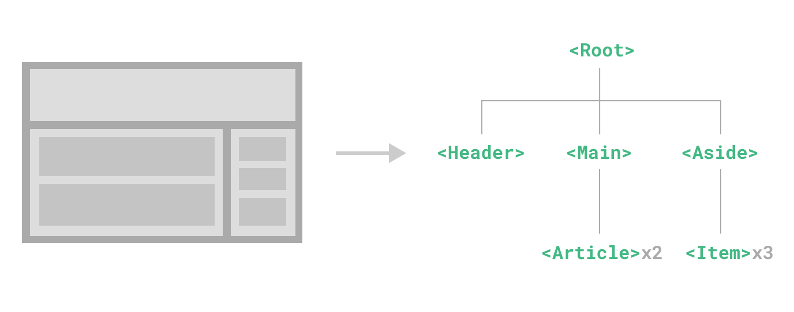

# 컴포넌트 기본 {#components-basics}

<ScrimbaLink href="https://scrimba.com/links/vue-component-basics" title="무료 Vue.js 컴포넌트 기본 강의" type="scrimba">
  Scrimba에서 인터랙티브 비디오 강의를 시청하세요
</ScrimbaLink>

컴포넌트를 사용하면 UI를 독립적이고 재사용 가능한 조각으로 분할하고, 각 조각을 개별적으로 생각할 수 있습니다. 앱이 중첩된 컴포넌트의 트리 구조로 구성되는 것이 일반적입니다:



<!-- https://www.figma.com/file/qa7WHDQRWuEZNRs7iZRZSI/components -->

이는 우리가 네이티브 HTML 요소를 중첩하는 방식과 매우 유사하지만, Vue는 각 컴포넌트에 맞춤형 콘텐츠와 로직을 캡슐화할 수 있는 자체 컴포넌트 모델을 구현합니다. Vue는 네이티브 웹 컴포넌트와도 잘 호환됩니다. Vue 컴포넌트와 네이티브 웹 컴포넌트의 관계가 궁금하다면, [여기에서 더 읽어보세요](/guide/extras/web-components).

## 컴포넌트 정의하기 {#defining-a-component}

빌드 단계를 사용할 때, 일반적으로 각 Vue 컴포넌트를 `.vue` 확장자를 사용하는 전용 파일에 정의합니다. 이를 [싱글 파일 컴포넌트](/guide/scaling-up/sfc) (SFC)라고 합니다:

<div class="options-api">

```vue
<script>
export default {
  data() {
    return {
      count: 0
    }
  }
}
</script>

<template>
  <button @click="count++">You clicked me {{ count }} times.</button>
</template>
```

</div>
<div class="composition-api">

```vue
<script setup>
import { ref } from 'vue'

const count = ref(0)
</script>

<template>
  <button @click="count++">You clicked me {{ count }} times.</button>
</template>
```

</div>

빌드 단계를 사용하지 않을 때는, Vue 컴포넌트를 Vue 전용 옵션을 포함하는 일반 JavaScript 객체로 정의할 수 있습니다:

<div class="options-api">

```js
export default {
  data() {
    return {
      count: 0
    }
  },
  template: `
    <button @click="count++">
      You clicked me {{ count }} times.
    </button>`
}
```

</div>
<div class="composition-api">

```js
import { ref } from 'vue'

export default {
  setup() {
    const count = ref(0)
    return { count }
  },
  template: `
    <button @click="count++">
      You clicked me {{ count }} times.
    </button>`
  // DOM 내 템플릿을 대상으로 할 수도 있습니다:
  // template: '#my-template-element'
}
```

</div>

여기서는 템플릿이 JavaScript 문자열로 인라인되어 있으며, Vue가 이를 즉석에서 컴파일합니다. 또한 ID 선택자를 사용하여 요소(일반적으로 네이티브 `<template>` 요소)를 지정할 수도 있습니다. Vue는 해당 요소의 내용을 템플릿 소스로 사용합니다.

위 예제는 하나의 컴포넌트를 정의하고 `.js` 파일의 기본 내보내기로 내보내지만, 명명된 내보내기를 사용하여 동일한 파일에서 여러 컴포넌트를 내보낼 수도 있습니다.

## 컴포넌트 사용하기 {#using-a-component}

:::tip
이 가이드의 나머지 부분에서는 SFC 문법을 사용할 것입니다. 빌드 단계를 사용하든 아니든 컴포넌트에 대한 개념은 동일합니다. [예제](/examples/) 섹션에서는 두 가지 시나리오 모두에서 컴포넌트 사용법을 보여줍니다.
:::

자식 컴포넌트를 사용하려면, 부모 컴포넌트에서 이를 import해야 합니다. 카운터 컴포넌트를 `ButtonCounter.vue`라는 파일에 넣었다고 가정하면, 해당 컴포넌트는 파일의 기본 내보내기로 노출됩니다:

<div class="options-api">

```vue
<script>
import ButtonCounter from './ButtonCounter.vue'

export default {
  components: {
    ButtonCounter
  }
}
</script>

<template>
  <h1>Here is a child component!</h1>
  <ButtonCounter />
</template>
```

import한 컴포넌트를 템플릿에서 사용하려면, `components` 옵션으로 [등록](/guide/components/registration)해야 합니다. 그러면 등록된 키를 태그로 사용하여 컴포넌트를 사용할 수 있습니다.

</div>

<div class="composition-api">

```vue
<script setup>
import ButtonCounter from './ButtonCounter.vue'
</script>

<template>
  <h1>Here is a child component!</h1>
  <ButtonCounter />
</template>
```

`<script setup>`을 사용하면, import한 컴포넌트가 자동으로 템플릿에서 사용할 수 있게 됩니다.

</div>

컴포넌트를 전역으로 등록하여, 앱 내 모든 컴포넌트에서 import 없이 사용할 수도 있습니다. 전역 등록과 지역 등록의 장단점은 [컴포넌트 등록](/guide/components/registration) 섹션에서 다룹니다.

컴포넌트는 원하는 만큼 여러 번 재사용할 수 있습니다:

```vue-html
<h1>Here are many child components!</h1>
<ButtonCounter />
<ButtonCounter />
<ButtonCounter />
```

<div class="options-api">

[Playground에서 실행해보기](https://play.vuejs.org/#eNqVUE1LxDAQ/StjLqusNHotcfHj4l8QcontLBtsJiGdiFL6301SdrEqyEJyeG9m3ps3k3gIoXlPKFqhxi7awDtN1gUfGR4Ts6cnn4gxwj56B5tGrtgyutEEoAk/6lCPe5MGhqmwnc9KhMRjuxCwFi3UrCk/JU/uGTC6MBjGglgdbnfPGBFM/s7QJ3QHO/TfxC+UzD21d72zPItU8uQrrsWvnKsT/ZW2N2wur45BI3KKdETlFlmphZsF58j/RgdQr3UJuO8G273daVFFtlstahngxSeoNezBIUzTYgPzDGwdjk1VkYvMj4jzF0nwsyQ=)

</div>
<div class="composition-api">

[Playground에서 실행해보기](https://play.vuejs.org/#eNqVj91KAzEQhV/lmJsqlY3eSlr8ufEVhNys6ZQGNz8kE0GWfXez2SJUsdCLuZiZM9+ZM4qnGLvPQuJBqGySjYxMXOJWe+tiSIznwhz8SyieKWGfgsOqkyfTGbDSXsmFUG9rw+Ti0DPNHavD/faVEqGv5Xr/BXOwww4mVBNPnvOVklXTtKeO8qKhkj++4lb8+fL/mCMS7TEdAy6BtDfBZ65fVgA2s+L67uZMUEC9N0s8msGaj40W7Xa91qKtgbdQ0Ha0gyOM45E+TWDrKHeNIhfMr0DTN4U0me8=)

</div>

버튼을 클릭할 때마다 각 버튼이 자신의 `count` 값을 별도로 유지하는 것을 알 수 있습니다. 이는 컴포넌트를 사용할 때마다 새로운 **인스턴스**가 생성되기 때문입니다.

SFC에서는 자식 컴포넌트의 태그 이름에 `PascalCase`를 사용하는 것이 권장됩니다. 이는 네이티브 HTML 요소와 구분하기 위함입니다. 네이티브 HTML 태그 이름은 대소문자를 구분하지 않지만, Vue SFC는 컴파일된 포맷이므로 대소문자를 구분하는 태그 이름을 사용할 수 있습니다. 또한 태그를 `/>`로 닫을 수도 있습니다.

템플릿을 DOM에 직접 작성하는 경우(예: 네이티브 `<template>` 요소의 내용으로), 템플릿은 브라우저의 네이티브 HTML 파싱 동작을 따릅니다. 이런 경우 컴포넌트에 대해 `kebab-case`와 명시적 닫는 태그를 사용해야 합니다:

```vue-html
<!-- 이 템플릿이 DOM에 작성된 경우 -->
<button-counter></button-counter>
<button-counter></button-counter>
<button-counter></button-counter>
```

자세한 내용은 [in-DOM 템플릿 파싱 주의사항](#in-dom-template-parsing-caveats)을 참고하세요.

## Props 전달하기 {#passing-props}

블로그를 만든다고 가정하면, 블로그 포스트를 나타내는 컴포넌트가 필요할 것입니다. 모든 블로그 포스트가 동일한 시각적 레이아웃을 공유하되, 내용은 다르게 하고 싶습니다. 이런 컴포넌트는, 표시할 특정 포스트의 제목과 내용 등 데이터를 전달할 수 없다면 쓸모가 없습니다. 이때 props가 필요합니다.

Props는 컴포넌트에 등록할 수 있는 사용자 지정 속성입니다. 블로그 포스트 컴포넌트에 제목을 전달하려면, 이 컴포넌트가 허용하는 props 목록에 이를 선언해야 합니다. <span class="options-api">[`props`](/api/options-state#props) 옵션</span><span class="composition-api">[`defineProps`](/api/sfc-script-setup#defineprops-defineemits) 매크로</span>를 사용합니다:

<div class="options-api">

```vue
<!-- BlogPost.vue -->
<script>
export default {
  props: ['title']
}
</script>

<template>
  <h4>{{ title }}</h4>
</template>
```

prop 속성에 값을 전달하면, 해당 값이 컴포넌트 인스턴스의 속성이 됩니다. 이 속성의 값은 템플릿 내와 컴포넌트의 `this` 컨텍스트에서 다른 컴포넌트 속성과 마찬가지로 접근할 수 있습니다.

</div>
<div class="composition-api">

```vue
<!-- BlogPost.vue -->
<script setup>
defineProps(['title'])
</script>

<template>
  <h4>{{ title }}</h4>
</template>
```

`defineProps`는 `<script setup>` 내부에서만 사용할 수 있는 컴파일 타임 매크로이며, 명시적으로 import할 필요가 없습니다. 선언된 props는 자동으로 템플릿에 노출됩니다. `defineProps`는 또한 컴포넌트에 전달된 모든 props를 포함하는 객체를 반환하므로, 필요하다면 JavaScript에서 접근할 수 있습니다:

```js
const props = defineProps(['title'])
console.log(props.title)
```

참고: [컴포넌트 Props 타입 지정](/guide/typescript/composition-api#typing-component-props) <sup class="vt-badge ts" />

`<script setup>`을 사용하지 않는 경우, props는 `props` 옵션을 사용해 선언해야 하며, props 객체는 `setup()`의 첫 번째 인수로 전달됩니다:

```js
export default {
  props: ['title'],
  setup(props) {
    console.log(props.title)
  }
}
```

</div>

컴포넌트는 원하는 만큼 많은 props를 가질 수 있으며, 기본적으로 어떤 값이든 어떤 prop에든 전달할 수 있습니다.

prop이 등록되면, 다음과 같이 사용자 지정 속성으로 데이터를 전달할 수 있습니다:

```vue-html
<BlogPost title="My journey with Vue" />
<BlogPost title="Blogging with Vue" />
<BlogPost title="Why Vue is so fun" />
```

하지만 일반적인 앱에서는 부모 컴포넌트에 포스트 배열이 있을 것입니다:

<div class="options-api">

```js
export default {
  // ...
  data() {
    return {
      posts: [
        { id: 1, title: 'My journey with Vue' },
        { id: 2, title: 'Blogging with Vue' },
        { id: 3, title: 'Why Vue is so fun' }
      ]
    }
  }
}
```

</div>
<div class="composition-api">

```js
const posts = ref([
  { id: 1, title: 'My journey with Vue' },
  { id: 2, title: 'Blogging with Vue' },
  { id: 3, title: 'Why Vue is so fun' }
])
```

</div>

그런 다음, `v-for`를 사용해 각 포스트마다 컴포넌트를 렌더링하고 싶을 것입니다:

```vue-html
<BlogPost
  v-for="post in posts"
  :key="post.id"
  :title="post.title"
 />
```

<div class="options-api">

[Playground에서 실행해보기](https://play.vuejs.org/#eNp9UU1rhDAU/CtDLrawVfpxklRo74We2kPtQdaoaTUJ8bmtiP+9ia6uC2VBgjOZeXnz3sCejAkPnWAx4+3eSkNJqmRjtCU817p81S2hsLpBEEYL4Q1BqoBUid9Jmosi62rC4Nm9dn4lFLXxTGAt5dG482eeUXZ1vdxbQZ1VCwKM0zr3x4KBATKPcbsDSapFjOClx5d2JtHjR1KFN9fTsfbWcXdy+CZKqcqL+vuT/r3qvQqyRatRdMrpF/nn/DNhd7iPR+v8HCDRmDoj4RHxbfyUDjeFto8p8yEh1Rw2ZV4JxN+iP96FMvest8RTTws/gdmQ8HUr7ikere+yHduu62y//y3NWG38xIOpeODyXcoE8OohGYZ5VhhHHjl83sD4B3XgyGI=)

</div>
<div class="composition-api">

[Playground에서 실행해보기](https://play.vuejs.org/#eNp9kU9PhDAUxL/KpBfWBCH+OZEuid5N9qSHrQezFKhC27RlDSF8d1tYQBP1+N78OpN5HciD1sm54yQj1J6M0A6Wu07nTIpWK+MwwPASI0qjWkQejVbpsVHVQVl30ZJ0WQRHjwFMnpT0gPZLi32w2h2DMEAUGW5iOOEaniF66vGuOiN5j0/hajx7B4zxxt5ubIiphKz+IO828qXugw5hYRXKTnqSydcrJmk61/VF/eB4q5s3x8Pk6FJjauDO16Uye0ZCBwg5d2EkkED2wfuLlogibMOTbMpf9tMwP8jpeiMfRdM1l8Tk+/F++Y6Cl0Lyg1Ha7o7R5Bn9WwSg9X0+DPMxMI409fPP1PELlVmwdQ==)

</div>

동적 prop 값을 전달할 때는 [`v-bind` 문법](/api/built-in-directives#v-bind) (`:title="post.title"`)을 사용하는 것에 주목하세요. 이는 미리 렌더링할 내용을 알 수 없을 때 특히 유용합니다.

지금은 props에 대해 이 정도만 알면 충분하지만, 이 페이지를 다 읽고 내용을 익힌 후에는 [Props](/guide/components/props) 전체 가이드를 다시 읽어보시길 권장합니다.

## 이벤트 리스닝 {#listening-to-events}

`<BlogPost>` 컴포넌트를 개발하다 보면, 일부 기능은 부모에게 다시 소통해야 할 필요가 있습니다. 예를 들어, 블로그 포스트의 텍스트를 확대하는 접근성 기능을 추가하고 싶을 수 있습니다. 이때 페이지의 나머지 부분은 기본 크기를 유지합니다.

부모에서는 `postFontSize` <span class="options-api">data 속성</span><span class="composition-api">ref</span>을 추가하여 이 기능을 지원할 수 있습니다:

<div class="options-api">

```js{6}
data() {
  return {
    posts: [
      /* ... */
    ],
    postFontSize: 1
  }
}
```

</div>
<div class="composition-api">

```js{5}
const posts = ref([
  /* ... */
])

const postFontSize = ref(1)
```

</div>

이 값을 템플릿에서 사용하여 모든 블로그 포스트의 글꼴 크기를 제어할 수 있습니다:

```vue-html{1,7}
<div :style="{ fontSize: postFontSize + 'em' }">
  <BlogPost
    v-for="post in posts"
    :key="post.id"
    :title="post.title"
   />
</div>
```

이제 `<BlogPost>` 컴포넌트의 템플릿에 버튼을 추가해봅시다:

```vue{5}
<!-- BlogPost.vue, <script> 생략 -->
<template>
  <div class="blog-post">
    <h4>{{ title }}</h4>
    <button>Enlarge text</button>
  </div>
</template>
```

버튼은 아직 아무 동작도 하지 않습니다. 버튼을 클릭하면 부모에게 모든 포스트의 텍스트를 확대하라고 알려야 합니다. 이 문제를 해결하기 위해, 컴포넌트는 커스텀 이벤트 시스템을 제공합니다. 부모는 자식 컴포넌트 인스턴스의 어떤 이벤트든 `v-on` 또는 `@`로 리스닝할 수 있습니다. 이는 네이티브 DOM 이벤트와 동일합니다:

```vue-html{3}
<BlogPost
  ...
  @enlarge-text="postFontSize += 0.1"
 />
```

그런 다음 자식 컴포넌트는 내장 [**`$emit`** 메서드](/api/component-instance#emit)를 호출하여 자신에게 이벤트를 발생시킬 수 있습니다. 이벤트 이름을 전달합니다:

```vue{5}
<!-- BlogPost.vue, <script> 생략 -->
<template>
  <div class="blog-post">
    <h4>{{ title }}</h4>
    <button @click="$emit('enlarge-text')">Enlarge text</button>
  </div>
</template>
```

`@enlarge-text="postFontSize += 0.1"` 리스너 덕분에, 부모는 이벤트를 받아 `postFontSize` 값을 업데이트합니다.

<div class="options-api">

[Playground에서 실행해보기](https://play.vuejs.org/#eNqNUsFOg0AQ/ZUJMaGNbbHqidCmmujNxMRED9IDhYWuhV0CQy0S/t1ZYIEmaiRkw8y8N/vmMZVxl6aLY8EM23ByP+Mprl3Bk1RmCPexjJ5ljhBmMgFzYemEIpiuAHAFOzXQgIVeESNUKutL4gsmMLfbBPStVFTP1Bl46E2mup4xLDKhI4CUsMR+1zFABTywYTkD5BgzG8ynEj4kkVgJnxz38Eqaut5jxvXAUCIiLqI/8TcD/m1fKhTwHHIJYSEIr+HbnqikPkqBL/yLSMs23eDooNexel8pQJaksYeMIgAn4EewcyxjtnKNCsK+zbgpXILJEnW30bCIN7ZTPcd5KDNqoWjARWufa+iyfWBlV13wYJRvJtWVJhiKGyZiL4vYHNkJO8wgaQVXi6UGr51+Ndq5LBqMvhyrH9eYGePtOVu3n3YozWSqFsBsVJmt3SzhzVaYY2nm9l82+7GX5zTGjlTM1SyNmy5SeX+7rqr2r0NdOxbFXWVXIEoBGz/m/oHIF0rB5Pz6KTV6aBOgEo7Vsn51ov4GgAAf2A==)

</div>
<div class="composition-api">

[Playground에서 실행해보기](https://play.vuejs.org/#eNp1Uk1PwkAQ/SuTxqQYgYp6ahaiJngzITHRA/UAZQor7W7TnaK16X93th8UEuHEvPdm5s3bls5Tmo4POTq+I0yYyZTAIOXpLFAySXVGUEKGEVQQZToBl6XukXqO9XahDbXc2OsAO5FlAIEKtWJByqCBqR01WFqiBLnxYTIEkhSjD+5rAV86zxQW8C1pB+88Aaphr73rtXbNVqrtBeV9r/zYFZYHacBoiHLFykB9Xgfq1NmLVvQmf7E1OGFaeE0anAMXhEkarwhtRWIjD+AbKmKcBk4JUdvtn8+6ARcTu87hLuCf6NJpSoDDKNIZj7BtIFUTUuB0tL/HomXHcnOC18d1TF305COqeJVtcUT4Q62mtzSF2/GkE8/E8b1qh8Ljw/if8I7nOkPn9En/+Ug2GEmFi0ynZrB0azOujbfB54kki5+aqumL8bING28Yr4xh+2vePrI39CnuHmZl2TwwVJXwuG6ZdU6kFTyGsQz33HyFvH5wvvyaB80bACwgvKbrYgLVH979DQc=)

</div>

발생시키는 이벤트를 <span class="options-api">[`emits`](/api/options-state#emits) 옵션</span><span class="composition-api">[`defineEmits`](/api/sfc-script-setup#defineprops-defineemits) 매크로</span>로 선언할 수도 있습니다:

<div class="options-api">

```vue{5}
<!-- BlogPost.vue -->
<script>
export default {
  props: ['title'],
  emits: ['enlarge-text']
}
</script>
```

</div>
<div class="composition-api">

```vue{4}
<!-- BlogPost.vue -->
<script setup>
defineProps(['title'])
defineEmits(['enlarge-text'])
</script>
```

</div>

이렇게 하면 컴포넌트가 발생시키는 모든 이벤트를 문서화하고, [유효성 검사](/guide/components/events#events-validation)를 선택적으로 수행할 수 있습니다. 또한 Vue가 해당 이벤트를 자식 컴포넌트의 루트 요소에 네이티브 리스너로 암묵적으로 적용하는 것을 방지할 수 있습니다.

<div class="composition-api">

`defineProps`와 마찬가지로, `defineEmits`는 `<script setup>`에서만 사용할 수 있으며 import할 필요가 없습니다. 이 함수는 `$emit` 메서드와 동등한 `emit` 함수를 반환합니다. `<script setup>` 섹션에서는 `$emit`에 직접 접근할 수 없으므로, 이 함수를 사용해 이벤트를 발생시킬 수 있습니다:

```vue
<script setup>
const emit = defineEmits(['enlarge-text'])

emit('enlarge-text')
</script>
```

참고: [컴포넌트 Emits 타입 지정](/guide/typescript/composition-api#typing-component-emits) <sup class="vt-badge ts" />

`<script setup>`을 사용하지 않는 경우, `emits` 옵션을 사용해 발생시키는 이벤트를 선언할 수 있습니다. `emit` 함수는 setup 컨텍스트의 속성으로 접근할 수 있습니다(두 번째 인수로 전달됨):

```js
export default {
  emits: ['enlarge-text'],
  setup(props, ctx) {
    ctx.emit('enlarge-text')
  }
}
```

</div>

지금은 커스텀 컴포넌트 이벤트에 대해 이 정도만 알면 충분하지만, 이 페이지를 다 읽고 내용을 익힌 후에는 [커스텀 이벤트](/guide/components/events) 전체 가이드를 다시 읽어보시길 권장합니다.

## 슬롯을 이용한 콘텐츠 분배 {#content-distribution-with-slots}

HTML 요소와 마찬가지로, 컴포넌트에 콘텐츠를 전달할 수 있으면 유용할 때가 많습니다. 예를 들어:

```vue-html
<AlertBox>
  Something bad happened.
</AlertBox>
```

이렇게 렌더링될 수 있습니다:

:::danger 이것은 데모용 오류입니다
Something bad happened.
:::

이것은 Vue의 커스텀 `<slot>` 요소를 사용해 구현할 수 있습니다:

```vue{5}
<!-- AlertBox.vue -->
<template>
  <div class="alert-box">
    <strong>이것은 데모용 오류입니다</strong>
    <slot />
  </div>
</template>

<style scoped>
.alert-box {
  /* ... */
}
</style>
```

위에서 볼 수 있듯이, `<slot>`을 콘텐츠가 들어갈 자리의 플레이스홀더로 사용합니다. 이게 전부입니다!

<div class="options-api">

[Playground에서 실행해보기](https://play.vuejs.org/#eNpVUcFOwzAM/RUTDruwFhCaUCmThsQXcO0lbbKtIo0jx52Kpv07TreWouTynl+en52z2oWQnXqrClXGhtrA28q3XUBi2DlL/IED7Ak7WGX5RKQHq8oDVN4Oo9TYve4dwzmxDcp7bz3HAs5/LpfKyy3zuY0Atl1wmm1CXE5SQeLNX9hZPrb+ALU2cNQhWG9NNkrnLKIt89lGPahlyDTVogVAadoTNE7H+F4pnZTrGodKjUUpRyb0h+0nEdKdRL3CW7GmfNY5ZLiiMhfP/ynG0SL/OAuxwWCNMNncbVqSQyrgfrPZvCVcIxkrxFMYIKJrDZA1i8qatGl72ehLGEY6aGNkNwU8P96YWjffB8Lem/Xkvn9NR6qy+fRd14FSgopvmtQmzTT9Toq9VZdfIpa5jQ==)

</div>
<div class="composition-api">

[Playground에서 실행해보기](https://play.vuejs.org/#eNpVUEtOwzAQvcpgFt3QBBCqUAiRisQJ2GbjxG4a4Xis8aQKqnp37PyUyqv3mZn3fBVH55JLr0Umcl9T6xi85t4VpW07h8RwNJr4Cwc4EXawS9KFiGO70ubpNBcmAmDdOSNZR8T5Yg0IoOQf7DSfW9tAJRWcpXPaapWM1nVt8ObpukY8ie29GHNzAiBX7QVqI73/LIWMzn2FQylGMcieCW1TfBMhPYSoE5zFitLVZ5BhQnkadt6nGKt5/jMafI1Oq8Ak6zW4xrEaDVIGj4fD4SPiCknpQLy4ATyaVgFptVH2JFXb+wze3DDSTioV/iaD1+eZqWT92xD2Vu2X7af3+IJ6G7/UToVigpJnTzwTO42eWDnELsTtH/wUqH4=)

</div>

지금은 슬롯에 대해 이 정도만 알면 충분하지만, 이 페이지를 다 읽고 내용을 익힌 후에는 [슬롯](/guide/components/slots) 전체 가이드를 다시 읽어보시길 권장합니다.

## 동적 컴포넌트 {#dynamic-components}

탭 인터페이스처럼, 컴포넌트를 동적으로 전환해야 할 때가 있습니다:

<div class="options-api">

[Playground에서 예제 열기](https://play.vuejs.org/#eNqNVE2PmzAQ/Ssj9kArLSHbrXpwk1X31mMPvS17cIxJrICNbJMmivLfO/7AEG2jRiDkefP85sNmztlr3y8OA89ItjJMi96+VFJ0vdIWfqqOQ6NVB/midIYj5sn9Sxlrkt9b14RXzXbiMElEO5IAKsmPnljzhg6thbNDmcLdkktrSADAJ/IYlj5MXEc9Z1w8VFNLP30ed2luBy1HC4UHrVH2N90QyJ1kHnUALN1gtLeIQu6juEUMkb8H5sXHqiS+qzK1Cw3Lu76llqMFsKrFAVhLjVlXWc07VWUeR89msFbhhhAWDkWjNJIwPgjp06iy5CV7fgrOOTgKv+XoKIIgpnoGyiymSmZ1wnq9dqJweZ8p/GCtYHtUmBMdLXFitgDnc9ju68b0yxDO1WzRTEcFRLiUJsEqSw3wwi+rMpFDj0psEq5W5ax1aBp7at1y4foWzq5R0hYN7UR7ImCoNIXhWjTfnW+jdM01gaf+CEa1ooYHzvnMVWhaiwEP90t/9HBP61rILQJL3POMHw93VG+FLKzqUYx3c2yjsOaOwNeRO2B8zKHlzBKQWJNH1YHrplV/iiMBOliFILYNK5mOKdSTMviGCTyNojFdTKBoeWNT3s8f/Vpsd7cIV61gjHkXnotR6OqVkJbrQKdsv9VqkDWBh2bpnn8VXaDcHPexE4wFzsojO9eDUOSVPF+65wN/EW7sHRsi5XaFqaexn+EH9Xcpe8zG2eWG3O0/NVzUaeJMk+jGhUXlNPXulw5j8w7t2bi8X32cuf/Vv/wF/SL98A==)

</div>
<div class="composition-api">

[Playground에서 예제 열기](https://play.vuejs.org/#eNqNVMGOmzAQ/ZURe2BXCiHbrXpwk1X31mMPvS1V5RiTWAEb2SZNhPLvHdvggLZRE6TIM/P8/N5gpk/e2nZ57HhCkrVhWrQWDLdd+1pI0bRKW/iuGg6VVg2ky9wFDp7G8g9lrIl1H80Bb5rtxfFKMcRzUA+aV3AZQKEEhWRKGgus05pL+5NuYeNwj6mTkT4VckRYujVY63GT17twC6/Fr4YjC3kp5DoPNtEgBpY3bU0txwhgXYojsJoasymSkjeqSHweK9vOWoUbXIC/Y1YpjaDH3wt39hMI6TUUSYSQAz8jArPT5Mj+nmIhC6zpAu1TZlEhmXndbBwpXH5NGL6xWrADMsyaMj1lkAzQ92E7mvYe8nCcM24xZApbL5ECiHCSnP73KyseGnvh6V/XedwS2pVjv3C1ziddxNDYc+2WS9fC8E4qJW1W0UbUZwKGSpMZrkX11dW2SpdcE3huT2BULUp44JxPSpmmpegMgU/tyadbWpZC7jCxwj0v+OfTDdU7ITOrWiTjzTS3Vei8IfB5xHZ4PmqoObMEJHryWXXkuqrVn+xEgHZWYRKbh06uLyv4iQq+oIDnkXSQiwKymlc26n75WNdit78FmLWCMeZL+GKMwlKrhLRcBzhlh51WnSwJPFQr9/zLdIZ007w/O6bR4MQe2bseBJMzer5yzwf8MtzbOzYMkNsOY0+HfoZv1d+lZJGMg8fNqdsfbbio4b77uRVv7I0Li8xxZN1PHWbeHdyTWXc/+zgw/8t/+QsROe9h)

</div>

위 예제는 Vue의 `<component>` 요소와 특별한 `is` 속성으로 가능합니다:

<div class="options-api">

```vue-html
<!-- currentTab이 변경되면 컴포넌트가 변경됩니다 -->
<component :is="currentTab"></component>
```

</div>
<div class="composition-api">

```vue-html
<!-- currentTab이 변경되면 컴포넌트가 변경됩니다 -->
<component :is="tabs[currentTab]"></component>
```

</div>

위 예제에서 `:is`에 전달되는 값은 다음 중 하나일 수 있습니다:

- 등록된 컴포넌트의 이름 문자열, 또는
- 실제 import한 컴포넌트 객체

`is` 속성을 사용해 일반 HTML 요소를 생성할 수도 있습니다.

`<component :is="...">`로 여러 컴포넌트 간 전환 시, 전환된 컴포넌트는 언마운트됩니다. 비활성 컴포넌트를 "살려두려면" 내장 [`<KeepAlive>` 컴포넌트](/guide/built-ins/keep-alive)를 사용할 수 있습니다.

## in-DOM 템플릿 파싱 주의사항 {#in-dom-template-parsing-caveats}

Vue 템플릿을 DOM에 직접 작성하는 경우, Vue는 DOM에서 템플릿 문자열을 가져와야 합니다. 이로 인해 브라우저의 네이티브 HTML 파싱 동작 때문에 몇 가지 주의사항이 있습니다.

:::tip
아래에서 논의하는 제한 사항은 템플릿을 DOM에 직접 작성하는 경우에만 적용됩니다. 다음 소스의 문자열 템플릿에는 적용되지 않습니다:

- 싱글 파일 컴포넌트
- 인라인 템플릿 문자열(예: `template: '...'`)
- `<script type="text/x-template">`
  :::

### 대소문자 구분 없음 {#case-insensitivity}

HTML 태그와 속성 이름은 대소문자를 구분하지 않으므로, 브라우저는 모든 대문자를 소문자로 해석합니다. 즉, in-DOM 템플릿을 사용할 때는 PascalCase 컴포넌트 이름, camelCased prop 이름, `v-on` 이벤트 이름 모두 kebab-case(하이픈 구분)로 사용해야 합니다:

```js
// JavaScript에서는 camelCase
const BlogPost = {
  props: ['postTitle'],
  emits: ['updatePost'],
  template: `
    <h3>{{ postTitle }}</h3>
  `
}
```

```vue-html
<!-- HTML에서는 kebab-case -->
<blog-post post-title="hello!" @update-post="onUpdatePost"></blog-post>
```

### 셀프 클로징 태그 {#self-closing-tags}

이전 코드 샘플에서는 컴포넌트에 셀프 클로징 태그를 사용했습니다:

```vue-html
<MyComponent />
```

이는 Vue의 템플릿 파서가 태그 종류와 상관없이 `/>`를 태그 종료로 인식하기 때문입니다.

하지만 in-DOM 템플릿에서는 항상 명시적으로 닫는 태그를 포함해야 합니다:

```vue-html
<my-component></my-component>
```

HTML 명세상 [일부 특정 요소](https://html.spec.whatwg.org/multipage/syntax.html#void-elements)만 닫는 태그를 생략할 수 있습니다. 가장 흔한 예는 `<input>`, ``입니다. 그 외 모든 요소에서 닫는 태그를 생략하면, 네이티브 HTML 파서는 여는 태그가 끝나지 않았다고 생각합니다. 예를 들어, 다음 코드는:

```vue-html
<my-component /> <!-- 여기서 태그를 닫으려 했지만... -->
<span>hello</span>
```

다음과 같이 파싱됩니다:

```vue-html
<my-component>
  <span>hello</span>
</my-component> <!-- 브라우저는 여기서 닫습니다. -->
```

### 요소 배치 제한 {#element-placement-restrictions}

`<ul>`, `<ol>`, `<table>`, `<select>` 등 일부 HTML 요소는 내부에 올 수 있는 요소가 제한되어 있습니다. `<li>`, `<tr>`, `<option>` 등 일부 요소는 특정 요소 내부에만 올 수 있습니다.

이런 제한이 있는 요소와 함께 컴포넌트를 사용할 때 문제가 발생할 수 있습니다. 예를 들어:

```vue-html
<table>
  <blog-post-row></blog-post-row>
</table>
```

커스텀 컴포넌트 `<blog-post-row>`는 잘못된 콘텐츠로 간주되어 밖으로 이동되며, 렌더링 결과에 오류가 발생합니다. 이럴 때는 특별한 [`is` 속성](/api/built-in-special-attributes#is)을 사용할 수 있습니다:

```vue-html
<table>
  <tr is="vue:blog-post-row"></tr>
</table>
```

:::tip
네이티브 HTML 요소에서 `is`를 사용할 때는, 값 앞에 `vue:`를 붙여야 Vue 컴포넌트로 인식됩니다. 이는 네이티브 [커스텀 빌트인 요소](https://html.spec.whatwg.org/multipage/custom-elements.html#custom-elements-customized-builtin-example)와 혼동을 피하기 위함입니다.
:::

지금은 in-DOM 템플릿 파싱 주의사항에 대해 이 정도만 알면 충분합니다. 그리고 사실, 이것이 Vue의 _Essentials_의 끝입니다. 아직 배울 것이 더 있지만, 우선 Vue로 직접 무언가를 만들어보거나, 아직 보지 않았다면 [예제](/examples/)를 살펴보는 등 잠시 쉬어가시길 추천합니다.

방금 익힌 내용에 익숙해졌다면, 가이드의 다음 장으로 넘어가 컴포넌트에 대해 더 깊이 배워보세요.
