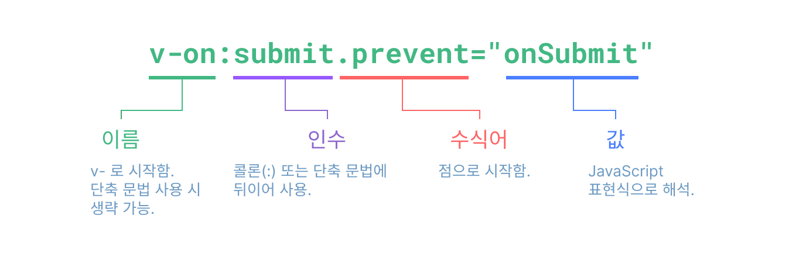

# 템플릿 문법 {#template-syntax}

<ScrimbaLink href="https://scrimba.com/links/vue-template-syntax" title="무료 Vue.js 템플릿 문법 강의" type="scrimba">
  Scrimba에서 인터랙티브 비디오 강의 시청하기
</ScrimbaLink>

Vue는 HTML 기반의 템플릿 문법을 사용하여 렌더링된 DOM을 컴포넌트 인스턴스의 데이터에 선언적으로 바인딩할 수 있게 해줍니다. 모든 Vue 템플릿은 문법적으로 유효한 HTML이기 때문에, 표준을 준수하는 브라우저와 HTML 파서에서 파싱될 수 있습니다.

내부적으로 Vue는 템플릿을 고도로 최적화된 JavaScript 코드로 컴파일합니다. 반응성(reactivity) 시스템과 결합하여, Vue는 앱 상태가 변경될 때 다시 렌더링해야 할 최소한의 컴포넌트와 최소한의 DOM 조작만을 지능적으로 파악하여 적용할 수 있습니다.

Virtual DOM 개념에 익숙하고 JavaScript의 강력한 기능을 선호한다면, 템플릿 대신 [렌더 함수](/guide/extras/render-function)를 직접 작성할 수도 있으며, 선택적으로 JSX도 지원합니다. 하지만, 이 경우 템플릿만큼의 컴파일 타임 최적화는 누릴 수 없다는 점에 유의하세요.

## 텍스트 보간 {#text-interpolation}

데이터 바인딩의 가장 기본적인 형태는 "머스태시" 문법(이중 중괄호)을 사용하는 텍스트 보간입니다:

```vue-html
<span>메시지: {{ msg }}</span>
```

머스태시 태그는 [해당 컴포넌트 인스턴스](/guide/essentials/reactivity-fundamentals#declaring-reactive-state)의 `msg` 속성 값으로 대체됩니다. 또한 `msg` 속성이 변경될 때마다 자동으로 업데이트됩니다.

## 원시 HTML {#raw-html}

이중 머스태시는 데이터를 일반 텍스트로 해석하며, HTML로 해석하지 않습니다. 실제 HTML을 출력하려면 [`v-html` 디렉티브](/api/built-in-directives#v-html)를 사용해야 합니다:

```vue-html
<p>텍스트 보간 사용: {{ rawHtml }}</p>
<p>v-html 디렉티브 사용: <span v-html="rawHtml"></span></p>
```

<script setup>
  const rawHtml = '<span style="color: red">이것은 빨간색이어야 합니다.</span>'
</script>

<div class="demo">
  <p>텍스트 보간 사용: {{ rawHtml }}</p>
  <p>v-html 디렉티브 사용: <span v-html="rawHtml"></span></p>
</div>

여기서 새로운 개념을 접하게 됩니다. `v-html` 속성은 **디렉티브**라고 부릅니다. 디렉티브는 `v-`로 시작하여 Vue에서 제공하는 특별한 속성임을 나타내며, 예상하셨듯이 렌더링된 DOM에 특별한 반응형 동작을 적용합니다. 여기서는 "이 요소의 inner HTML을 현재 활성 인스턴스의 `rawHtml` 속성과 동기화하라"고 말하는 것과 같습니다.

`span`의 내용은 `rawHtml` 속성의 값으로 대체되며, 일반 HTML로 해석됩니다. 데이터 바인딩은 무시됩니다. `v-html`을 사용하여 템플릿 일부를 조합할 수는 없습니다. Vue는 문자열 기반 템플릿 엔진이 아니기 때문입니다. 대신, UI 재사용과 조합의 기본 단위로 컴포넌트를 사용하는 것이 권장됩니다.

:::warning 보안 경고
웹사이트에서 임의의 HTML을 동적으로 렌더링하는 것은 매우 위험할 수 있습니다. [XSS 취약점](https://en.wikipedia.org/wiki/Cross-site_scripting)으로 쉽게 이어질 수 있기 때문입니다. `v-html`은 신뢰할 수 있는 콘텐츠에만 사용하고, **절대** 사용자로부터 입력받은 콘텐츠에는 사용하지 마세요.
:::

## 속성 바인딩 {#attribute-bindings}

머스태시는 HTML 속성 내부에서는 사용할 수 없습니다. 대신 [`v-bind` 디렉티브](/api/built-in-directives#v-bind)를 사용하세요:

```vue-html
<div v-bind:id="dynamicId"></div>
```

`v-bind` 디렉티브는 요소의 `id` 속성을 컴포넌트의 `dynamicId` 속성과 동기화하도록 Vue에 지시합니다. 바인딩된 값이 `null` 또는 `undefined`이면, 해당 속성은 렌더링된 요소에서 제거됩니다.

### 축약 문법 {#shorthand}

`v-bind`는 매우 자주 사용되기 때문에 전용 축약 문법이 있습니다:

```vue-html
<div :id="dynamicId"></div>
```

`:`로 시작하는 속성은 일반 HTML과는 다르게 보일 수 있지만, 실제로는 속성 이름에 사용할 수 있는 유효한 문자이며, Vue가 지원하는 모든 브라우저에서 올바르게 파싱됩니다. 또한, 최종 렌더링된 마크업에는 나타나지 않습니다. 축약 문법은 선택 사항이지만, 이후 사용법을 더 배우면 그 편리함을 알게 될 것입니다.

> 이후 가이드에서는 코드 예제에서 축약 문법을 사용할 것입니다. 이는 Vue 개발자들이 가장 많이 사용하는 방식이기 때문입니다.

### 동일 이름 축약 문법 {#same-name-shorthand}

- 3.4+에서만 지원

속성 이름이 바인딩하려는 JavaScript 변수 이름과 동일하다면, 속성 값을 생략하여 더 짧게 쓸 수 있습니다:

```vue-html
<!-- :id="id"와 동일 -->
<div :id></div>

<!-- 이것도 동작합니다 -->
<div v-bind:id></div>
```

이는 JavaScript에서 객체 선언 시 프로퍼티 축약 문법과 유사합니다. 이 기능은 Vue 3.4 이상에서만 사용할 수 있습니다.

### 불리언 속성 {#boolean-attributes}

[불리언 속성](https://html.spec.whatwg.org/multipage/common-microsyntaxes.html#boolean-attributes)은 요소에 존재 여부로 true/false 값을 나타내는 속성입니다. 예를 들어, [`disabled`](https://developer.mozilla.org/ko/docs/Web/HTML/Attributes/disabled)는 가장 많이 사용되는 불리언 속성 중 하나입니다.

이 경우 `v-bind`는 약간 다르게 동작합니다:

```vue-html
<button :disabled="isButtonDisabled">버튼</button>
```

`isButtonDisabled`가 [truthy 값](https://developer.mozilla.org/ko/docs/Glossary/Truthy)이면 `disabled` 속성이 포함됩니다. 값이 빈 문자열이어도 `<button disabled="">`와 일관성을 유지하기 위해 포함됩니다. 그 외의 [falsy 값](https://developer.mozilla.org/ko/docs/Glossary/Falsy)인 경우 속성이 생략됩니다.

### 여러 속성 동적 바인딩 {#dynamically-binding-multiple-attributes}

다음과 같이 여러 속성을 나타내는 JavaScript 객체가 있다면:

<div class="composition-api">

```js
const objectOfAttrs = {
  id: 'container',
  class: 'wrapper',
  style: 'background-color:green'
}
```

</div>
<div class="options-api">

```js
data() {
  return {
    objectOfAttrs: {
      id: 'container',
      class: 'wrapper'
    }
  }
}
```

</div>

`v-bind`에 인자 없이 사용하여 한 번에 바인딩할 수 있습니다:

```vue-html
<div v-bind="objectOfAttrs"></div>
```

## JavaScript 표현식 사용하기 {#using-javascript-expressions}

지금까지는 템플릿에서 단순한 속성 키에만 바인딩했습니다. 하지만 Vue는 모든 데이터 바인딩에서 JavaScript 표현식의 강력한 기능을 지원합니다:

```vue-html
{{ number + 1 }}

{{ ok ? 'YES' : 'NO' }}

{{ message.split('').reverse().join('') }}

<div :id="`list-${id}`"></div>
```

이러한 표현식은 현재 컴포넌트 인스턴스의 데이터 범위 내에서 JavaScript로 평가됩니다.

Vue 템플릿에서는 다음 위치에서 JavaScript 표현식을 사용할 수 있습니다:

- 텍스트 보간(머스태시) 내부
- 모든 Vue 디렉티브(즉, `v-`로 시작하는 특수 속성)의 속성 값

### 표현식만 허용 {#expressions-only}

각 바인딩에는 **하나의 표현식**만 포함될 수 있습니다. 표현식이란 값을 평가할 수 있는 코드 조각입니다. 간단히 말해, `return` 뒤에 쓸 수 있는지로 판단할 수 있습니다.

따라서, 다음과 같은 코드는 **동작하지 않습니다**:

```vue-html
<!-- 이건 표현식이 아니라 문장입니다: -->
{{ var a = 1 }}

<!-- 흐름 제어도 동작하지 않습니다. 삼항 연산자를 사용하세요 -->
{{ if (ok) { return message } }}
```

### 함수 호출하기 {#calling-functions}

바인딩 표현식 내에서 컴포넌트에 노출된 메서드를 호출할 수 있습니다:

```vue-html
<time :title="toTitleDate(date)" :datetime="date">
  {{ formatDate(date) }}
</time>
```

:::tip
바인딩 표현식 내에서 호출되는 함수는 컴포넌트가 업데이트될 때마다 호출되므로, 데이터 변경이나 비동기 작업과 같은 **부작용**이 없어야 합니다.
:::

### 제한된 전역 접근 {#restricted-globals-access}

템플릿 표현식은 샌드박스화되어 있으며, [제한된 전역 목록](https://github.com/vuejs/core/blob/main/packages/shared/src/globalsAllowList.ts#L3)에만 접근할 수 있습니다. 이 목록에는 `Math`와 `Date`와 같은 자주 사용되는 내장 전역 객체가 포함되어 있습니다.

목록에 명시적으로 포함되지 않은 전역, 예를 들어 `window`에 추가한 사용자 속성 등은 템플릿 표현식에서 접근할 수 없습니다. 하지만 [`app.config.globalProperties`](/api/application#app-config-globalproperties)에 추가하여 모든 Vue 표현식에서 사용할 전역을 명시적으로 정의할 수 있습니다.

## 디렉티브 {#directives}

디렉티브는 `v-` 접두사가 붙은 특수 속성입니다. Vue는 위에서 소개한 `v-html`과 `v-bind`를 포함하여 여러 [내장 디렉티브](/api/built-in-directives)를 제공합니다.

디렉티브 속성 값은 단일 JavaScript 표현식이어야 합니다(`v-for`, `v-on`, `v-slot`은 예외이며, 각각의 섹션에서 다룹니다). 디렉티브의 역할은 표현식의 값이 변경될 때 DOM에 반응적으로 업데이트를 적용하는 것입니다. 예를 들어 [`v-if`](/api/built-in-directives#v-if)는 다음과 같이 사용합니다:

```vue-html
<p v-if="seen">이제 나를 볼 수 있습니다</p>
```

여기서 `v-if` 디렉티브는 `seen` 표현식의 진위값에 따라 `<p>` 요소를 삽입하거나 제거합니다.

### 인자 {#arguments}

일부 디렉티브는 콜론으로 표시되는 "인자"를 받을 수 있습니다. 예를 들어, `v-bind` 디렉티브는 HTML 속성을 반응적으로 업데이트하는 데 사용됩니다:

```vue-html
<a v-bind:href="url"> ... </a>

<!-- 축약 문법 -->
<a :href="url"> ... </a>
```

여기서 `href`는 인자이며, `v-bind` 디렉티브에 요소의 `href` 속성을 `url` 표현식의 값에 바인딩하라고 지시합니다. 축약 문법에서는 인자 앞의 모든 부분(즉, `v-bind:`)이 `:` 한 글자로 축약됩니다.

또 다른 예는 DOM 이벤트를 감지하는 `v-on` 디렉티브입니다:

```vue-html
<a v-on:click="doSomething"> ... </a>

<!-- 축약 문법 -->
<a @click="doSomething"> ... </a>
```

여기서 인자는 감지할 이벤트 이름인 `click`입니다. `v-on`에도 `@`라는 축약 문법이 있습니다. 이벤트 처리에 대해서는 이후에 더 자세히 다룹니다.

### 동적 인자 {#dynamic-arguments}

디렉티브 인자에 대괄호로 감싼 JavaScript 표현식을 사용할 수도 있습니다:

```vue-html
<!--
인자 표현식에는 아래 "동적 인자 값 제약" 및 "동적 인자 문법 제약"
섹션에서 설명한 몇 가지 제약이 있습니다.
-->
<a v-bind:[attributeName]="url"> ... </a>

<!-- 축약 문법 -->
<a :[attributeName]="url"> ... </a>
```

여기서 `attributeName`은 JavaScript 표현식으로 동적으로 평가되며, 평가된 값이 최종 인자 값으로 사용됩니다. 예를 들어, 컴포넌트 인스턴스에 `attributeName` 데이터 속성이 있고 그 값이 `"href"`라면, 이 바인딩은 `v-bind:href`와 동일하게 동작합니다.

마찬가지로, 동적 인자를 사용하여 동적 이벤트 이름에 핸들러를 바인딩할 수도 있습니다:

```vue-html
<a v-on:[eventName]="doSomething"> ... </a>

<!-- 축약 문법 -->
<a @[eventName]="doSomething"> ... </a>
```

이 예시에서 `eventName`의 값이 `"focus"`라면, `v-on:[eventName]`은 `v-on:focus`와 동일하게 동작합니다.

#### 동적 인자 값 제약 {#dynamic-argument-value-constraints}

동적 인자는 문자열로 평가되어야 하며, `null`은 예외입니다. 특별한 값인 `null`은 바인딩을 명시적으로 제거하는 데 사용할 수 있습니다. 그 외의 비문자열 값은 경고를 발생시킵니다.

#### 동적 인자 문법 제약 {#dynamic-argument-syntax-constraints}

동적 인자 표현식에는 몇 가지 문법 제약이 있습니다. 공백이나 따옴표와 같은 일부 문자는 HTML 속성 이름에 사용할 수 없기 때문입니다. 예를 들어, 다음은 유효하지 않습니다:

```vue-html
<!-- 컴파일러 경고가 발생합니다. -->
<a :['foo' + bar]="value"> ... </a>
```

복잡한 동적 인자를 전달해야 한다면, [계산된 속성(computed property)](./computed)을 사용하는 것이 더 좋습니다. 이에 대해서는 곧 다룹니다.

in-DOM 템플릿(HTML 파일에 직접 작성된 템플릿)을 사용할 때는, 브라우저가 속성 이름을 소문자로 변환하므로 대문자가 포함된 키 이름을 피해야 합니다:

```vue-html
<a :[someAttr]="value"> ... </a>
```

위 코드는 in-DOM 템플릿에서 `:[someattr]`로 변환됩니다. 만약 컴포넌트에 `someAttr` 속성이 있고 `someattr`가 아니라면, 코드가 동작하지 않습니다. 싱글 파일 컴포넌트 내부의 템플릿은 **이 제약을 받지 않습니다**.

### 수식어 {#modifiers}

수식어(modifier)는 점(`.`)으로 표시되는 특수 접미사로, 디렉티브가 특별한 방식으로 바인딩되어야 함을 나타냅니다. 예를 들어, `.prevent` 수식어는 `v-on` 디렉티브에 트리거된 이벤트에서 `event.preventDefault()`를 호출하라고 지시합니다:

```vue-html
<form @submit.prevent="onSubmit">...</form>
```

이후 [v-on](./event-handling#event-modifiers)과 [v-model](./forms#modifiers)에서 수식어의 다른 예시도 살펴볼 것입니다.

마지막으로, 전체 디렉티브 문법을 시각화한 그림입니다:



<!-- https://www.figma.com/file/BGWUknIrtY9HOmbmad0vFr/Directive -->
