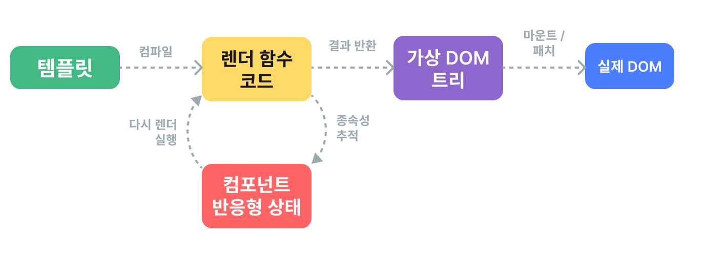

# 렌더링(rendering) 메커니즘 {#rendering-mechanism}

Vue가 템플릿(template)을 실제 DOM 노드로 어떻게 변환하는지, 그리고 Vue가 이러한 DOM 노드들을 어떻게 효율적으로 업데이트하는지 궁금하셨을 것입니다. 여기서는 Vue의 내부 렌더링 메커니즘을 살펴보며 이러한 질문들에 대해 설명해보겠습니다.

## 가상 DOM {#virtual-dom}

Vue의 렌더링 시스템이 기반하고 있는 "가상 DOM"이라는 용어를 들어보셨을 것입니다.

가상 DOM(VDOM)은 UI의 이상적이거나 "가상"인 표현을 메모리에 보관하고, 이를 "실제" DOM과 동기화하는 프로그래밍 개념입니다. 이 개념은 [React](https://react.dev/)에서 처음 도입되었으며, Vue를 포함한 많은 다른 프레임워크에서 다양한 방식으로 채택되었습니다.

가상 DOM은 특정 기술이 아니라 패턴에 가깝기 때문에, 하나의 정해진 구현 방식이 있는 것은 아닙니다. 간단한 예시로 이 개념을 설명할 수 있습니다:

```js
const vnode = {
  type: 'div',
  props: {
    id: 'hello'
  },
  children: [
    /* 더 많은 vnode들 */
  ]
}
```

여기서 `vnode`는 `<div>` 요소를 나타내는 일반 JavaScript 객체(즉, "가상 노드")입니다. 실제 요소를 생성하는 데 필요한 모든 정보를 담고 있습니다. 또한 더 많은 자식 vnode들을 포함하고 있어, 가상 DOM 트리의 루트가 됩니다.

런타임 렌더러는 가상 DOM 트리를 순회하며 실제 DOM 트리를 생성할 수 있습니다. 이 과정을 **마운트(mount)**라고 합니다.

가상 DOM 트리의 두 복사본이 있다면, 렌더러는 두 트리를 순회하고 비교하여 차이점을 찾아 실제 DOM에 변경 사항을 적용할 수 있습니다. 이 과정을 **패치**라고 하며, "디프(diffing)" 또는 "조정(reconciliation)"이라고도 합니다.

가상 DOM의 주요 이점은 개발자가 원하는 UI 구조를 선언적으로 프로그래밍적으로 생성, 검사, 조합할 수 있게 해주며, 직접적인 DOM 조작은 렌더러에 맡길 수 있다는 점입니다.

## 렌더 파이프라인 {#render-pipeline}

높은 수준에서, Vue 컴포넌트(component)가 마운트될 때 다음과 같은 일이 일어납니다:

1. **컴파일**: Vue 템플릿은 **렌더 함수**로 컴파일됩니다. 렌더 함수는 가상 DOM 트리를 반환하는 함수입니다. 이 단계는 빌드 단계에서 미리 수행할 수도 있고, 런타임 컴파일러를 사용해 실시간으로 수행할 수도 있습니다.

2. **마운트**: 런타임 렌더러가 렌더 함수를 호출하여 반환된 가상 DOM 트리를 순회하고, 이를 기반으로 실제 DOM 노드를 생성합니다. 이 단계는 [반응형 효과](./reactivity-in-depth)로 수행되므로, 사용된 모든 반응형 의존성을 추적합니다.

3. **패치**: 마운트 시 사용된 의존성이 변경되면, 효과가 다시 실행됩니다. 이때 새로운, 업데이트된 가상 DOM 트리가 생성됩니다. 런타임 렌더러는 새 트리를 순회하며 이전 트리와 비교하고, 실제 DOM에 필요한 업데이트를 적용합니다.



<!-- https://www.figma.com/file/elViLsnxGJ9lsQVsuhwqxM/Rendering-Mechanism -->

## 템플릿 vs. 렌더 함수 {#templates-vs-render-functions}

Vue 템플릿은 가상 DOM 렌더 함수로 컴파일됩니다. Vue는 또한 템플릿 컴파일 단계를 건너뛰고 직접 렌더 함수를 작성할 수 있는 API도 제공합니다. 렌더 함수는 매우 동적인 로직을 다룰 때 템플릿보다 더 유연합니다. 왜냐하면 JavaScript의 모든 기능을 사용해 vnode를 다룰 수 있기 때문입니다.

그렇다면 왜 Vue는 기본적으로 템플릿 사용을 권장할까요? 여러 가지 이유가 있습니다:

1. 템플릿은 실제 HTML과 더 가깝습니다. 이로 인해 기존 HTML 조각을 재사용하거나, 접근성 모범 사례를 적용하거나, CSS로 스타일링하거나, 디자이너가 이해하고 수정하기가 더 쉽습니다.

2. 템플릿은 더 결정적인 문법 덕분에 정적 분석이 더 쉽습니다. 이로 인해 Vue의 템플릿 컴파일러가 가상 DOM의 성능을 향상시키기 위한 다양한 컴파일 타임 최적화를 적용할 수 있습니다(아래에서 자세히 설명합니다).

실제로, 템플릿은 대부분의 애플리케이션에서 충분합니다. 렌더 함수는 주로 매우 동적인 렌더링 로직이 필요한 재사용 가능한 컴포넌트에서만 사용됩니다. 렌더 함수 사용에 대해서는 [렌더 함수 & JSX](./render-function)에서 더 자세히 다룹니다.

## 컴파일러 기반 가상 DOM {#compiler-informed-virtual-dom}

React 및 대부분의 다른 가상 DOM 구현체의 가상 DOM은 순수 런타임 방식입니다. 조정 알고리즘은 들어오는 가상 DOM 트리에 대해 어떤 가정도 할 수 없으므로, 트리를 완전히 순회하고 모든 vnode의 props를 비교해야 정확성을 보장할 수 있습니다. 또한, 트리의 일부가 전혀 변하지 않더라도, 매번 리렌더링 시 항상 새로운 vnode가 생성되어 불필요한 메모리 사용이 발생합니다. 이것이 가상 DOM의 가장 많이 비판받는 부분 중 하나입니다. 즉, 다소 무식한 조정 과정이 선언적이고 정확한 코드를 위해 효율성을 희생한다는 점입니다.

하지만 꼭 그럴 필요는 없습니다. Vue에서는 프레임워크가 컴파일러와 런타임을 모두 제어합니다. 이를 통해 긴밀하게 결합된 렌더러만이 활용할 수 있는 다양한 컴파일 타임 최적화를 구현할 수 있습니다. 컴파일러는 템플릿을 정적으로 분석하여 생성된 코드에 힌트를 남길 수 있고, 런타임은 가능한 경우 이러한 힌트를 활용해 지름길을 사용할 수 있습니다. 동시에, 사용자가 더 직접적인 제어가 필요한 경우 렌더 함수 계층으로 내려갈 수 있는 능력도 보존합니다. 이러한 하이브리드 방식을 **컴파일러 기반 가상 DOM**이라고 부릅니다.

아래에서는 Vue 템플릿 컴파일러가 가상 DOM의 런타임 성능을 향상시키기 위해 수행하는 주요 최적화 몇 가지를 살펴보겠습니다.

### 정적 캐시 {#cache-static}

템플릿에는 동적 바인딩(binding)이 전혀 없는 부분이 자주 존재합니다:

```vue-html{2-3}
<div>
  <div>foo</div> <!-- 캐시됨 -->
  <div>bar</div> <!-- 캐시됨 -->
  <div>{{ dynamic }}</div>
</div>
```

[템플릿 탐색기에서 확인하기](https://template-explorer.vuejs.org/#eyJzcmMiOiI8ZGl2PlxuICA8ZGl2PmZvbzwvZGl2PiA8IS0tIGNhY2hlZCAtLT5cbiAgPGRpdj5iYXI8L2Rpdj4gPCEtLSBjYWNoZWQgLS0+XG4gIDxkaXY+e3sgZHluYW1pYyB9fTwvZGl2PlxuPC9kaXY+XG4iLCJvcHRpb25zIjp7ImhvaXN0U3RhdGljIjp0cnVlfX0=)

`foo`와 `bar` div는 정적입니다. 매번 리렌더링할 때 vnode를 새로 만들고 디프하는 것은 불필요합니다. 렌더러는 초기 렌더링 시 이 vnode들을 생성하여 캐시하고, 이후 리렌더링에서는 동일한 vnode를 재사용합니다. 또한, 이전 vnode와 새 vnode가 동일한 경우 디프 과정도 완전히 건너뛸 수 있습니다.

또한, 연속된 정적 요소가 충분히 많을 경우, 이들은 모든 노드의 순수 HTML 문자열을 담은 하나의 "정적 vnode"로 압축됩니다([예시](https://template-explorer.vuejs.org/#eyJzcmMiOiI8ZGl2PlxuICA8ZGl2IGNsYXNzPVwiZm9vXCI+Zm9vPC9kaXY+XG4gIDxkaXYgY2xhc3M9XCJmb29cIj5mb288L2Rpdj5cbiAgPGRpdiBjbGFzcz1cImZvb1wiPmZvbzwvZGl2PlxuICA8ZGl2IGNsYXNzPVwiZm9vXCI+Zm9vPC9kaXY+XG4gIDxkaXYgY2xhc3M9XCJmb29cIj5mb288L2Rpdj5cbiAgPGRpdj57eyBkeW5hbWljIH19PC9kaXY+XG48L2Rpdj4iLCJzc3IiOmZhbHNlLCJvcHRpb25zIjp7ImhvaXN0U3RhdGljIjp0cnVlfX0=)). 이러한 정적 vnode는 `innerHTML`을 직접 설정하여 마운트됩니다.

### 패치 플래그 {#patch-flags}

동적 바인딩이 있는 단일 요소의 경우에도, 컴파일 타임에 많은 정보를 추론할 수 있습니다:

```vue-html
<!-- class 바인딩만 있음 -->
<div :class="{ active }"></div>

<!-- id와 value 바인딩만 있음 -->
<input :id="id" :value="value">

<!-- 텍스트 자식만 있음 -->
<div>{{ dynamic }}</div>
```

[템플릿 탐색기에서 확인하기](https://template-explorer.vuejs.org/#eyJzcmMiOiI8ZGl2IDpjbGFzcz1cInsgYWN0aXZlIH1cIj48L2Rpdj5cblxuPGlucHV0IDppZD1cImlkXCIgOnZhbHVlPVwidmFsdWVcIj5cblxuPGRpdj57eyBkeW5hbWljIH19PC9kaXY+Iiwib3B0aW9ucyI6e319)

이러한 요소에 대한 렌더 함수 코드를 생성할 때, Vue는 각 요소가 어떤 업데이트가 필요한지 정보를 vnode 생성 호출에 직접 인코딩합니다:

```js{3}
createElementVNode("div", {
  class: _normalizeClass({ active: _ctx.active })
}, null, 2 /* CLASS */)
```

마지막 인자인 `2`는 [패치 플래그](https://github.com/vuejs/core/blob/main/packages/shared/src/patchFlags.ts)입니다. 하나의 요소는 여러 패치 플래그를 가질 수 있으며, 이들은 하나의 숫자로 병합됩니다. 런타임 렌더러는 [비트 연산](https://en.wikipedia.org/wiki/Bitwise_operation)을 사용해 플래그를 확인하고, 특정 작업이 필요한지 판단할 수 있습니다:

```js
if (vnode.patchFlag & PatchFlags.CLASS /* 2 */) {
  // 요소의 class를 업데이트
}
```

비트 연산 검사는 매우 빠릅니다. 패치 플래그를 통해 Vue는 동적 바인딩이 있는 요소를 업데이트할 때 최소한의 작업만 수행할 수 있습니다.

Vue는 또한 vnode의 자식 타입도 인코딩합니다. 예를 들어, 여러 루트 노드를 가진 템플릿은 프래그먼트(fragment)로 표현됩니다. 대부분의 경우, 이러한 루트 노드의 순서는 절대 바뀌지 않는다는 것을 확실히 알 수 있으므로, 이 정보도 패치 플래그로 런타임에 제공할 수 있습니다:

```js{4}
export function render() {
  return (_openBlock(), _createElementBlock(_Fragment, null, [
    /* 자식들 */
  ], 64 /* STABLE_FRAGMENT */))
}
```

런타임은 루트 프래그먼트에 대해 자식 순서 조정 과정을 완전히 건너뛸 수 있습니다.

### 트리 평탄화 {#tree-flattening}

이전 예시의 생성된 코드를 다시 보면, 반환된 가상 DOM 트리의 루트가 특별한 `createElementBlock()` 호출로 생성된다는 것을 알 수 있습니다:

```js{2}
export function render() {
  return (_openBlock(), _createElementBlock(_Fragment, null, [
    /* 자식들 */
  ], 64 /* STABLE_FRAGMENT */))
}
```

개념적으로, "블록"은 내부 구조가 안정적인 템플릿의 일부입니다. 이 경우, `v-if`나 `v-for`와 같은 구조적 디렉티브(directive)가 없으므로 전체 템플릿이 하나의 블록을 가집니다.

각 블록은 패치 플래그가 있는 모든 하위 노드(직접 자식뿐만 아니라)를 추적합니다. 예를 들어:

```vue-html{3,5}
<div> <!-- 루트 블록 -->
  <div>...</div>         <!-- 추적하지 않음 -->
  <div :id="id"></div>   <!-- 추적함 -->
  <div>                  <!-- 추적하지 않음 -->
    <div>{{ bar }}</div> <!-- 추적함 -->
  </div>
</div>
```

결과적으로, 동적 하위 노드만 포함하는 평탄화된 배열이 생성됩니다:

```
div (블록 루트)
- :id 바인딩이 있는 div
- {{ bar }} 바인딩이 있는 div
```

이 컴포넌트가 리렌더링되어야 할 때, 전체 트리를 순회하는 대신 평탄화된 트리만 순회하면 됩니다. 이를 **트리 평탄화(Tree Flattening)**라고 하며, 가상 DOM 조정 시 순회해야 하는 노드 수를 크게 줄여줍니다. 템플릿의 정적 부분은 효과적으로 건너뛰게 됩니다.

`v-if`와 `v-for` 디렉티브는 새로운 블록 노드를 생성합니다:

```vue-html
<div> <!-- 루트 블록 -->
  <div>
    <div v-if> <!-- if 블록 -->
      ...
    </div>
  </div>
</div>
```

자식 블록은 부모 블록의 동적 하위 배열에 추적됩니다. 이를 통해 부모 블록의 구조가 안정적으로 유지됩니다.

### SSR 하이드레이션(hydration)에 미치는 영향 {#impact-on-ssr-hydration}

패치 플래그와 트리 평탄화는 Vue의 [SSR 하이드레이션](/guide/scaling-up/ssr#client-hydration) 성능도 크게 향상시킵니다:

- 단일 요소 하이드레이션은 해당 vnode의 패치 플래그를 기반으로 빠른 경로를 사용할 수 있습니다.

- 하이드레이션 시 블록 노드와 그 동적 하위 노드만 순회하면 되므로, 템플릿 수준에서 부분 하이드레이션을 효과적으로 달성할 수 있습니다.
