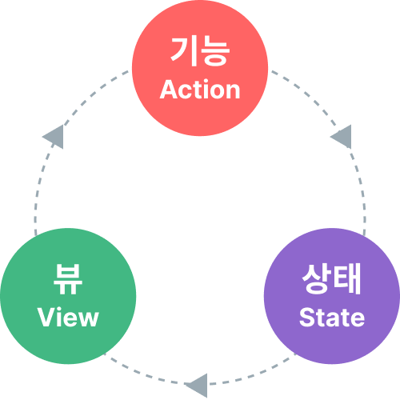

# 상태 관리 {#state-management}

## 상태 관리란? {#what-is-state-management}

기술적으로, 모든 Vue 컴포넌트 인스턴스는 이미 자신의 반응형 상태를 "관리"하고 있습니다. 간단한 카운터 컴포넌트를 예로 들어보겠습니다:

<div class="composition-api">

```vue
<script setup>
import { ref } from 'vue'

// 상태
const count = ref(0)

// 액션
function increment() {
  count.value++
}
</script>

<!-- 뷰 -->
<template>{{ count }}</template>
```

</div>
<div class="options-api">

```vue
<script>
export default {
  // 상태
  data() {
    return {
      count: 0
    }
  },
  // 액션
  methods: {
    increment() {
      this.count++
    }
  }
}
</script>

<!-- 뷰 -->
<template>{{ count }}</template>
```

</div>

이것은 다음과 같은 부분을 가진 독립적인 단위입니다:

- **상태**: 우리의 앱을 구동하는 진실의 원천;
- **뷰**: **상태**의 선언적 매핑;
- **액션**: **뷰**에서 사용자 입력에 반응하여 상태가 변경될 수 있는 가능한 방법.

이는 "단방향 데이터 흐름" 개념의 간단한 표현입니다:

<p style="text-align: center">
  
</p>

하지만, **공통 상태를 공유하는 여러 컴포넌트**가 있을 때 이 단순함은 무너지기 시작합니다:

1. 여러 뷰가 동일한 상태 조각에 의존할 수 있습니다.
2. 서로 다른 뷰의 액션이 동일한 상태 조각을 변경해야 할 수 있습니다.

첫 번째 경우, 가능한 해결책은 공유 상태를 공통 조상 컴포넌트로 "끌어올리고", 그 후 props로 하위 컴포넌트에 전달하는 것입니다. 하지만, 이는 계층 구조가 깊은 컴포넌트 트리에서는 금방 번거로워지며, [Prop Drilling](/guide/components/provide-inject#prop-drilling)이라는 또 다른 문제로 이어집니다.

두 번째 경우, 우리는 종종 템플릿 ref를 통해 직접 부모/자식 인스턴스에 접근하거나, 이벤트를 통해 여러 상태 복사본을 변경하고 동기화하려는 해결책에 의존하게 됩니다. 이 두 패턴 모두 취약하며 금방 유지보수하기 어려운 코드로 이어집니다.

더 간단하고 직관적인 해결책은 공유 상태를 컴포넌트에서 분리하여 전역 싱글턴에서 관리하는 것입니다. 이렇게 하면, 우리의 컴포넌트 트리는 하나의 큰 "뷰"가 되고, 트리 어디에 있든 모든 컴포넌트가 상태에 접근하거나 액션을 트리거할 수 있습니다!

## 반응성 API를 이용한 간단한 상태 관리 {#simple-state-management-with-reactivity-api}

<div class="options-api">

옵션 API에서는 반응형 데이터를 `data()` 옵션을 사용해 선언합니다. 내부적으로, `data()`가 반환하는 객체는 [`reactive()`](/api/reactivity-core#reactive) 함수를 통해 반응형으로 만들어지며, 이 함수는 공개 API로도 제공됩니다.

</div>

여러 인스턴스에서 공유되어야 하는 상태가 있다면, [`reactive()`](/api/reactivity-core#reactive)를 사용해 반응형 객체를 만들고, 이를 여러 컴포넌트에 import할 수 있습니다:

```js [store.js]
import { reactive } from 'vue'

export const store = reactive({
  count: 0
})
```

<div class="composition-api">

```vue [ComponentA.vue]
<script setup>
import { store } from './store.js'
</script>

<template>From A: {{ store.count }}</template>
```

```vue [ComponentB.vue]
<script setup>
import { store } from './store.js'
</script>

<template>From B: {{ store.count }}</template>
```

</div>
<div class="options-api">

```vue [ComponentA.vue]
<script>
import { store } from './store.js'

export default {
  data() {
    return {
      store
    }
  }
}
</script>

<template>From A: {{ store.count }}</template>
```

```vue [ComponentB.vue]
<script>
import { store } from './store.js'

export default {
  data() {
    return {
      store
    }
  }
}
</script>

<template>From B: {{ store.count }}</template>
```

</div>

이제 `store` 객체가 변경될 때마다 `<ComponentA>`와 `<ComponentB>` 모두 자동으로 뷰가 갱신됩니다. 이제 우리는 하나의 진실의 원천을 가지게 되었습니다.

하지만, 이는 또한 `store`를 import하는 어떤 컴포넌트든 원하는 대로 상태를 변경할 수 있다는 의미이기도 합니다:

```vue-html{2}
<template>
  <button @click="store.count++">
    From B: {{ store.count }}
  </button>
</template>
```

이 방식이 간단한 경우에는 동작하지만, 모든 컴포넌트가 전역 상태를 임의로 변경할 수 있다면 장기적으로 유지보수가 어려워집니다. 상태 변경 로직도 상태 자체처럼 중앙 집중화하려면, store에 액션의 의도를 표현하는 이름의 메서드를 정의하는 것이 좋습니다:

```js{5-7} [store.js]
import { reactive } from 'vue'

export const store = reactive({
  count: 0,
  increment() {
    this.count++
  }
})
```

```vue-html{2}
<template>
  <button @click="store.increment()">
    From B: {{ store.count }}
  </button>
</template>
```

<div class="composition-api">

[Playground에서 실행해보기](https://play.vuejs.org/#eNrNkk1uwyAQha8yYpNEiUzXllPVrtRTeJNSqtLGgGBsVbK4ewdwnT9FWWSTFczwmPc+xMhqa4uhl6xklRdOWQQvsbfPrVadNQ7h1dCqpcYaPp3pYFHwQyteXVxKm0tpM0krnm3IgAqUnd3vUFIFUB1Z8bNOkzoVny+wDTuNcZ1gBI/GSQhzqlQX3/5Gng81pA1t33tEo+FF7JX42bYsT1BaONlRguWqZZMU4C261CWMk3EhTK8RQphm8Twse/BscoUsvdqDkTX3kP3nI6aZwcmdQDUcMPJPabX8TQphtCf0RLqd1csxuqQAJTxtYnEUGtIpAH4pn1Ou17FDScOKhT+QNAVM)

</div>
<div class="options-api">

[Playground에서 실행해보기](https://play.vuejs.org/#eNrdU8FqhDAU/JVHLruyi+lZ3FIt9Cu82JilaTWR5CkF8d8bE5O1u1so9FYQzAyTvJnRTKTo+3QcOMlIbpgWPT5WUnS90gjPyr4ll1jAWasOdim9UMum3a20vJWWqxSgkvzTyRt+rocWYVpYFoQm8wRsJh+viHLBcyXtk9No2ALkXd/WyC0CyDfW6RVTOiancQM5ku+x7nUxgUGlOcwxn8Ppu7HJ7udqaqz3SYikOQ5aBgT+OA9slt9kasToFnb5OiAqCU+sFezjVBHvRUimeWdT7JOKrFKAl8VvYatdI6RMDRJhdlPtWdQf5mdQP+SHdtyX/IftlH9pJyS1vcQ2NK8ZivFSiL8BsQmmpMG1s1NU79frYA1k8OD+/I3pUA6+CeNdHg6hmoTMX9pPSnk=)

</div>

:::tip
클릭 핸들러에서 `store.increment()`와 같이 괄호를 사용하는 것에 주의하세요. 이는 메서드를 올바른 `this` 컨텍스트로 호출하기 위해 필요합니다. 이 메서드는 컴포넌트 메서드가 아니기 때문입니다.
:::

여기서는 하나의 반응형 객체를 store로 사용하고 있지만, `ref()`나 `computed()` 등 다른 [반응성(reactivity) API](/api/reactivity-core)로 생성한 반응형 상태를 공유하거나, [Composable](/guide/reusability/composables)에서 전역 상태를 반환할 수도 있습니다:

```js
import { ref } from 'vue'

// 전역 상태, 모듈 스코프에서 생성
const globalCount = ref(1)

export function useCount() {
  // 로컬 상태, 컴포넌트별로 생성
  const localCount = ref(1)

  return {
    globalCount,
    localCount
  }
}
```

Vue의 반응성 시스템이 컴포넌트 모델과 분리되어 있다는 점은 매우 유연하게 사용할 수 있게 해줍니다.

## SSR 고려사항 {#ssr-considerations}

[서버 사이드 렌더링(SSR)](./ssr)을 활용하는 애플리케이션을 구축하는 경우, 위 패턴은 store가 여러 요청에 걸쳐 공유되는 싱글턴이기 때문에 문제가 발생할 수 있습니다. 이에 대한 자세한 내용은 SSR 가이드의 [요청 간 상태 오염](./ssr#cross-request-state-pollution)에서 다루고 있습니다.

## Pinia {#pinia}

직접 만든 상태 관리 솔루션이 간단한 시나리오에서는 충분하지만, 대규모 프로덕션 애플리케이션에서는 더 많은 사항을 고려해야 합니다:

- 팀 협업을 위한 더 강력한 컨벤션
- Vue DevTools와의 통합(타임라인, 컴포넌트 내 검사, 타임 트래블 디버깅 등)
- 핫 모듈 교체
- 서버 사이드 렌더링 지원

[Pinia](https://pinia.vuejs.org)는 위의 모든 기능을 구현한 상태 관리 라이브러리입니다. Vue 핵심 팀에서 관리하며, Vue 2와 Vue 3 모두에서 동작합니다.

기존 사용자라면 Vue의 이전 공식 상태 관리 라이브러리인 [Vuex](https://vuex.vuejs.org/)에 익숙할 수 있습니다. Pinia가 생태계에서 같은 역할을 하게 되면서, Vuex는 이제 유지보수 모드에 들어갔습니다. 여전히 동작하지만, 더 이상 새로운 기능이 추가되지 않습니다. 새로운 애플리케이션에는 Pinia 사용을 권장합니다.

Pinia는 Vuex의 다음 버전이 어떤 모습일지 탐구하는 과정에서 시작되었으며, Vuex 5를 위한 핵심 팀 논의에서 나온 많은 아이디어를 통합했습니다. 결국, Pinia가 우리가 Vuex 5에서 원했던 대부분을 이미 구현하고 있다는 것을 깨닫고, Pinia를 새로운 공식 권장 사항으로 삼기로 결정했습니다.

Vuex와 비교했을 때, Pinia는 더 간단한 API와 적은 형식적 절차, Composition API 스타일의 API, 그리고 가장 중요한 TypeScript 사용 시 강력한 타입 추론 지원을 제공합니다.
