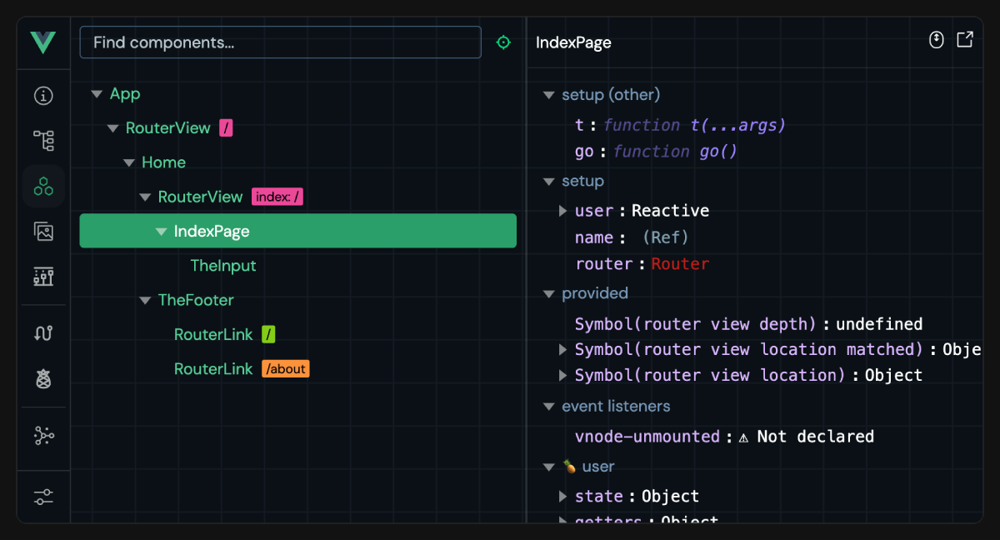

<script setup>
import { VTCodeGroup, VTCodeGroupTab } from '@vue/theme'
</script>

# 도구 {#tooling}

## 온라인에서 사용해보기 {#try-it-online}

Vue SFC를 사용해보려면 컴퓨터에 아무것도 설치할 필요가 없습니다. 브라우저에서 바로 사용할 수 있는 온라인 플레이그라운드가 있습니다:

- [Vue SFC Playground](https://play.vuejs.org)
  - 항상 최신 커밋에서 배포됨
  - 컴포넌트(component) 컴파일 결과를 확인하는 데 최적화됨
- [Vue + Vite on StackBlitz](https://vite.new/vue)
  - 실제 Vite 개발 서버가 브라우저에서 실행되는 IDE와 유사한 환경
  - 로컬 환경과 가장 유사함

버그를 신고할 때 재현 예시를 제공하기 위해서도 이러한 온라인 플레이그라운드를 사용하는 것이 좋습니다.

## 프로젝트 스캐폴딩(scaffolding) {#project-scaffolding}

### Vite {#vite}

[Vite](https://vite.dev/)는 Vue SFC를 1급으로 지원하는 가볍고 빠른 빌드 도구입니다. Vue의 저자인 Evan You가 만들었습니다!

Vite + Vue로 시작하려면 다음 명령어를 실행하세요:

::: code-group

```sh [npm]
$ npm create vue@latest
```

```sh [pnpm]
$ pnpm create vue@latest
```
  
```sh [yarn]
# Yarn Modern (v2+)용
$ yarn create vue@latest
  
# Yarn ^v4.11 용
$ yarn dlx create-vue@latest
```
  
```sh [bun]
$ bun create vue@latest
```

:::

이 명령어는 공식 Vue 프로젝트 스캐폴딩 도구인 [create-vue](https://github.com/vuejs/create-vue)를 설치하고 실행합니다.

- Vite에 대해 더 알아보려면 [Vite 문서](https://vite.dev/)를 참고하세요.
- Vite 프로젝트에서 Vue 관련 동작(예: Vue 컴파일러에 옵션 전달 등)을 설정하려면 [@vitejs/plugin-vue](https://github.com/vitejs/vite-plugin-vue/tree/main/packages/plugin-vue#readme) 문서를 참고하세요.

위에서 언급한 온라인 플레이그라운드 모두 Vite 프로젝트로 파일 다운로드를 지원합니다.

### Vue CLI {#vue-cli}

[Vue CLI](https://cli.vuejs.org/)는 Vue를 위한 공식 webpack 기반 도구 체인입니다. 현재는 유지보수 모드에 있으며, webpack 전용 기능이 꼭 필요하지 않다면 새로운 프로젝트는 Vite로 시작하는 것을 권장합니다. 대부분의 경우 Vite가 더 나은 개발 경험을 제공합니다.

Vue CLI에서 Vite로 마이그레이션하는 방법:

- [VueSchool.io의 Vue CLI -> Vite 마이그레이션 가이드](https://vueschool.io/articles/vuejs-tutorials/how-to-migrate-from-vue-cli-to-vite/)
- [자동 마이그레이션을 도와주는 도구/플러그인(plugin)](https://github.com/vitejs/awesome-vite#vue-cli)

### 브라우저 내 템플릿(template) 컴파일에 대한 참고 사항 {#note-on-in-browser-template-compilation}

빌드 단계를 거치지 않고 Vue를 사용할 때는 컴포넌트 템플릿을 페이지의 HTML에 직접 작성하거나 인라인 자바스크립트 문자열로 작성합니다. 이런 경우, Vue는 브라우저에서 즉석으로 템플릿을 컴파일하기 위해 템플릿 컴파일러를 함께 제공해야 합니다. 반면, 빌드 단계에서 미리 템플릿을 컴파일하면 컴파일러가 필요하지 않습니다. 클라이언트 번들 크기를 줄이기 위해 Vue는 [다양한 "빌드"](https://unpkg.com/browse/vue@3/dist/)를 제공하여 각 용도에 맞게 최적화합니다.

- `vue.runtime.*`로 시작하는 빌드 파일은 **런타임 전용 빌드**입니다: 컴파일러가 포함되어 있지 않습니다. 이 빌드를 사용할 때는 모든 템플릿이 빌드 단계에서 미리 컴파일되어야 합니다.

- `.runtime`이 포함되지 않은 빌드 파일은 **풀 빌드**입니다: 컴파일러가 포함되어 있어 브라우저에서 직접 템플릿을 컴파일할 수 있습니다. 하지만 페이로드가 약 14kb 증가합니다.

기본 도구 설정은 SFC의 모든 템플릿이 미리 컴파일되므로 런타임 전용 빌드를 사용합니다. 어떤 이유로든 빌드 단계를 거치더라도 브라우저 내 템플릿 컴파일이 필요하다면, 빌드 도구에서 `vue`를 `vue/dist/vue.esm-bundler.js`로 별칭(alias) 설정하면 됩니다.

빌드 단계 없이 더 가벼운 대안을 찾고 있다면 [petite-vue](https://github.com/vuejs/petite-vue)를 참고하세요.

## IDE 지원 {#ide-support}

- 권장 IDE 설정은 [VS Code](https://code.visualstudio.com/) + [Vue - Official 확장](https://marketplace.visualstudio.com/items?itemName=Vue.volar) (이전 명칭: Volar)입니다. 이 확장은 템플릿 표현식 및 컴포넌트 props에 대한 구문 강조, TypeScript 지원, 인텔리센스를 제공합니다.

  :::tip
  Vue - Official은 Vue 2용 공식 VS Code 확장이었던 [Vetur](https://marketplace.visualstudio.com/items?itemName=octref.vetur)를 대체합니다. Vetur가 설치되어 있다면 Vue 3 프로젝트에서는 반드시 비활성화하세요.
  :::

- [WebStorm](https://www.jetbrains.com/webstorm/)도 Vue SFC에 대한 훌륭한 내장 지원을 제공합니다.

- [Language Service Protocol](https://microsoft.github.io/language-server-protocol/) (LSP)을 지원하는 다른 IDE들도 LSP를 통해 Volar의 핵심 기능을 활용할 수 있습니다:

  - [LSP-Volar](https://github.com/sublimelsp/LSP-volar)를 통한 Sublime Text 지원.

  - [coc-volar](https://github.com/yaegassy/coc-volar)를 통한 vim / Neovim 지원.

  - [lsp-mode](https://emacs-lsp.github.io/lsp-mode/page/lsp-volar/)를 통한 emacs 지원

## 브라우저 개발자 도구 {#browser-devtools}

Vue 브라우저 개발자 도구 확장 프로그램을 사용하면 Vue 앱의 컴포넌트 트리를 탐색하고, 개별 컴포넌트의 상태를 검사하며, 상태 관리 이벤트를 추적하고, 성능을 프로파일링할 수 있습니다.



- [문서](https://devtools.vuejs.org/)
- [Chrome 확장 프로그램](https://chromewebstore.google.com/detail/vuejs-devtools/nhdogjmejiglipccpnnnanhbledajbpd)
- [Vite 플러그인](https://devtools.vuejs.org/guide/vite-plugin)
- [독립 실행형 Electron 앱](https://devtools.vuejs.org/guide/standalone)

## TypeScript {#typescript}

주요 문서: [Vue와 TypeScript 사용하기](/guide/typescript/overview).

- [Vue - Official 확장](https://github.com/vuejs/language-tools)은 `<script lang="ts">` 블록을 사용하는 SFC에 대해 템플릿 표현식과 컴포넌트 간 props 검증을 포함한 타입 검사를 제공합니다.

- [`vue-tsc`](https://github.com/vuejs/language-tools/tree/master/packages/tsc)를 사용하면 커맨드라인에서 동일한 타입 검사를 수행하거나 SFC용 `d.ts` 파일을 생성할 수 있습니다.

## 테스트 {#testing}

주요 문서: [테스트 가이드](/guide/scaling-up/testing).

- [Cypress](https://www.cypress.io/)는 E2E 테스트에 권장됩니다. [Cypress Component Test Runner](https://docs.cypress.io/guides/component-testing/introduction)를 통해 Vue SFC의 컴포넌트 테스트에도 사용할 수 있습니다.

- [Vitest](https://vitest.dev/)는 Vue / Vite 팀원이 만든 테스트 러너로, 속도에 중점을 두고 있습니다. Vite 기반 애플리케이션에서 단위/컴포넌트 테스트에 즉각적인 피드백 루프를 제공합니다.

- [Jest](https://jestjs.io/)는 [vite-jest](https://github.com/sodatea/vite-jest)를 통해 Vite와 함께 사용할 수 있습니다. 하지만 기존 Jest 기반 테스트 스위트를 Vite 기반 환경으로 마이그레이션해야 하는 경우에만 권장하며, Vitest가 훨씬 효율적으로 유사한 기능을 제공합니다.

## 린팅 {#linting}

Vue 팀은 SFC 전용 린팅 규칙을 지원하는 [ESLint](https://eslint.org/) 플러그인인 [eslint-plugin-vue](https://github.com/vuejs/eslint-plugin-vue)를 유지 관리하고 있습니다.

이전에 Vue CLI를 사용했던 사용자는 webpack 로더를 통해 린터가 설정되는 것에 익숙할 수 있습니다. 하지만 Vite 기반 빌드 환경에서는 다음을 권장합니다:

1. `npm install -D eslint eslint-plugin-vue`를 실행한 후, `eslint-plugin-vue`의 [설정 가이드](https://eslint.vuejs.org/user-guide/#usage)를 따르세요.

2. [VS Code용 ESLint](https://marketplace.visualstudio.com/items?itemName=dbaeumer.vscode-eslint)와 같은 ESLint IDE 확장 프로그램을 설정하여 개발 중 에디터에서 바로 린터 피드백을 받을 수 있습니다. 이렇게 하면 개발 서버를 시작할 때 불필요한 린팅 비용도 줄일 수 있습니다.

3. 프로덕션 빌드 명령의 일부로 ESLint를 실행하여, 배포 전에 전체 린터 피드백을 받을 수 있습니다.

4. (선택 사항) [lint-staged](https://github.com/okonet/lint-staged)와 같은 도구를 설정하여 git 커밋 시 수정된 파일을 자동으로 린트할 수 있습니다.

## 포매팅 {#formatting}

- [Vue - Official](https://github.com/vuejs/language-tools) VS Code 확장은 Vue SFC에 대한 포매팅을 기본적으로 제공합니다.

- 또는 [Prettier](https://prettier.io/)도 Vue SFC 포매팅을 기본 지원합니다.

## SFC 커스텀 블록 통합 {#sfc-custom-block-integrations}

커스텀 블록은 동일한 Vue 파일에 서로 다른 요청 쿼리로 import되는 형태로 컴파일됩니다. 이러한 import 요청을 처리하는 것은 하위 빌드 도구의 몫입니다.

- Vite를 사용하는 경우, 매칭되는 커스텀 블록을 실행 가능한 자바스크립트로 변환하는 커스텀 Vite 플러그인을 사용해야 합니다. [예시](https://github.com/vitejs/vite-plugin-vue/tree/main/packages/plugin-vue#example-for-transforming-custom-blocks)

- Vue CLI 또는 일반 webpack을 사용하는 경우, 매칭되는 블록을 변환하도록 webpack 로더를 설정해야 합니다. [예시](https://vue-loader.vuejs.org/guide/custom-blocks.html)

## 하위 레벨 패키지 {#lower-level-packages}

### `@vue/compiler-sfc` {#vue-compiler-sfc}

- [문서](https://github.com/vuejs/core/tree/main/packages/compiler-sfc)

이 패키지는 Vue 코어 모노레포의 일부이며, 항상 메인 `vue` 패키지와 동일한 버전으로 배포됩니다. 메인 `vue` 패키지의 의존성으로 포함되어 있으며, `vue/compiler-sfc`로 프록시(proxy)되어 별도로 설치할 필요가 없습니다.

이 패키지는 Vue SFC를 처리하기 위한 하위 레벨 유틸리티를 제공하며, 커스텀 도구에서 Vue SFC를 지원해야 하는 도구 제작자를 위한 것입니다.

:::tip
항상 `vue/compiler-sfc` 딥 임포트를 통해 이 패키지를 사용하는 것이 좋습니다. 이렇게 하면 Vue 런타임과 버전이 동기화됩니다.
:::

### `@vitejs/plugin-vue` {#vitejs-plugin-vue}

- [문서](https://github.com/vitejs/vite-plugin-vue/tree/main/packages/plugin-vue)

Vite에서 Vue SFC 지원을 제공하는 공식 플러그인입니다.

### `vue-loader` {#vue-loader}

- [문서](https://vue-loader.vuejs.org/)

webpack에서 Vue SFC 지원을 제공하는 공식 로더입니다. Vue CLI를 사용하는 경우 [Vue CLI에서 `vue-loader` 옵션 수정 문서](https://cli.vuejs.org/guide/webpack.html#modifying-options-of-a-loader)도 참고하세요.

## 기타 온라인 플레이그라운드 {#other-online-playgrounds}

- [VueUse Playground](https://play.vueuse.org)
- [Vue + Vite on Repl.it](https://replit.com/@templates/VueJS-with-Vite)
- [Vue on CodeSandbox](https://codesandbox.io/p/devbox/github/codesandbox/sandbox-templates/tree/main/vue-vite)
- [Vue on Codepen](https://codepen.io/pen/editor/vue)
- [Vue on WebComponents.dev](https://webcomponents.dev/create/cevue)

## 백엔드 프레임워크 통합 {#backend-framework-integrations}

Vue를 [Laravel](https://laravel.com/)과 함께 사용한다면, Laravel이 공식 [Vite 플러그인](https://laravel.com/docs/vite)을 제공하므로 에셋 번들링(bundling)과 핫 모듈 교체(HMR)를 별도 설정 없이 바로 사용할 수 있습니다.

다른 백엔드를 사용한다면, Vite의 [백엔드 통합 가이드](https://vite.dev/guide/backend-integration.html)를 참고하여 직접 연동을 설정하세요.
